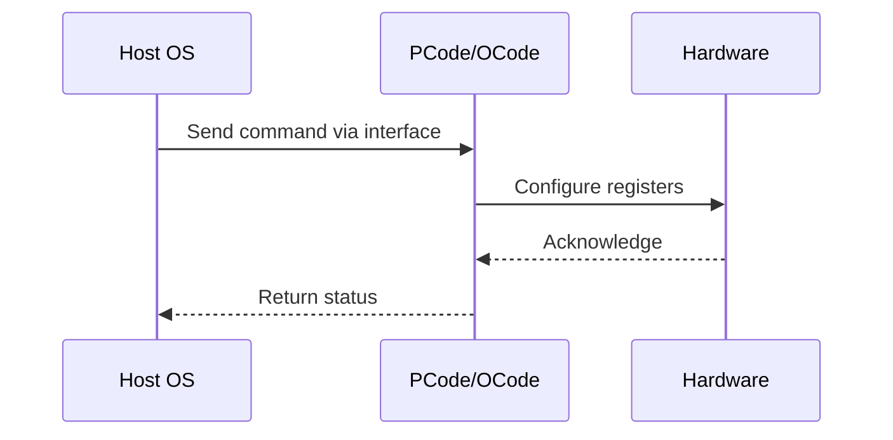

# NWP PSS Analysis

## Metadata
- HSD ID: 22021970049
- Title: C6 Residency Counter
- Feature: Core C-States
- Sub Feature: C6
- Script: nwp_pss_scripts/nwp_pega_cstate.py
- HSD Script: (none)
- TC Owner: aprakas2
- TR Owner: thangama
- Validation Environment: emulation.hsle,xos
- Test Cycle: Newport Product.trunk.pss_0p8.pss.val.NWP_MCP HSLE XOS
- NWP Scope: Runnable_On_N-1

## HSD Hierarchy
- Test Case Definition: [22021969891 - Core C-State Residency Counter Checks](https://hsdes.intel.com/appstore/article/#/22021969891)
- Test Case: [22021970049 - C6 Residency Counter](https://hsdes.intel.com/appstore/article/#/22021970049)
- Test Result: [22022027544 - [PSS][CORE_CSTATES] C6 Residency Counter](https://hsdes.intel.com/appstore/article/#/22022027544)

## KB References
- KB Article: [KB/pm_features/core_c_states/c6.md](../../../KB/pm_features/core_c_states/c6.md)

## Model Response

## Refined Intent
Verify C6 residency counter (MSR 0x3FD) increments when cores enter C6 state via MWAIT using Intel Idle driver or Solar tool. This flow enables cross-product coverage with CXL VTC domain.

## Refined Test Steps
Pre-Conditions:
  - C6 enabled in BIOS
  - IMH Fuses: punit/PCODE_CORE_C_STATE = 0x3, punit/PCODE_PKG_C_STATE = 0x8
  - IMH Fuses: PMSRVR_PTPCFSMS_PKG_C_STATE_LIMIT_REQ_FUSED_C_STATE_MAX_LIMIT_FUSE = 0x2
  - IMH Fuses: PMSRVR_PTPCFSMS_PKG_C_STATE_LIMIT_REQ_FUSED_FUSED_PKGC_STATE_MAX_LIMIT_FUSE = 0x2
  - CBB Fuses: fw_fuses_CORE_C_STATE, fw_fuses_PKG_C_STATE_LIMIT_REQ_C_STATE_MAX_LIMIT, fw_fuses_PKG_C_STATE_LIMIT_REQ_FUSED_PKGC_STATE_MAX_LIMIT
  - Kernel Config: idle=poll, idle=halt, idle=nomwait must NOT be in boot parameters
  - Intel Idle driver or Solar workload available
  - Model: XOS, HSLE with Aunit Fmod and CorePMA

Step 1 — Inject MWaits:
  Use Intel Idle Driver or Solar tool to inject MWaits with C6 hint.

Step 2 — Verify BIOS ACPI enumeration:
  Confirm C-states properly enumerated via ACPI.

Step 3 — Verify CC6 residency counter:
  Read MSR 0x3FD — verify counter is incrementing.
  Delta should be > 0 and proportional to idle time.

Pass/Fail Criteria:
  PASS: CC6 residency counter (MSR 0x3FD) is incrementing after C6 entry
  FAIL: Residency counter not incrementing

HAS/MAS References:
  - DMR CBB PM HAS — Core C6 Residency: https://docs.intel.com/documents/pm_doc/src/server/DMR/IP_PM_Features/CBB/DMR_CBB_PM.html

### NWP Project Relevance
**Test Classification:** Regression (DMR-inherited)
**Feature Status:** Expected to work
**Test Purpose:** Verify C6 residency counter (MSR 0x3FD) increments when cores enter C6 state via MWAIT using Intel Idle driver or Solar tool. This flow enables cross-product coverage with CXL VTC domain.
**Negative Test Aspect:** None
**NWP Delta:** Topology differences from DMR (2 CBB + 1 NIO); same Core C-States behavior expected

## Section A: Critical Execution Path
1. Step 1 — Inject MWaits:
2. Step 2 — Verify BIOS ACPI enumeration:
3. Step 3 — Verify CC6 residency counter:

## Section B: Component Interaction Diagram

## Section C: Interface Coverage Assessment
| Interface | Covered | Notes |
| --------- | ------- | ----- |
| CSR | Yes | Primary interface |
| Fuse | Yes | Primary interface |
| MSR | Yes | Primary interface |
| PEGA | Yes | Primary interface |
| 0x3FD C6_RESIDENCY | Yes | Register access |

## Section D: NWP Specification References
- **NWP PM HAS**: [NWP HAS - PM Features](https://docs.intel.com/documents/custom-xeon/newport-docs/has/Overview/NWP_HAS.html#pm-features)
- **NWP PM MAS**: [NWP IMH SoC PM MAS](https://docs.intel.com/documents/custom-xeon/newport-docs/mas/pm/nwp_imh_soc_pm_mas.html)
- **DMR PM HAS**: [DMR SoC PM HAS](https://docs.intel.com/documents/pm_doc/src/server/DMR/SOC_PM_HAS/DMR_SOC_PM_HAS.html)
- **Feature HAS**: [PNC PM HAS §8 - Core C-States](https://docs.intel.com/documents/pm_doc/src/server/GNR/Features/LNC/GNR_LNC_Core.html#core-c-states)
- **DMR CBB HAS**: [DMR CBB CCP HAS](https://docs.intel.com/documents/pm_doc/src/DMR_CBB/IP%20Integration/CCP%20HAS/cbb_cpp_has.html)
- **Intel® 64 and IA-32 SDM**: MSR definitions, CPUID enumeration

## Section E: NWP Risk Assessment
| Risk | Likelihood | Impact | Mitigation |
| ---- | ---------- | ------ | ---------- |
| Topology change | Medium | Medium | Verify on multi-die config |
| Interface delta | Low | Low | Compare with DMR baseline |
| Timing sensitivity | Low | Medium | Allow tolerance margins |

## Section F: Recommendations
1. Verify test works on NWP multi-die topology
2. Check for any interface changes from DMR
3. Update HAS references to NWP specifications
4. Add negative test coverage if missing
5. Consider additional stress test variants

---
*Generated from metadata on 2026-05-28 23:20:51*