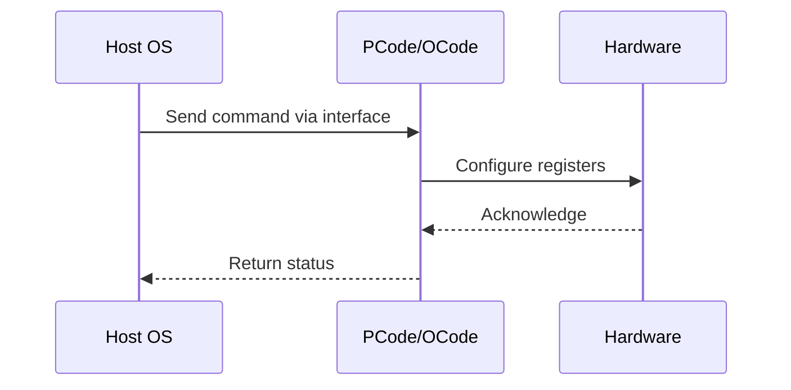

# NWP PSS Analysis

## Metadata
- HSD ID: 22022060655
- Title: PKGC ZBB Negative Checks
- Feature: Core C-States
- Sub Feature: PKGC
- Script: pm/pss/pkgc/pega_c6.py
- HSD Script: (none)
- TC Owner: jscanlo1
- TR Owner: thangama
- Validation Environment: emulation.hsle
- Test Cycle: Newport Product.trunk.pss_1p0.pss.val.NWP_MCP-HSLE
- NWP Scope: Runnable_On_N-1

## HSD Hierarchy
- Test Case Definition: [22022060621 - NWP ZBB Negative Validation](https://hsdes.intel.com/appstore/article/#/22022060621)
- Test Case: [22022060655 - PKGC ZBB Negative Checks](https://hsdes.intel.com/appstore/article/#/22022060655)
- Test Result: [22022060668 - [PSS][PKGC] PKGC ZBB Negative Checks](https://hsdes.intel.com/appstore/article/#/22022060668)

## KB References
- KB Article: [KB/pm_features/core_c_states/pkgc.md](../../../KB/pm_features/core_c_states/pkgc.md)

## Model Response

## Refined Intent
NWP ZBB negative validation: verify PKGC (Package C-state) is unsupported in NWP. PC2/PC6 residency counters must not increment, PKGC fuses must be disabled, and PKGC-related BIOS knobs must not be exposed.

## Refined Test Steps
Pre-Conditions:
  - NWP platform booted
  - NIO Fuse: FUSE_PKG_C_STATE = ZERO
  - CBB Fuse: PKG_C_STATE_LIMIT_REQ_C_STATE_MAX_LIMIT = ZERO

Step 1 — Verify PC2/PC6 residency counters:
  Read PC2/PC6 residency MSRs — verify counters are not increasing.

Step 2 — Verify PKGC fuses:
  NIO: FUSE_PKG_C_STATE = 0 (PKGC disabled).
  CBB: PKG_C_STATE_LIMIT_REQ_C_STATE_MAX_LIMIT = 0.

Step 3 — Verify BIOS knobs:
  Package C State BIOS knob should show only C0/C1 state option.
  MSR 0xE2 bits [3:0] (PKG_C_STATE_LIMIT) = 0 (C0/C1 only).
  PKGC cannot be enabled even if attempted.

Step 4 — Attempt PKGC entry:
  Idle all cores — verify package never enters PkgC2/PkgC6.

Pass/Fail Criteria:
  PASS: PKGC disabled on NWP — no residency, fuses zero, knobs not exposed
  FAIL: PKGC residency > 0, fuse non-zero, or PKGC knob available on NWP

HAS/MAS References:
  - NWP PM MAS — PkgC ZBB scope: https://docs.intel.com/documents/custom-xeon/newport-docs/mas/pm/nwp_imh_soc_pm_mas.html
  - DMR SoC PM HAS — Package C-State: https://docs.intel.com/documents/pm_doc/src/server/DMR/SOC_PM_HAS/DMR_SOC_PM_HAS.html

### NWP Project Relevance
**Test Classification:** Regression (DMR-inherited)
**Feature Status:** Expected to work
**Test Purpose:** NWP ZBB negative validation: verify PKGC (Package C-state) is unsupported in NWP. PC2/PC6 residency counters must not increment, PKGC fuses must be disabled, and PKGC-related BIOS knobs must not be ex
**Negative Test Aspect:** None
**NWP Delta:** Topology differences from DMR (2 CBB + 1 NIO); same Core C-States behavior expected

## Section A: Critical Execution Path
1. Step 1 — Verify PC2/PC6 residency counters:
2. Step 2 — Verify PKGC fuses:
3. Step 3 — Verify BIOS knobs:
4. Step 4 — Attempt PKGC entry:

## Section B: Component Interaction Diagram

## Section C: Interface Coverage Assessment
| Interface | Covered | Notes |
| --------- | ------- | ----- |
| CSR | Yes | Primary interface |
| Fuse | Yes | Primary interface |
| MSR | Yes | Primary interface |
| 0xE2 PKG_CST_CONFIG_CONTROL | Yes | Register access |
| PC2/PC6 residency MSRs | Yes | Register access |

## Section D: NWP Specification References
- **NWP PM HAS**: [NWP HAS - PM Features](https://docs.intel.com/documents/custom-xeon/newport-docs/has/Overview/NWP_HAS.html#pm-features)
- **NWP PM MAS**: [NWP IMH SoC PM MAS](https://docs.intel.com/documents/custom-xeon/newport-docs/mas/pm/nwp_imh_soc_pm_mas.html)
- **DMR PM HAS**: [DMR SoC PM HAS](https://docs.intel.com/documents/pm_doc/src/server/DMR/SOC_PM_HAS/DMR_SOC_PM_HAS.html)
- **Feature HAS**: [PNC PM HAS §8 - Core C-States](https://docs.intel.com/documents/pm_doc/src/server/GNR/Features/LNC/GNR_LNC_Core.html#core-c-states)
- **DMR CBB HAS**: [DMR CBB CCP HAS](https://docs.intel.com/documents/pm_doc/src/DMR_CBB/IP%20Integration/CCP%20HAS/cbb_cpp_has.html)
- **Intel® 64 and IA-32 SDM**: MSR definitions, CPUID enumeration

## Section E: NWP Risk Assessment
| Risk | Likelihood | Impact | Mitigation |
| ---- | ---------- | ------ | ---------- |
| Topology change | Medium | Medium | Verify on multi-die config |
| Interface delta | Low | Low | Compare with DMR baseline |
| Timing sensitivity | Low | Medium | Allow tolerance margins |

## Section F: Recommendations
1. Verify test works on NWP multi-die topology
2. Check for any interface changes from DMR
3. Update HAS references to NWP specifications
4. Add negative test coverage if missing
5. Consider additional stress test variants

---
*Generated from metadata on 2026-05-28 23:20:51*