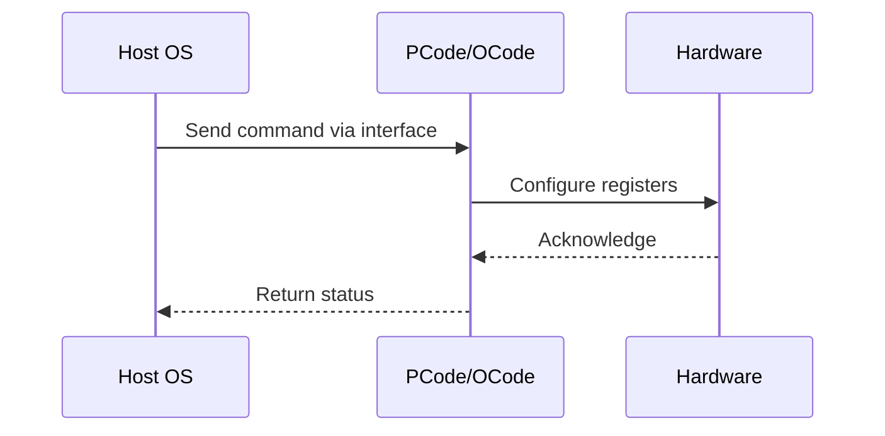

# NWP PSS Analysis

## Metadata
- HSD ID: 22021970174
- Title: Out of Boundary Frequency Check
- Feature: Fabric DVFS
- Sub Feature: DVFS
- Script: nwp_pss_scripts/nwp_dvfs.py
- HSD Script: pm\pss\dvfs\dvfs.py
- TC Owner: jscanlo1
- TR Owner: akurathi
- Validation Environment: emulation.hsle
- Test Cycle: Newport Product.trunk.pss_0p8.pss.val.NWP_MCP-HSLE
- NWP Scope: Runnable_On_N-1

## HSD Hierarchy
- Test Case Definition: [22021969935 - UFS Algorithms](https://hsdes.intel.com/appstore/article/#/22021969935)
- Test Case: [22021970174 - Out of Boundary Frequency Check](https://hsdes.intel.com/appstore/article/#/22021970174)
- Test Result: [22022027625 - [PSS][DVFS] Out of Boundary Frequency Check](https://hsdes.intel.com/appstore/article/#/22022027625)

## KB References
- KB Article: [KB/pm_features/fabric_dvfs/dvfs.md](../../../KB/pm_features/fabric_dvfs/dvfs.md)

## Model Response

## Refined Intent
Verify FW enforces fused limits for mesh GV out-of-boundary frequency requests. NWP: UFS is ZBB'd — mesh/CAB fixed at 2 GHz. Out-of-boundary requests should have no effect.

## Refined Test Steps
Pre-Conditions:
  - NWP: UFS ZBB'd — negative validation

Step 1 — Attempt out-of-bound mesh frequency request:
  Request mesh frequency above and below fused limits.
  On NWP: expect no change from fixed 2 GHz.

Step 2 — Verify mesh frequency unchanged:
  Read UFS_STATUS — verify fixed at 2 GHz.

Pass/Fail Criteria:
  PASS (NWP): Mesh frequency unchanged at 2 GHz after out-of-boundary request
  FAIL: Mesh frequency changes on NWP

HAS/MAS References:
  - NWP PM MAS — UFS ZBB (mesh/CAB fixed 2 GHz): https://docs.intel.com/documents/custom-xeon/newport-docs/mas/pm/nwp_imh_soc_pm_mas.html

### NWP Project Relevance
**Test Classification:** Regression (DMR-inherited)
**Feature Status:** Expected to work
**Test Purpose:** Verify FW enforces fused limits for mesh GV out-of-boundary frequency requests. NWP: UFS is ZBB'd — mesh/CAB fixed at 2 GHz. Out-of-boundary requests should have no effect.
**Negative Test Aspect:** None
**NWP Delta:** Topology differences from DMR (2 CBB + 1 NIO); same Fabric DVFS behavior expected

## Section A: Critical Execution Path
1. Step 1 — Attempt out-of-bound mesh frequency request:
2. Step 2 — Verify mesh frequency unchanged:

## Section B: Component Interaction Diagram

## Section C: Interface Coverage Assessment
| Interface | Covered | Notes |
| --------- | ------- | ----- |
| CSR | Yes | Primary interface |
| TPMI_IB | Yes | Primary interface |

## Section D: NWP Specification References
- **NWP PM HAS**: [NWP HAS - PM Features](https://docs.intel.com/documents/custom-xeon/newport-docs/has/Overview/NWP_HAS.html#pm-features)
- **NWP PM MAS**: [NWP IMH SoC PM MAS - Fabric DVFS](https://docs.intel.com/documents/custom-xeon/newport-docs/mas/pm/nwp_imh_soc_pm_mas.html#fabric-dvfs)
- **DMR PM HAS**: [DMR SoC PM HAS](https://docs.intel.com/documents/pm_doc/src/server/DMR/SOC_PM_HAS/DMR_SOC_PM_HAS.html)
- **Feature HAS**: [DMR Fabric DVFS HAS](https://docs.intel.com/documents/pm_doc/src/server/DMR/Features/FabricDVFS/DMR_FabricDVFS.html)
- **Intel® 64 and IA-32 SDM**: MSR definitions, CPUID enumeration

## Section E: NWP Risk Assessment
| Risk | Likelihood | Impact | Mitigation |
| ---- | ---------- | ------ | ---------- |
| Topology change | Medium | Medium | Verify on multi-die config |
| Interface delta | Low | Low | Compare with DMR baseline |
| Timing sensitivity | Low | Medium | Allow tolerance margins |

## Section F: Recommendations
1. Verify test works on NWP multi-die topology
2. Check for any interface changes from DMR
3. Update HAS references to NWP specifications
4. Add negative test coverage if missing
5. Consider additional stress test variants

---
*Generated from metadata on 2026-05-28 23:20:51*