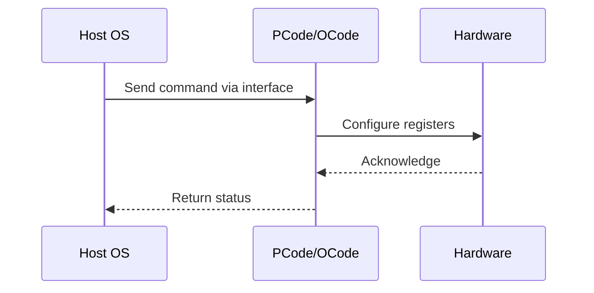

# NWP PSS Analysis

## Metadata
- HSD ID: 22021980804
- Title: TPMI register verification - CBB
- Feature: Fabric DVFS
- Sub Feature: DVFS
- Script: pm/pss/dvfs/dvfs.py
- HSD Script: (none)
- TC Owner: jscanlo1
- TR Owner: akurathi
- Validation Environment: emulation.hsle
- Test Cycle: Newport Product.trunk.pss_0p5.pss.val.NWP_MCP-HSLE
- NWP Scope: Runnable_On_N-1

## HSD Hierarchy
- Test Case Definition: [22021980310 - TPMI Registers](https://hsdes.intel.com/appstore/article/#/22021980310)
- Test Case: [22021980804 - TPMI register verification - CBB](https://hsdes.intel.com/appstore/article/#/22021980804)
- Test Result: [22022027661 - [PSS][DVFS] TPMI register verification - CBB](https://hsdes.intel.com/appstore/article/#/22022027661)

## KB References
- KB Article: [KB/pm_features/fabric_dvfs/dvfs.md](../../../KB/pm_features/fabric_dvfs/dvfs.md)

## Model Response

## Refined Intent
Verify default values across all UFS TPMI registers for CBB. NWP: UFS is ZBB'd — registers should show fixed/disabled state reflecting 2 GHz mesh.

## Refined Test Steps
Pre-Conditions:
  - NWP: UFS ZBB'd — negative validation

Step 1 — Read all CBB UFS TPMI registers:
  Record all field values.
  On NWP: expect fixed/default values reflecting 2 GHz mesh.

Step 2 — Verify no dynamic UFS capability:
  Attempt to modify UFS registers — expect no effect or write rejected.

Pass/Fail Criteria:
  PASS (NWP): CBB UFS registers show fixed/disabled state
  FAIL: Dynamic UFS capability present on NWP

HAS/MAS References:
  - TPMI HAS — UFS registers: https://docs.intel.com/documents/pm_doc/src/server/arch_common/TPMI/TPMI.html
  - NWP PM MAS — UFS ZBB: https://docs.intel.com/documents/custom-xeon/newport-docs/mas/pm/nwp_imh_soc_pm_mas.html

### NWP Project Relevance
**Test Classification:** Regression (DMR-inherited)
**Feature Status:** Expected to work
**Test Purpose:** Verify default values across all UFS TPMI registers for CBB. NWP: UFS is ZBB'd — registers should show fixed/disabled state reflecting 2 GHz mesh.
**Negative Test Aspect:** None
**NWP Delta:** Topology differences from DMR (2 CBB + 1 NIO); same Fabric DVFS behavior expected

## Section A: Critical Execution Path
1. Step 1 — Read all CBB UFS TPMI registers:
2. Step 2 — Verify no dynamic UFS capability:

## Section B: Component Interaction Diagram

## Section C: Interface Coverage Assessment
| Interface | Covered | Notes |
| --------- | ------- | ----- |
| CSR | Yes | Primary interface |
| TPMI_IB | Yes | Primary interface |

## Section D: NWP Specification References
- **NWP PM HAS**: [NWP HAS - PM Features](https://docs.intel.com/documents/custom-xeon/newport-docs/has/Overview/NWP_HAS.html#pm-features)
- **NWP PM MAS**: [NWP IMH SoC PM MAS - Fabric DVFS](https://docs.intel.com/documents/custom-xeon/newport-docs/mas/pm/nwp_imh_soc_pm_mas.html#fabric-dvfs)
- **DMR PM HAS**: [DMR SoC PM HAS](https://docs.intel.com/documents/pm_doc/src/server/DMR/SOC_PM_HAS/DMR_SOC_PM_HAS.html)
- **Feature HAS**: [DMR Fabric DVFS HAS](https://docs.intel.com/documents/pm_doc/src/server/DMR/Features/FabricDVFS/DMR_FabricDVFS.html)
- **Intel® 64 and IA-32 SDM**: MSR definitions, CPUID enumeration

## Section E: NWP Risk Assessment
| Risk | Likelihood | Impact | Mitigation |
| ---- | ---------- | ------ | ---------- |
| Topology change | Medium | Medium | Verify on multi-die config |
| Interface delta | Low | Low | Compare with DMR baseline |
| Timing sensitivity | Low | Medium | Allow tolerance margins |

## Section F: Recommendations
1. Verify test works on NWP multi-die topology
2. Check for any interface changes from DMR
3. Update HAS references to NWP specifications
4. Add negative test coverage if missing
5. Consider additional stress test variants

---
*Generated from metadata on 2026-05-28 23:20:51*