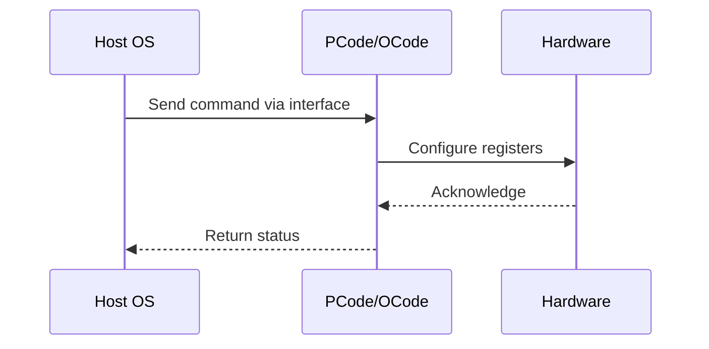

# NWP PSS Analysis

## Metadata
- HSD ID: 22021970051
- Title: MR4-based CLTT
- Feature: Power/RAPL
- Sub Feature: Memory PM
- Script: nwp_pss_scripts/nwp_memory_pm.py
- HSD Script: newport\pm\pss\memory\mr4_cltt.py
- TC Owner: jinwengo
- TR Owner: mps
- Validation Environment: emulation.hsle
- Test Cycle: Newport Product.trunk.pss_0p8.pss.val.NWP_NIO-HSLE
- NWP Scope: Runnable_On_N-1

## HSD Hierarchy
- Test Case Definition: [22021969893 - CLTT](https://hsdes.intel.com/appstore/article/#/22021969893)
- Test Case: [22021970051 - MR4-based CLTT](https://hsdes.intel.com/appstore/article/#/22021970051)
- Test Result: [22022027678 - [PSS][MEMORY] MR4-based CLTT](https://hsdes.intel.com/appstore/article/#/22022027678)

## KB References
- KB Article: [KB/pm_features/power_rapl/memory_pm.md](../../../KB/pm_features/power_rapl/memory_pm.md)

## Model Response

## Refined Intent
Verify MR4-based CLTT (Closed Loop Thermal Throttling) engages when memory temperature exceeds threshold. NWP: MR4 is the only temperature source supported for CLTT (TSOD/PECI not supported).

## Refined Test Steps
Pre-Conditions:
  - BIOS knob thermalthrottlingsupport = 0x4 (CLTT with MR4, default on NWP)
  - Memory populated with DIMMs

Step 1 — Check MR4 CLTT enabled:
  sv.socket0.imh0.memss.mcs.mcscheds_common.thr_ctrl0.mr4temp_thr_en
  Expect: 1 (enabled)

Step 2 — Read MR4 threshold temperatures per DIMM:
  sv.socket0.imh0.memss.mcs.mcscheds_common.mr4_temp_thresh[0]
  sv.socket0.imh0.memss.mcs.mcscheds_common.mr4_temp_thresh[1]
  Verify thresholds match expected values.

Step 3 — Check programmed throttling levels:
  sv.socket0.imh0.memss.mc0.mcscheds_common.dimm_therm_thr_lvl[0].show()
  sv.socket0.imh0.memss.mc0.mcscheds_common.dimm_therm_thr_lvl[1].show()
  Expected defaults: crit=0x7, high=0xf, mid=0xff, low=0xff

Step 4 — Check DIMM temperatures:
  sv.socket0.imh0.memss.mcs.subchs.mcdata.mr4temp

Step 5 — Check BW throttling enabled and time window:
  sv.socket0.imh0.memss.mc0.mcscheds_common.dimm_bw_thrt.throttle_bw_en
  sv.socket0.imh0.memss.mc0.mcscheds_common.dimm_bw_thrt.throttle_bw_window

Step 6 — Record initial throttling counters:
  sv.socket0.imh0.memss.mcs.mcscheds_common.tele_thr_count_chnl

Step 7 — Run memory traffic (memicals or bare metal).

Step 8 — Lower MR4 thresholds to induce throttling:
  sv.socket0.imh0.memss.mcs.mcscheds_common.mr4_temp_thresh[0].mr4_temp_low_maxthreshold = 0
  sv.socket0.imh0.memss.mcs.mcscheds_common.mr4_temp_thresh[0].mr4_temp_mid_maxthreshold = 0
  sv.socket0.imh0.memss.mcs.mcscheds_common.mr4_temp_thresh[0].mr4_temp_high_maxthreshold = 0

Step 9 — Read throttling counters again:
  sv.socket0.imh0.memss.mcs.mcscheds_common.tele_thr_count_chnl
  Verify counters incremented.

Pass/Fail Criteria:
  PASS: Throttling counters increment after lowering MR4 thresholds
  FAIL: No throttling counter change after threshold reduction

HAS/MAS References:
  - DMR DDR5/MCR HAS — MR4-based CLTT: https://docs.intel.com/documents/pm_doc/src/server/DMR/IP_PM_Features/DMR_DDR5_MCR.html#mr4-based-cltt

### NWP Project Relevance
**Test Classification:** Regression (DMR-inherited)
**Feature Status:** Expected to work
**Test Purpose:** Verify MR4-based CLTT (Closed Loop Thermal Throttling) engages when memory temperature exceeds threshold. NWP: MR4 is the only temperature source supported for CLTT (TSOD/PECI not supported).
**Negative Test Aspect:** None
**NWP Delta:** Topology differences from DMR (2 CBB + 1 NIO); same Power/RAPL behavior expected

## Section A: Critical Execution Path
1. Step 1 — Check MR4 CLTT enabled:
2. Step 2 — Read MR4 threshold temperatures per DIMM:
3. Step 3 — Check programmed throttling levels:
4. Step 4 — Check DIMM temperatures:
5. Step 5 — Check BW throttling enabled and time window:

## Section B: Component Interaction Diagram

## Section C: Interface Coverage Assessment
| Interface | Covered | Notes |
| --------- | ------- | ----- |
| B2P | Yes | Primary interface |
| CSR | Yes | Primary interface |

## Section D: NWP Specification References
- **NWP PM HAS**: [NWP HAS - PM Features](https://docs.intel.com/documents/custom-xeon/newport-docs/has/Overview/NWP_HAS.html#pm-features)
- **NWP PM MAS**: [NWP IMH SoC PM MAS](https://docs.intel.com/documents/custom-xeon/newport-docs/mas/pm/nwp_imh_soc_pm_mas.html)
- **DMR PM HAS**: [DMR SoC PM HAS](https://docs.intel.com/documents/pm_doc/src/server/DMR/SOC_PM_HAS/DMR_SOC_PM_HAS.html)
- **Feature HAS**: [PNC PM HAS §7 - RAPL](https://docs.intel.com/documents/pm_doc/src/server/GNR/Features/LNC/GNR_LNC_RAPL.html)
- **DMR CBB HAS**: [DMR CBB PM HAS - RAPL](https://docs.intel.com/documents/pm_doc/src/DMR_CBB/IP%20Integration/PM%20HAS/cbb_pm_has.html#rapl)
- **Intel® 64 and IA-32 SDM**: MSR definitions, CPUID enumeration

## Section E: NWP Risk Assessment
| Risk | Likelihood | Impact | Mitigation |
| ---- | ---------- | ------ | ---------- |
| Topology change | Medium | Medium | Verify on multi-die config |
| Interface delta | Low | Low | Compare with DMR baseline |
| Timing sensitivity | Low | Medium | Allow tolerance margins |

## Section F: Recommendations
1. Verify test works on NWP multi-die topology
2. Check for any interface changes from DMR
3. Update HAS references to NWP specifications
4. Add negative test coverage if missing
5. Consider additional stress test variants

---
*Generated from metadata on 2026-05-28 23:20:51*