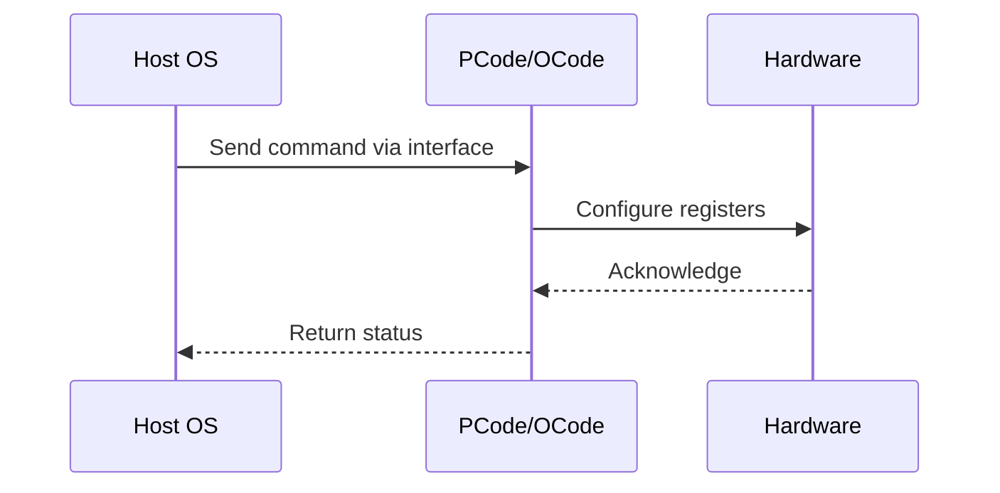

# NWP PSS Analysis

## Metadata
- HSD ID: 22021970057
- Title: MemClos Feature Discovery
- Feature: Power/RAPL
- Sub Feature: Memory PM
- Script: nwp_pss_scripts/nwp_memory_pm.py
- HSD Script: newport\pm\pss\memory\memclos.py
- TC Owner: isaxena
- TR Owner: bg3
- Validation Environment: emulation.hsle
- Test Cycle: Newport Product.trunk.pss_0p8.pss.val.NWP_NIO-HSLE
- NWP Scope: Runnable_On_N-1

## HSD Hierarchy
- Test Case Definition: [22021969898 - MemClos Initialization](https://hsdes.intel.com/appstore/article/#/22021969898)
- Test Case: [22021970057 - MemClos Feature Discovery](https://hsdes.intel.com/appstore/article/#/22021970057)
- Test Result: [22022320852 - [PSS][MEMORY] MemClos Feature Discovery](https://hsdes.intel.com/appstore/article/#/22022320852)

## KB References
- KB Article: [KB/pm_features/power_rapl/memory_pm.md](../../../KB/pm_features/power_rapl/memory_pm.md)

## Model Response

## Refined Intent
Verify MemClos feature discovery: DRC_Header.DRC_FEATURE_AVAILABLE indicates MemClos support when fuse is enabled. NWP: MemClos/DRC is ZBB'd — expect feature not available.

## Refined Test Steps
Pre-Conditions:
  - NWP: MemClos ZBB'd — negative validation

Step 1 — Read DRC_Header.DRC_FEATURE_AVAILABLE:
  On NWP: expect 0 (feature not available).

Step 2 — Check MemClos fuse:
  Verify MemClos fuse is disabled on NWP.

Pass/Fail Criteria:
  PASS (NWP): DRC_FEATURE_AVAILABLE = 0, fuse disabled
  FAIL: Feature reports available on NWP

HAS/MAS References:
  - NWP PM MAS — MemClos/DRC ZBB: https://docs.intel.com/documents/custom-xeon/newport-docs/mas/pm/nwp_imh_soc_pm_mas.html

### NWP Project Relevance
**Test Classification:** Regression (DMR-inherited)
**Feature Status:** Expected to work
**Test Purpose:** Verify MemClos feature discovery: DRC_Header.DRC_FEATURE_AVAILABLE indicates MemClos support when fuse is enabled. NWP: MemClos/DRC is ZBB'd — expect feature not available.
**Negative Test Aspect:** None
**NWP Delta:** Topology differences from DMR (2 CBB + 1 NIO); same Power/RAPL behavior expected

## Section A: Critical Execution Path
1. Step 1 — Read DRC_Header.DRC_FEATURE_AVAILABLE:
2. Step 2 — Check MemClos fuse:

## Section B: Component Interaction Diagram

## Section C: Interface Coverage Assessment
| Interface | Covered | Notes |
| --------- | ------- | ----- |
| Fuse | Yes | Primary interface |
| TPMI_IB | Yes | Primary interface |
| TPMI: DRC_Header.DRC_FEATURE_AVAILABLE | Yes | TPMI interface |

## Section D: NWP Specification References
- **NWP PM HAS**: [NWP HAS - PM Features](https://docs.intel.com/documents/custom-xeon/newport-docs/has/Overview/NWP_HAS.html#pm-features)
- **NWP PM MAS**: [NWP IMH SoC PM MAS](https://docs.intel.com/documents/custom-xeon/newport-docs/mas/pm/nwp_imh_soc_pm_mas.html)
- **DMR PM HAS**: [DMR SoC PM HAS](https://docs.intel.com/documents/pm_doc/src/server/DMR/SOC_PM_HAS/DMR_SOC_PM_HAS.html)
- **Feature HAS**: [PNC PM HAS §7 - RAPL](https://docs.intel.com/documents/pm_doc/src/server/GNR/Features/LNC/GNR_LNC_RAPL.html)
- **DMR CBB HAS**: [DMR CBB PM HAS - RAPL](https://docs.intel.com/documents/pm_doc/src/DMR_CBB/IP%20Integration/PM%20HAS/cbb_pm_has.html#rapl)
- **Intel® 64 and IA-32 SDM**: MSR definitions, CPUID enumeration

## Section E: NWP Risk Assessment
| Risk | Likelihood | Impact | Mitigation |
| ---- | ---------- | ------ | ---------- |
| Topology change | Medium | Medium | Verify on multi-die config |
| Interface delta | Low | Low | Compare with DMR baseline |
| Timing sensitivity | Low | Medium | Allow tolerance margins |

## Section F: Recommendations
1. Verify test works on NWP multi-die topology
2. Check for any interface changes from DMR
3. Update HAS references to NWP specifications
4. Add negative test coverage if missing
5. Consider additional stress test variants

---
*Generated from metadata on 2026-05-28 23:20:51*