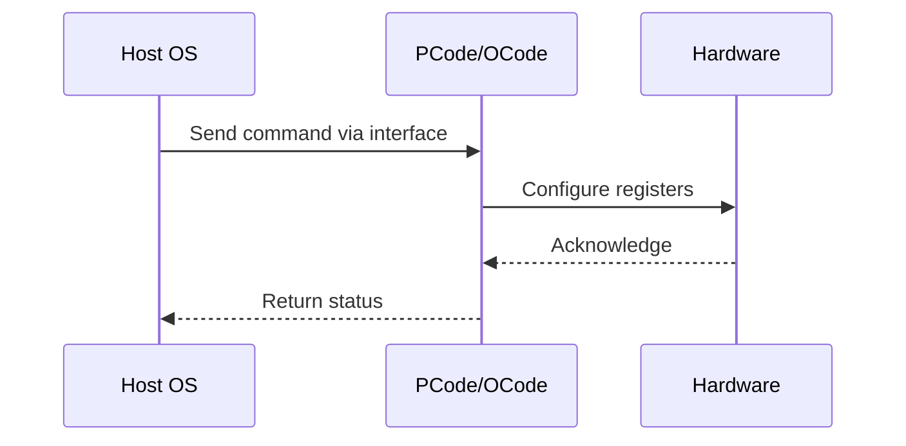

# NWP PSS Analysis

## Metadata
- HSD ID: 22021970098
- Title: PLR - Fast RAPL
- Feature: Power/RAPL
- Sub Feature: Socket RAPL
- Script: pm/pss/pmax/pmax_inject_cbb.py
- HSD Script: (none)
- TC Owner: isaxena
- TR Owner: mps
- Validation Environment: virtual_platform
- Test Cycle: Newport Product.trunk.pss_1p0.pss.val.NWP_VP
- NWP Scope: Runnable_On_N-1

## HSD Hierarchy
- Test Case Definition: [22021969916 - Fast RAPL](https://hsdes.intel.com/appstore/article/#/22021969916)
- Test Case: [22021970098 - PLR - Fast RAPL](https://hsdes.intel.com/appstore/article/#/22021970098)
- Test Result: [22022027657 - [PSS][FAST_RAPL] PLR - Fast RAPL](https://hsdes.intel.com/appstore/article/#/22022027657)

## KB References
- KB Article: [KB/pm_features/power_rapl/socket_rapl.md](../../../KB/pm_features/power_rapl/socket_rapl.md)

## Model Response

## Refined Intent
Verify PLR (Perf Limit Reasons) bits are set correctly when Fast RAPL is asserted. Fast RAPL is a HW PID control loop running every ~500µs (much faster than Primecode slowloop). Trigger by programming TDP low while keeping PL1/PL2 high, then check coarse and fine-grained PLR bits.

## Refined Test Steps
Pre-Conditions:
  - Platform booted to XOS
  - Socket RAPL functional, PL1/PL2 accessible (MSR 0x610)
  - PLR MSRs accessible: coarse-grained and fine-grained PLR

Step 1 — Program TDP to trigger Fast RAPL:
  Set TDP for the SST-PP level to a low value while keeping PL1/PL2 high.
  Either program via fuses (sst_pp_info_1) or at runtime (rapl_power_info.tdp).
  This forces the Fast RAPL HW PID loop to engage.

Step 2 — Verify Fast RAPL engagement:
  Confirm Fast RAPL is active (~500µs loop period).
  Verify frequency/power is being throttled by the HW PID loop.

Step 3 — Check coarse-grained PLR bits:
  Read MSR 0x64F (IA32_HWP_STATUS) or PACKAGE_THERM_STATUS.
  Verify RAPL-related PLR bits are set.

Step 4 — Check fine-grained PLR bits:
  Read fine-grained PLR register.
  Verify Fast RAPL specific PLR bits are set.

Step 5 — Remove Fast RAPL trigger:
  Restore TDP to normal value.
  Verify PLR bits clear after throttle is released.

Pass/Fail Criteria:
  PASS: Coarse and fine-grained PLR bits set correctly when Fast RAPL asserts, clear when released
  FAIL: PLR bits not set during Fast RAPL throttle, or stuck after release

HAS/MAS References:
  - DMR RAPL Simplification HAS — Fast RAPL: https://docs.intel.com/documents/pm_doc/src/server/DMR/PM%20Features/DMR_RAPL_Simplification.html#fast-rapl
  - Perf Limit Reasons HAS — Fast RAPL PLR: https://docs.intel.com/documents/pm_doc/src/server/GNR/Features/perf_limit_reasons/perf_limit_reasons_has.html

### NWP Project Relevance
**Test Classification:** Regression (DMR-inherited)
**Feature Status:** Expected to work
**Test Purpose:** Verify PLR (Perf Limit Reasons) bits are set correctly when Fast RAPL is asserted. Fast RAPL is a HW PID control loop running every ~500µs (much faster than Primecode slowloop). Trigger by programming
**Negative Test Aspect:** None
**NWP Delta:** Topology differences from DMR (2 CBB + 1 NIO); same Power/RAPL behavior expected

## Section A: Critical Execution Path
1. Step 1 — Program TDP to trigger Fast RAPL:
2. Step 2 — Verify Fast RAPL engagement:
3. Step 3 — Check coarse-grained PLR bits:
4. Step 4 — Check fine-grained PLR bits:
5. Step 5 — Remove Fast RAPL trigger:

## Section B: Component Interaction Diagram

## Section C: Interface Coverage Assessment
| Interface | Covered | Notes |
| --------- | ------- | ----- |
| Fuse | Yes | Primary interface |
| MSR | Yes | Primary interface |
| PLR | Yes | Primary interface |
| TPMI_IB | Yes | Primary interface |
| 0x64F IA32_HWP_STATUS | Yes | Register access |
| 0x1B1 PACKAGE_THERM_STATUS | Yes | Register access |
| TPMI: opc_pkg_therm_status | Yes | TPMI interface |
| TPMI: sst_pp_info_1 (TDP) | Yes | TPMI interface |

## Section D: NWP Specification References
- **NWP PM HAS**: [NWP HAS - PM Features](https://docs.intel.com/documents/custom-xeon/newport-docs/has/Overview/NWP_HAS.html#pm-features)
- **NWP PM MAS**: [NWP IMH SoC PM MAS](https://docs.intel.com/documents/custom-xeon/newport-docs/mas/pm/nwp_imh_soc_pm_mas.html)
- **DMR PM HAS**: [DMR SoC PM HAS](https://docs.intel.com/documents/pm_doc/src/server/DMR/SOC_PM_HAS/DMR_SOC_PM_HAS.html)
- **Feature HAS**: [PNC PM HAS §7 - RAPL](https://docs.intel.com/documents/pm_doc/src/server/GNR/Features/LNC/GNR_LNC_RAPL.html)
- **DMR CBB HAS**: [DMR CBB PM HAS - RAPL](https://docs.intel.com/documents/pm_doc/src/DMR_CBB/IP%20Integration/PM%20HAS/cbb_pm_has.html#rapl)
- **Intel® 64 and IA-32 SDM**: MSR definitions, CPUID enumeration

## Section E: NWP Risk Assessment
| Risk | Likelihood | Impact | Mitigation |
| ---- | ---------- | ------ | ---------- |
| Topology change | Medium | Medium | Verify on multi-die config |
| Interface delta | Low | Low | Compare with DMR baseline |
| Timing sensitivity | Low | Medium | Allow tolerance margins |

## Section F: Recommendations
1. Verify test works on NWP multi-die topology
2. Check for any interface changes from DMR
3. Update HAS references to NWP specifications
4. Add negative test coverage if missing
5. Consider additional stress test variants

---
*Generated from metadata on 2026-05-28 23:20:51*