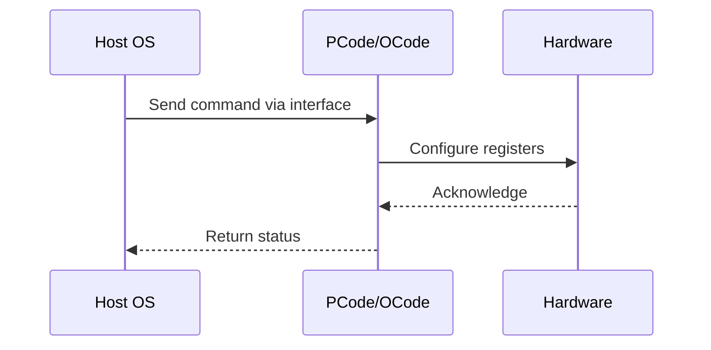

# NWP PSS Analysis

## Metadata
- HSD ID: 22021970108
- Title: PLR - Socket RAPL PL2
- Feature: Power/RAPL
- Sub Feature: Socket RAPL
- Script: pm/pss/pmax/pmax_inject_cbb.py
- HSD Script: (none)
- TC Owner: isaxena
- TR Owner: mps
- Validation Environment: virtual_platform
- Test Cycle: Newport Product.trunk.pss_1p0.pss.val.NWP_VP
- NWP Scope: Runnable_On_N-1

## HSD Hierarchy
- Test Case Definition: [22021969919 - Socket RAPL](https://hsdes.intel.com/appstore/article/#/22021969919)
- Test Case: [22021970108 - PLR - Socket RAPL PL2](https://hsdes.intel.com/appstore/article/#/22021970108)
- Test Result: [22022027540 - [PSS][SOCKET_RAPL] PLR - Socket RAPL PL2](https://hsdes.intel.com/appstore/article/#/22022027540)

## KB References
- KB Article: [KB/pm_features/power_rapl/socket_rapl.md](../../../KB/pm_features/power_rapl/socket_rapl.md)

## Model Response

## Refined Intent
Verify relevant PLR (Perf Limit Reasons) bits are set correctly when power consumed exceeds PL2 limits. RAPL power limits and time windows are programmed by BIOS via CSR; OS can reprogram via TPMI. Primecode samples the most recent PL1/PL2 and enforces across SoC. MBVR Xtors provide power data as input to the RAPL algorithm. This flow can be covered in VP with FMODS.

## Refined Test Steps
Pre-Conditions:
  - TPMI and CSR lock must be disabled
  - PL2 limit can also be set through BIOS as an additional check
  - Ingredients: Primecode, Pcode, Ocode (TPMI), BIOS (initial config), OS

Step 1 — Exceed RAPL PL2 limits:
  Either increase power consumption with a workload or injection into MBVR Xtor,
  or reduce PL2 limits.

Step 2 — Verify PLR bits are set:
  Read PLR die-level register (sv.socket0.cbb0.base.tpmi.plr_die_level).
  Verify corresponding RAPL PL2 PLR bit is set correctly.

Step 3 — Verify SST TPMI default values:
  Read SST TPMI interface default values.
  Verify they match expected programming based on fuses per
  DMR RAPL Simplification register programming spec.

Pass/Fail Criteria:
  PASS: Cores throttled based on RAPL algorithm, PLR bits set accordingly when PL2 exceeded
  FAIL: PLR bits not set when PL2 exceeded, or cores not throttled

HAS/MAS References:
  - DMR RAPL Simplification HAS — PL2 PLR: https://docs.intel.com/documents/pm_doc/src/server/DMR/PM%20Features/DMR_RAPL_Simplification.html#register-programming
  - Perf Limit Reasons HAS — RAPL bits: https://docs.intel.com/documents/pm_doc/src/server/GNR/Features/perf_limit_reasons/perf_limit_reasons_has.html

### NWP Project Relevance
**Test Classification:** Regression (DMR-inherited)
**Feature Status:** Expected to work
**Test Purpose:** Verify relevant PLR (Perf Limit Reasons) bits are set correctly when power consumed exceeds PL2 limits. RAPL power limits and time windows are programmed by BIOS via CSR; OS can reprogram via TPMI. Pr
**Negative Test Aspect:** None
**NWP Delta:** Topology differences from DMR (2 CBB + 1 NIO); same Power/RAPL behavior expected

## Section A: Critical Execution Path
1. Step 1 — Exceed RAPL PL2 limits:
2. Step 2 — Verify PLR bits are set:
3. Step 3 — Verify SST TPMI default values:

## Section B: Component Interaction Diagram

## Section C: Interface Coverage Assessment
| Interface | Covered | Notes |
| --------- | ------- | ----- |
| CSR | Yes | Primary interface |
| PLR | Yes | Primary interface |
| SVID | Yes | Primary interface |
| TPMI_IB | Yes | Primary interface |
| TPMI: plr_die_level | Yes | TPMI interface |
| TPMI: package_rapl_limit | Yes | TPMI interface |

## Section D: NWP Specification References
- **NWP PM HAS**: [NWP HAS - PM Features](https://docs.intel.com/documents/custom-xeon/newport-docs/has/Overview/NWP_HAS.html#pm-features)
- **NWP PM MAS**: [NWP IMH SoC PM MAS](https://docs.intel.com/documents/custom-xeon/newport-docs/mas/pm/nwp_imh_soc_pm_mas.html)
- **DMR PM HAS**: [DMR SoC PM HAS](https://docs.intel.com/documents/pm_doc/src/server/DMR/SOC_PM_HAS/DMR_SOC_PM_HAS.html)
- **Feature HAS**: [PNC PM HAS §7 - RAPL](https://docs.intel.com/documents/pm_doc/src/server/GNR/Features/LNC/GNR_LNC_RAPL.html)
- **DMR CBB HAS**: [DMR CBB PM HAS - RAPL](https://docs.intel.com/documents/pm_doc/src/DMR_CBB/IP%20Integration/PM%20HAS/cbb_pm_has.html#rapl)
- **Intel® 64 and IA-32 SDM**: MSR definitions, CPUID enumeration

## Section E: NWP Risk Assessment
| Risk | Likelihood | Impact | Mitigation |
| ---- | ---------- | ------ | ---------- |
| Topology change | Medium | Medium | Verify on multi-die config |
| Interface delta | Low | Low | Compare with DMR baseline |
| Timing sensitivity | Low | Medium | Allow tolerance margins |

## Section F: Recommendations
1. Verify test works on NWP multi-die topology
2. Check for any interface changes from DMR
3. Update HAS references to NWP specifications
4. Add negative test coverage if missing
5. Consider additional stress test variants

---
*Generated from metadata on 2026-05-28 23:20:51*