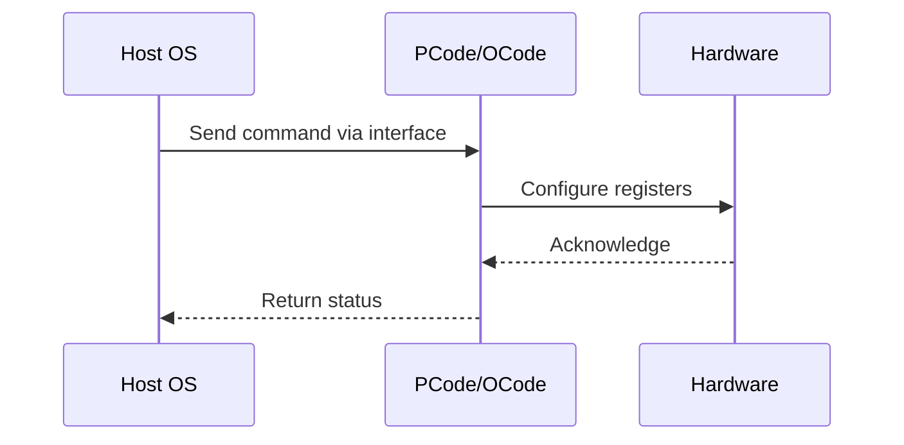

# NWP PSS Analysis

## Metadata
- HSD ID: 22021970110
- Title: Perf Status - Socket RAPL
- Feature: Power/RAPL
- Sub Feature: Socket RAPL
- Script: pm/pss/pmax/pmax_inject_mcp_monitoring.py
- HSD Script: (none)
- TC Owner: isaxena
- TR Owner: mps
- Validation Environment: virtual_platform
- Test Cycle: Newport Product.trunk.pss_1p0.pss.val.NWP_VP
- NWP Scope: Runnable_On_N-1

## HSD Hierarchy
- Test Case Definition: [22021969919 - Socket RAPL](https://hsdes.intel.com/appstore/article/#/22021969919)
- Test Case: [22021970110 - Perf Status - Socket RAPL](https://hsdes.intel.com/appstore/article/#/22021970110)
- Test Result: [22022027539 - [PSS][SOCKET_RAPL] Perf Status - Socket RAPL](https://hsdes.intel.com/appstore/article/#/22022027539)

## KB References
- KB Article: [KB/pm_features/power_rapl/socket_rapl.md](../../../KB/pm_features/power_rapl/socket_rapl.md)

## Model Response

## Refined Intent
Verify RAPL perf status counter moves as RAPL is limiting power/performance. RAPL algorithm is implemented in Primecode and enforces power consumed by SoC to within PL1/PL2. In NWP only Socket RAPL is implemented (DRAM RAPL and Platform RAPL are ZBB). BIOS, OS and FW are required for simulating end-to-end RAPL flow.

## Refined Test Steps
Pre-Conditions:
  - No special configuration required, boot with default fuses
  - BIOS knobs: PL1 enable, PL1 power limit, PL1 time window, PL2 enable, PL2 power limit, PL2 time window
  - Ingredients: BIOS, OS, Pcode

Step 1 — Request >Pn ratios:
  Request >Pn ratios on Core/mesh.

Step 2 — Set RAPL PL1/PL2 to low values:
  Set Socket RAPL PL1 and PL2 to low values via BIOS or TPMI.

Step 3 — Read Perf Status before and after:
  Read socket RAPL Perf Status (package_rapl_perf_status.pwr_limit_throttle_ctr)
  before and after programming power limits.

Pass/Fail Criteria:
  PASS: RAPL perf status counter increments when RAPL is limiting power
  FAIL: Perf status counter does not increment during RAPL throttling

HAS/MAS References:
  - DMR RAPL Simplification HAS — Perf Status: https://docs.intel.com/documents/pm_doc/src/server/DMR/PM%20Features/DMR_RAPL_Simplification.html
  - Socket RAPL HAS (Wave3): https://docs.intel.com/documents/pm_doc/src/server/Wave3_common/Socket_RAPL/Socket_RAPL.html

### NWP Project Relevance
**Test Classification:** Regression (DMR-inherited)
**Feature Status:** Expected to work
**Test Purpose:** Verify RAPL perf status counter moves as RAPL is limiting power/performance. RAPL algorithm is implemented in Primecode and enforces power consumed by SoC to within PL1/PL2. In NWP only Socket RAPL is
**Negative Test Aspect:** None
**NWP Delta:** Topology differences from DMR (2 CBB + 1 NIO); same Power/RAPL behavior expected

## Section A: Critical Execution Path
1. Step 1 — Request >Pn ratios:
2. Step 2 — Set RAPL PL1/PL2 to low values:
3. Step 3 — Read Perf Status before and after:

## Section B: Component Interaction Diagram

## Section C: Interface Coverage Assessment
| Interface | Covered | Notes |
| --------- | ------- | ----- |
| B2P | Yes | Primary interface |
| CSR | Yes | Primary interface |
| MSR | Yes | Primary interface |
| TPMI_IB | Yes | Primary interface |
| 0x610 PKG_POWER_LIMIT | Yes | Register access |

## Section D: NWP Specification References
- **NWP PM HAS**: [NWP HAS - PM Features](https://docs.intel.com/documents/custom-xeon/newport-docs/has/Overview/NWP_HAS.html#pm-features)
- **NWP PM MAS**: [NWP IMH SoC PM MAS](https://docs.intel.com/documents/custom-xeon/newport-docs/mas/pm/nwp_imh_soc_pm_mas.html)
- **DMR PM HAS**: [DMR SoC PM HAS](https://docs.intel.com/documents/pm_doc/src/server/DMR/SOC_PM_HAS/DMR_SOC_PM_HAS.html)
- **Feature HAS**: [PNC PM HAS §7 - RAPL](https://docs.intel.com/documents/pm_doc/src/server/GNR/Features/LNC/GNR_LNC_RAPL.html)
- **DMR CBB HAS**: [DMR CBB PM HAS - RAPL](https://docs.intel.com/documents/pm_doc/src/DMR_CBB/IP%20Integration/PM%20HAS/cbb_pm_has.html#rapl)
- **Intel® 64 and IA-32 SDM**: MSR definitions, CPUID enumeration

## Section E: NWP Risk Assessment
| Risk | Likelihood | Impact | Mitigation |
| ---- | ---------- | ------ | ---------- |
| Topology change | Medium | Medium | Verify on multi-die config |
| Interface delta | Low | Low | Compare with DMR baseline |
| Timing sensitivity | Low | Medium | Allow tolerance margins |

## Section F: Recommendations
1. Verify test works on NWP multi-die topology
2. Check for any interface changes from DMR
3. Update HAS references to NWP specifications
4. Add negative test coverage if missing
5. Consider additional stress test variants

---
*Generated from metadata on 2026-05-28 23:20:51*