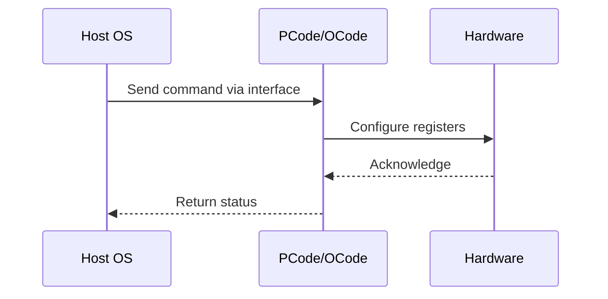

# NWP PSS Analysis

## Metadata
- HSD ID: 22021970114
- Title: UFS x RAPL
- Feature: Power/RAPL
- Sub Feature: Socket RAPL
- Script: pm/pss/ufs/ufs_tpmi.py
- HSD Script: (none)
- TC Owner: isaxena
- TR Owner: nkudliba
- Validation Environment: xos
- Test Cycle: 
- NWP Scope: Runnable_On_N-1

## HSD Hierarchy
- Test Case Definition: [22021969919 - Socket RAPL](https://hsdes.intel.com/appstore/article/#/22021969919)
- Test Case: [22021970114 - UFS x RAPL](https://hsdes.intel.com/appstore/article/#/22021970114)
- Test Result: [22022027596 - [PSS][SOCKET_RAPL] UFS x RAPL](https://hsdes.intel.com/appstore/article/#/22022027596)

## KB References
- KB Article: [KB/pm_features/power_rapl/socket_rapl.md](../../../KB/pm_features/power_rapl/socket_rapl.md)

## Model Response

## Refined Intent
Verify RAPL impact on CBB and IMH mesh frequencies. RAPL algorithm is implemented in Primecode and enforces power consumed by SoC to within PL1/PL2. In NWP only Socket RAPL is implemented (DRAM RAPL and Platform RAPL are ZBB). RAPL limits are programmed by BIOS via CSR and OS can reprogram via TPMI. Primecode samples the most recent PL1/PL2 and enforces across SoC. MBVR Xtors provide power data as input to the RAPL algorithm.

## Refined Test Steps
Pre-Conditions:
  - Platform booted with default fuses, no special configuration
  - BIOS knobs: PL1/2 enable, PL1/2 power limit, PL1/2 time window
  - BIOS, OS, and Pcode all required for end-to-end RAPL flow

Step 1 — Baseline mesh frequency and power:
  Read CBB mesh frequency and power consumed.
  Read IMH mesh frequency and power consumed.
  Record baseline values.

Step 2 — Reduce RAPL PL1 limit at runtime via TPMI:
  Write lower PL1 via TPMI (package_rapl_limit.pkg_pwr_lim_1).
  Wait for Primecode to sample the new limit.

Step 3 — Verify mesh frequency reduction from PL1:
  Read CBB mesh frequency — verify it reduces appropriately.
  Read IMH mesh frequency — verify it reduces appropriately.
  Verify IO Fabric frequency is NOT limited by RAPL.

Step 4 — Lower PL2 as well:
  Write lower PL2 via TPMI (package_rapl_limit.pkg_pwr_lim_2).
  Wait for Primecode to sample the new limit.

Step 5 — Verify mesh frequency reduction from PL2:
  Read CBB mesh frequency — verify further reduction.
  Read IMH mesh frequency — verify further reduction.
  Verify IO Fabric frequency is still NOT limited by RAPL.

Step 6 — Observe Fabric GV changes:
  Confirm Fabric GV changes as system hits RAPL limit.
  Confirm only memory and CBB Fabric are limited, not IO Fabric.

Pass/Fail Criteria:
  PASS: Fabric GV changes as system hits RAPL limit; IO Fabric not limited by RAPL, only memory and CBB Fabric
  FAIL: No mesh frequency reduction on PL1/PL2 lowering, or IO Fabric incorrectly throttled by RAPL

HAS/MAS References:
  - DMR RAPL Simplification HAS — UFS x RAPL: https://docs.intel.com/documents/pm_doc/src/server/DMR/PM%20Features/DMR_RAPL_Simplification.html
  - NWP PM MAS — Socket RAPL only: https://docs.intel.com/documents/custom-xeon/newport-docs/mas/pm/nwp_imh_soc_pm_mas.html

### NWP Project Relevance
**Test Classification:** Regression (DMR-inherited)
**Feature Status:** Expected to work
**Test Purpose:** Verify RAPL impact on CBB and IMH mesh frequencies. RAPL algorithm is implemented in Primecode and enforces power consumed by SoC to within PL1/PL2. In NWP only Socket RAPL is implemented (DRAM RAPL a
**Negative Test Aspect:** None
**NWP Delta:** Topology differences from DMR (2 CBB + 1 NIO); same Power/RAPL behavior expected

## Section A: Critical Execution Path
1. Step 1 — Baseline mesh frequency and power:
2. Step 2 — Reduce RAPL PL1 limit at runtime via TPMI:
3. Step 3 — Verify mesh frequency reduction from PL1:
4. Step 4 — Lower PL2 as well:
5. Step 5 — Verify mesh frequency reduction from PL2:

## Section B: Component Interaction Diagram

## Section C: Interface Coverage Assessment
| Interface | Covered | Notes |
| --------- | ------- | ----- |
| CSR | Yes | Primary interface |
| MSR | Yes | Primary interface |
| SVID | Yes | Primary interface |
| TPMI_IB | Yes | Primary interface |
| 0x610 PKG_POWER_LIMIT | Yes | Register access |
| TPMI: ufs_status/control | Yes | TPMI interface |
| TPMI: package_rapl_limit | Yes | TPMI interface |

## Section D: NWP Specification References
- **NWP PM HAS**: [NWP HAS - PM Features](https://docs.intel.com/documents/custom-xeon/newport-docs/has/Overview/NWP_HAS.html#pm-features)
- **NWP PM MAS**: [NWP IMH SoC PM MAS](https://docs.intel.com/documents/custom-xeon/newport-docs/mas/pm/nwp_imh_soc_pm_mas.html)
- **DMR PM HAS**: [DMR SoC PM HAS](https://docs.intel.com/documents/pm_doc/src/server/DMR/SOC_PM_HAS/DMR_SOC_PM_HAS.html)
- **Feature HAS**: [PNC PM HAS §7 - RAPL](https://docs.intel.com/documents/pm_doc/src/server/GNR/Features/LNC/GNR_LNC_RAPL.html)
- **DMR CBB HAS**: [DMR CBB PM HAS - RAPL](https://docs.intel.com/documents/pm_doc/src/DMR_CBB/IP%20Integration/PM%20HAS/cbb_pm_has.html#rapl)
- **Intel® 64 and IA-32 SDM**: MSR definitions, CPUID enumeration

## Section E: NWP Risk Assessment
| Risk | Likelihood | Impact | Mitigation |
| ---- | ---------- | ------ | ---------- |
| Topology change | Medium | Medium | Verify on multi-die config |
| Interface delta | Low | Low | Compare with DMR baseline |
| Timing sensitivity | Low | Medium | Allow tolerance margins |

## Section F: Recommendations
1. Verify test works on NWP multi-die topology
2. Check for any interface changes from DMR
3. Update HAS references to NWP specifications
4. Add negative test coverage if missing
5. Consider additional stress test variants

---
*Generated from metadata on 2026-05-28 23:20:51*