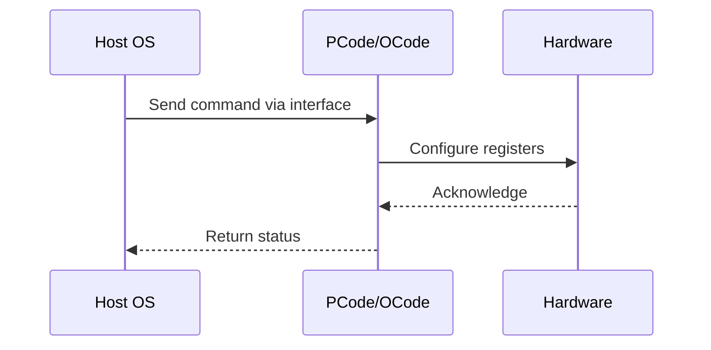

# NWP PSS Analysis

## Metadata
- HSD ID: 22021970115
- Title: Verify Mistletoe PRT
- Feature: Power/RAPL
- Sub Feature: Socket RAPL
- Script: pm/pss/pmax/pmax_inject_mcp.py
- HSD Script: (none)
- TC Owner: isaxena
- TR Owner: mps
- Validation Environment: virtual_platform
- Test Cycle: Newport Product.trunk.pss_1p0.pss.val.NWP_VP
- NWP Scope: Runnable_On_N-1

## HSD Hierarchy
- Test Case Definition: [22021969919 - Socket RAPL](https://hsdes.intel.com/appstore/article/#/22021969919)
- Test Case: [22021970115 - Verify Mistletoe PRT](https://hsdes.intel.com/appstore/article/#/22021970115)
- Test Result: [22022027552 - [PSS][SOCKET_RAPL] Verify Mistletoe PRT](https://hsdes.intel.com/appstore/article/#/22022027552)

## KB References
- KB Article: [KB/pm_features/power_rapl/socket_rapl.md](../../../KB/pm_features/power_rapl/socket_rapl.md)

## Model Response

## Refined Intent
Verify the Mistletoe PRT algorithm is working correctly. Mistletoe PRT operates within IMH Primecode and is related to RAPL enforcement. It mitigates power excursions by applying specific throttling strategies when RAPL limits are exceeded. RAPL algorithm is implemented in Primecode and enforces power consumed by SoC to within PL1/PL2. In NWP only Socket RAPL is implemented (DRAM RAPL and Platform RAPL are ZBB).

## Refined Test Steps
Pre-Conditions:
  - No special configuration required, boot with default fuses
  - BIOS knobs: PL1/2 enable, PL1/2 power limit, PL1/2 time window
  - Ingredients: BIOS, OS, Pcode

Step 1 — Check energy filtering enable:
  Read energy_filtering_enable bit in misc_package_ctls MSR.

Step 2 — Enable Mistletoe PRT:
  Enable Mistletoe PRT via MSR.
  Check energy reporting before and after enabling.
  Use registers to read pkg energy consumption and energy noise:
  imh0.punit.ptpcfsms.ptpcfsms.socket_rapl_energy_status
  imh0.punit.ptpcioregs.ptpcioregs.package_energy_status
  imh0.pcodeio_map.io_package_energy_status
  imh0.pcudata.pkgRAPLDomain.mistletoe_energy_noise
  pcudata.raplVars.patch_persistent.energy_fuzzing_enable
  pcudata.pkgRAPLDomain.pkg_energy_fuzzed_0
  pcudata.pkgRAPLDomain.pkg_energy_fuzzed_1

Step 3 — Reduce RAPL PL1 and monitor:
  Reduce RAPL PL1 limit in runtime via TPMI (package_rapl_limit.pkg_pwr_lim_1).
  Increase it back again.
  Continue monitoring energy reporting throughout.

Step 4 — Verify Mistletoe noise:
  Verify energy reporting shows added noise once Mistletoe is enabled,
  even when throttled via PL1.

Pass/Fail Criteria:
  PASS: Energy reporting shows added noise once Mistletoe PRT is enabled, even when throttled via PL1
  FAIL: No noise added to energy reporting after Mistletoe PRT enablement

HAS/MAS References:
  - DMR RAPL Simplification HAS — Mistletoe PRT: https://docs.intel.com/documents/pm_doc/src/server/DMR/PM%20Features/DMR_RAPL_Simplification.html

### NWP Project Relevance
**Test Classification:** Regression (DMR-inherited)
**Feature Status:** Expected to work
**Test Purpose:** Verify the Mistletoe PRT algorithm is working correctly. Mistletoe PRT operates within IMH Primecode and is related to RAPL enforcement. It mitigates power excursions by applying specific throttling s
**Negative Test Aspect:** None
**NWP Delta:** Topology differences from DMR (2 CBB + 1 NIO); same Power/RAPL behavior expected

## Section A: Critical Execution Path
1. Step 1 — Check energy filtering enable:
2. Step 2 — Enable Mistletoe PRT:
3. Step 3 — Reduce RAPL PL1 and monitor:
4. Step 4 — Verify Mistletoe noise:

## Section B: Component Interaction Diagram

## Section C: Interface Coverage Assessment
| Interface | Covered | Notes |
| --------- | ------- | ----- |
| CSR | Yes | Primary interface |
| MSR | Yes | Primary interface |
| PCUData | Yes | Primary interface |
| TPMI_IB | Yes | Primary interface |
| misc_package_ctls (energy_filtering_enable) | Yes | Register access |
| TPMI: package_rapl_limit | Yes | TPMI interface |
| TPMI: socket_rapl_energy_status | Yes | TPMI interface |

## Section D: NWP Specification References
- **NWP PM HAS**: [NWP HAS - PM Features](https://docs.intel.com/documents/custom-xeon/newport-docs/has/Overview/NWP_HAS.html#pm-features)
- **NWP PM MAS**: [NWP IMH SoC PM MAS](https://docs.intel.com/documents/custom-xeon/newport-docs/mas/pm/nwp_imh_soc_pm_mas.html)
- **DMR PM HAS**: [DMR SoC PM HAS](https://docs.intel.com/documents/pm_doc/src/server/DMR/SOC_PM_HAS/DMR_SOC_PM_HAS.html)
- **Feature HAS**: [PNC PM HAS §7 - RAPL](https://docs.intel.com/documents/pm_doc/src/server/GNR/Features/LNC/GNR_LNC_RAPL.html)
- **DMR CBB HAS**: [DMR CBB PM HAS - RAPL](https://docs.intel.com/documents/pm_doc/src/DMR_CBB/IP%20Integration/PM%20HAS/cbb_pm_has.html#rapl)
- **Intel® 64 and IA-32 SDM**: MSR definitions, CPUID enumeration

## Section E: NWP Risk Assessment
| Risk | Likelihood | Impact | Mitigation |
| ---- | ---------- | ------ | ---------- |
| Topology change | Medium | Medium | Verify on multi-die config |
| Interface delta | Low | Low | Compare with DMR baseline |
| Timing sensitivity | Low | Medium | Allow tolerance margins |

## Section F: Recommendations
1. Verify test works on NWP multi-die topology
2. Check for any interface changes from DMR
3. Update HAS references to NWP specifications
4. Add negative test coverage if missing
5. Consider additional stress test variants

---
*Generated from metadata on 2026-05-28 23:20:51*