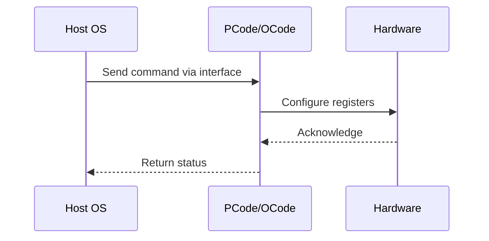

# NWP PSS Analysis

## Metadata
- HSD ID: 22021970182
- Title: BIOS configuration
- Feature: Power/RAPL
- Sub Feature: PMAX
- Script: pm/pss/pmax/pmax_inject_cbb.py
- HSD Script: (none)
- TC Owner: aprakas2
- TR Owner: mps
- Validation Environment: emulation.hsle,xos
- Test Cycle: Newport Product.trunk.pss_0p8.pss.val.NWP_MCP HSLE XOS
- NWP Scope: Runnable_On_N-1

## HSD Hierarchy
- Test Case Definition: [22021969944 - PMAX Configuration](https://hsdes.intel.com/appstore/article/#/22021969944)
- Test Case: [22021970182 - BIOS configuration](https://hsdes.intel.com/appstore/article/#/22021970182)
- Test Result: [22022027576 - [PSS][PMAX] BIOS configuration](https://hsdes.intel.com/appstore/article/#/22022027576)

## KB References
- KB Article: [KB/pm_features/power_rapl/pmax.md](../../../KB/pm_features/power_rapl/pmax.md)

## Model Response

## Refined Intent
Validate PMAX configuration using BIOS and TPMI interface. BIOS reads dual VccIN loadlines (iMH0/iMH1) via Primecode, determines if VTRIP offset adjustment is needed, and programs PMAX_CONTROL per iMH. Verify PMAX_CONTROL.PMAX_VTRIP_0_OFFSET[6:0] (TPMI ID 0x3, signed bit 6, 2mV resolution per bit [5:0]), PMAX_GPIO_TRANSMITTER_ENABLE[32], and PMAX_GPIO_TRIGGER_ENABLE[33].

## Refined Test Steps
Pre-Conditions:
  - Platform booted, BIOS has programmed PMAX_CONTROL registers
  - Dual VccIN VRs present (different loadlines possible per iMH)
  - TPMI accessible via PythonSV

Step 1 — Read BIOS-programmed PMAX_CONTROL per iMH:
  Read iMH0 PMAX_CONTROL (TPMI ID 0x3):
    PMAX_VTRIP_0_OFFSET[6:0] — signed, bit 6 is sign, [5:0] = offset in 2mV steps.
    PMAX_GPIO_TRANSMITTER_ENABLE[32] — CPU-detected PMAX asserts xxPMAX_TRIGGER_IO.
    PMAX_GPIO_TRIGGER_ENABLE[33] — platform can trigger PMAX via xxPMAX_TRIGGER_IO.
  Read iMH1 PMAX_CONTROL — same fields.
  Verify offsets reflect dual VccIN loadline differences.

Step 2 — Validate TPMI write of VTRIP offset:
  Write new PMAX_VTRIP_0_OFFSET value via TPMI (TPMI ID 0x3).
  Read back — verify value matches.
  Verify monotonic relationship: raising offset effectively reduces IccMax trip threshold.

Step 3 — Verify GPIO configuration:
  Set PMAX_GPIO_TRANSMITTER_ENABLE = 1 — verify CPU PMAX events propagate to xxPMAX_TRIGGER_IO pin.
  Set PMAX_GPIO_TRIGGER_ENABLE = 1 — verify platform can trigger PMAX via pin assertion.

Step 4 — Verify PMAX trip level adjustment effect:
  Apply positive VTRIP offset — verify PMAX trips at lower VccIN current.
  Apply negative VTRIP offset — verify PMAX trips at higher VccIN current.
  Verify adjustment works without changing HVM fuses (controllability use case).

Pass/Fail Criteria:
  PASS: PMAX_CONTROL.PMAX_VTRIP_0_OFFSET programmed correctly per iMH, TPMI read/write consistent, GPIO enables functional
  FAIL: VTRIP offset mismatch, TPMI write rejected, or GPIO configuration has no effect

HAS/MAS References:
  - DMR PMax HAS — BIOS Configuration / TPMI VTRIP: https://docs.intel.com/documents/pm_doc/src/server/DMR/PM%20Features/DMR_PMax.html#bios-configuration
  - TPMI HAS — PMAX_CONTROL (TPMI ID 0x3): https://docs.intel.com/documents/pm_doc/src/server/arch_common/TPMI/TPMI.html

### NWP Project Relevance
**Test Classification:** Regression (DMR-inherited)
**Feature Status:** Expected to work
**Test Purpose:** Validate PMAX configuration using BIOS and TPMI interface. BIOS reads dual VccIN loadlines (iMH0/iMH1) via Primecode, determines if VTRIP offset adjustment is needed, and programs PMAX_CONTROL per iMH
**Negative Test Aspect:** None
**NWP Delta:** Topology differences from DMR (2 CBB + 1 NIO); same Power/RAPL behavior expected

## Section A: Critical Execution Path
1. Step 1 — Read BIOS-programmed PMAX_CONTROL per iMH:
2. Step 2 — Validate TPMI write of VTRIP offset:
3. Step 3 — Verify GPIO configuration:
4. Step 4 — Verify PMAX trip level adjustment effect:

## Section B: Component Interaction Diagram

## Section C: Interface Coverage Assessment
| Interface | Covered | Notes |
| --------- | ------- | ----- |
| B2P | Yes | Primary interface |
| CSR | Yes | Primary interface |
| Fuse | Yes | Primary interface |
| TPMI_IB | Yes | Primary interface |
| TPMI: PMAX_CONTROL (TPMI ID 0x3) | Yes | TPMI interface |

## Section D: NWP Specification References
- **NWP PM HAS**: [NWP HAS - PM Features](https://docs.intel.com/documents/custom-xeon/newport-docs/has/Overview/NWP_HAS.html#pm-features)
- **NWP PM MAS**: [NWP IMH SoC PM MAS](https://docs.intel.com/documents/custom-xeon/newport-docs/mas/pm/nwp_imh_soc_pm_mas.html)
- **DMR PM HAS**: [DMR SoC PM HAS](https://docs.intel.com/documents/pm_doc/src/server/DMR/SOC_PM_HAS/DMR_SOC_PM_HAS.html)
- **Feature HAS**: [PNC PM HAS §7 - RAPL](https://docs.intel.com/documents/pm_doc/src/server/GNR/Features/LNC/GNR_LNC_RAPL.html)
- **DMR CBB HAS**: [DMR CBB PM HAS - RAPL](https://docs.intel.com/documents/pm_doc/src/DMR_CBB/IP%20Integration/PM%20HAS/cbb_pm_has.html#rapl)
- **Intel® 64 and IA-32 SDM**: MSR definitions, CPUID enumeration

## Section E: NWP Risk Assessment
| Risk | Likelihood | Impact | Mitigation |
| ---- | ---------- | ------ | ---------- |
| Topology change | Medium | Medium | Verify on multi-die config |
| Interface delta | Low | Low | Compare with DMR baseline |
| Timing sensitivity | Low | Medium | Allow tolerance margins |

## Section F: Recommendations
1. Verify test works on NWP multi-die topology
2. Check for any interface changes from DMR
3. Update HAS references to NWP specifications
4. Add negative test coverage if missing
5. Consider additional stress test variants

---
*Generated from metadata on 2026-05-28 23:20:51*