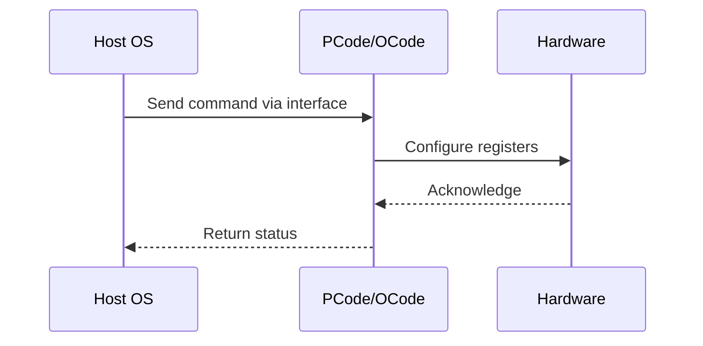

# NWP PSS Analysis

## Metadata
- HSD ID: 22021970204
- Title: SIMPL - All Fuses Verification
- Feature: Power/RAPL
- Sub Feature: SIMPL
- Script: nwp_pss_scripts/pss_simpl.py
- HSD Script: (none)
- TC Owner: isaxena
- TR Owner: mps
- Validation Environment: virtual_platform
- Test Cycle: Newport Product.trunk.pss_1p0.pss.val.NWP_VP
- NWP Scope: Runnable_On_N-1

## HSD Hierarchy
- Test Case Definition: [22021969948 - SIMPL E2E FLOW](https://hsdes.intel.com/appstore/article/#/22021969948)
- Test Case: [22021970204 - SIMPL - All Fuses Verification](https://hsdes.intel.com/appstore/article/#/22021970204)
- Test Result: [22022027630 - [PSS][SIMPL] SIMPL - All Fuses Verification](https://hsdes.intel.com/appstore/article/#/22022027630)

## KB References
- KB Article: [KB/pm_features/power_rapl/simpl.md](../../../KB/pm_features/power_rapl/simpl.md)

## Model Response

## Refined Intent
SIMPL enabling and TPMI register discovery. Read SIMPL_DFC_CONTROL/STATUS registers, verify SIMPL Policy 0 is active and fuses are correctly programmed. NWP supports single SIMPL policy.

## Refined Test Steps
Pre-Conditions:
  - NWP platform booted with default SIMPL fuses

Step 1 — Read SIMPL discovery registers:
  SIMPL_DFC_STATUS: SIMPL_NUM_POLICIES [3:0] — expect 1.
  SIMPL_DFC_STATUS: SIMPL_CURRENT_POLICY [11:8] — expect 0.
  PFM_STATUS: PFM_SOC_NUM_POLICIES — expect 1.

Step 2 — Verify SIMPL_DFC_CONTROL defaults:
  SIMPL_MAX_POLICY_OVRD = fuse NUM_SIMPL_POLICIES.
  SIMPL_MIN_POLICY_OVRD = 0.
  SIMPL_CBB_DFC_Mode — verify matches fuse SIMPL_CBB_DFC_EN.

Step 3 — Verify all SIMPL fuses:
  Read PCODE_SIMPL_POLICY_0_IMH_CFCIO_MAX_FREQ.
  Read PCODE_SIMPL_POLICY_0_IMH_CFCMEM_MAX_FREQ.
  Read SIMPL_POLICY_0_CBB_CFC_MAX_FREQ.
  Read SIMPL_POLICY_0_CBB_CCP_MAX_FREQ_CDYN_[0..5].

Pass/Fail Criteria:
  PASS: SIMPL Policy 0 discovered, fuses match expected values
  FAIL: NUM_POLICIES=0 or fuse mismatch

HAS/MAS References:
  - DMR SIMPL HAS — Discovery / DFC_STATUS: https://docs.intel.com/documents/pm_doc/src/server/DMR/PM%20Features/DMR_SIMPL.html

### NWP Project Relevance
**Test Classification:** Regression (DMR-inherited)
**Feature Status:** Expected to work
**Test Purpose:** SIMPL enabling and TPMI register discovery. Read SIMPL_DFC_CONTROL/STATUS registers, verify SIMPL Policy 0 is active and fuses are correctly programmed. NWP supports single SIMPL policy.
**Negative Test Aspect:** None
**NWP Delta:** Topology differences from DMR (2 CBB + 1 NIO); same Power/RAPL behavior expected

## Section A: Critical Execution Path
1. Step 1 — Read SIMPL discovery registers:
2. Step 2 — Verify SIMPL_DFC_CONTROL defaults:
3. Step 3 — Verify all SIMPL fuses:

## Section B: Component Interaction Diagram

## Section C: Interface Coverage Assessment
| Interface | Covered | Notes |
| --------- | ------- | ----- |
| Fuse | Yes | Primary interface |
| PCUData | Yes | Primary interface |
| TPMI_IB | Yes | Primary interface |
| TPMI: SIMPL_DFC_STATUS | Yes | TPMI interface |
| TPMI: SIMPL_DFC_CONTROL | Yes | TPMI interface |
| TPMI: PFM_STATUS | Yes | TPMI interface |

## Section D: NWP Specification References
- **NWP PM HAS**: [NWP HAS - PM Features](https://docs.intel.com/documents/custom-xeon/newport-docs/has/Overview/NWP_HAS.html#pm-features)
- **NWP PM MAS**: [NWP IMH SoC PM MAS](https://docs.intel.com/documents/custom-xeon/newport-docs/mas/pm/nwp_imh_soc_pm_mas.html)
- **DMR PM HAS**: [DMR SoC PM HAS](https://docs.intel.com/documents/pm_doc/src/server/DMR/SOC_PM_HAS/DMR_SOC_PM_HAS.html)
- **Feature HAS**: [PNC PM HAS §7 - RAPL](https://docs.intel.com/documents/pm_doc/src/server/GNR/Features/LNC/GNR_LNC_RAPL.html)
- **DMR CBB HAS**: [DMR CBB PM HAS - RAPL](https://docs.intel.com/documents/pm_doc/src/DMR_CBB/IP%20Integration/PM%20HAS/cbb_pm_has.html#rapl)
- **Intel® 64 and IA-32 SDM**: MSR definitions, CPUID enumeration

## Section E: NWP Risk Assessment
| Risk | Likelihood | Impact | Mitigation |
| ---- | ---------- | ------ | ---------- |
| Topology change | Medium | Medium | Verify on multi-die config |
| Interface delta | Low | Low | Compare with DMR baseline |
| Timing sensitivity | Low | Medium | Allow tolerance margins |

## Section F: Recommendations
1. Verify test works on NWP multi-die topology
2. Check for any interface changes from DMR
3. Update HAS references to NWP specifications
4. Add negative test coverage if missing
5. Consider additional stress test variants

---
*Generated from metadata on 2026-05-28 23:20:51*