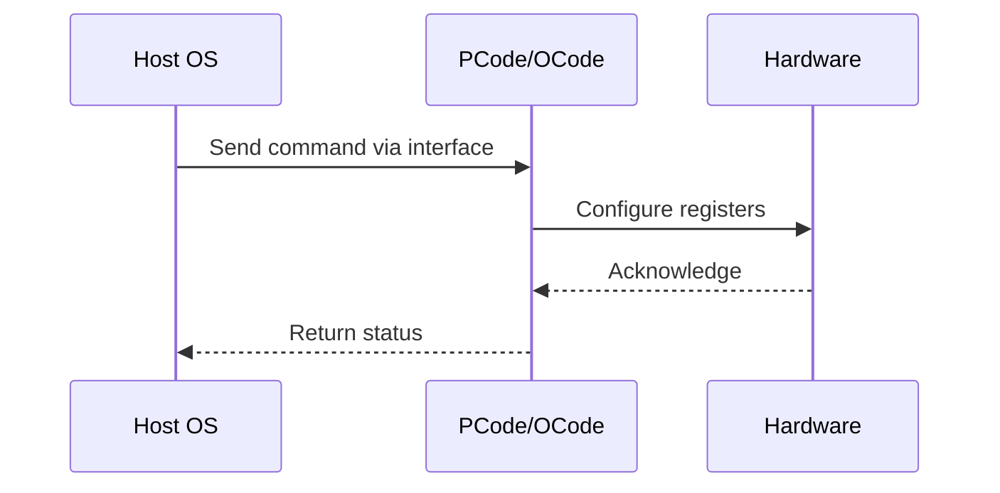

# NWP PSS Analysis

## Metadata
- HSD ID: 22021970205
- Title: SIMPL Policy 0 Verification
- Feature: Power/RAPL
- Sub Feature: SIMPL
- Script: nwp_pss_scripts/pss_simpl.py
- HSD Script: (none)
- TC Owner: isaxena
- TR Owner: mps
- Validation Environment: virtual_platform
- Test Cycle: Newport Product.trunk.pss_1p0.pss.val.NWP_VP
- NWP Scope: Runnable_On_N-1

## HSD Hierarchy
- Test Case Definition: [22021969948 - SIMPL E2E FLOW](https://hsdes.intel.com/appstore/article/#/22021969948)
- Test Case: [22021970205 - SIMPL Policy 0 Verification](https://hsdes.intel.com/appstore/article/#/22021970205)
- Test Result: [22022027647 - [PSS][SIMPL] SIMPL Policy 0 Verification](https://hsdes.intel.com/appstore/article/#/22022027647)

## KB References
- KB Article: [KB/pm_features/power_rapl/simpl.md](../../../KB/pm_features/power_rapl/simpl.md)

## Model Response

## Refined Intent
Verify SIMPL Policy 0 enforces correct core/mesh/fabric frequency ceilings per fused limits. NWP supports single SIMPL policy (Policy 0).

## Refined Test Steps
Pre-Conditions:
  - NWP platform booted with default SIMPL fuses

Step 1 — Verify Policy 0 active:
  Read pcudata.patch_persistent.current_policy — expect 0.
  Read SIMPL_DFC_STATUS.SIMPL_CURRENT_POLICY — expect 0.

Step 2 — Request high core + mesh frequencies:
  Inject high P-state request on cores.
  Request max mesh frequency.
  Verify frequencies do not exceed Policy 0 fused ceilings.

Step 3 — Reduce fused max frequencies and reboot:
  Modify SIMPL Policy 0 fuses to lower ceilings.
  Reboot and repeat Steps 1-2.
  Verify new lower ceilings are enforced.

Pass/Fail Criteria:
  PASS: Core/mesh frequency ceilings match SIMPL Policy 0 fuses
  FAIL: Frequency exceeds fused SIMPL Policy 0 limits

HAS/MAS References:
  - DMR SIMPL HAS — Policy 0 Enforcement: https://docs.intel.com/documents/pm_doc/src/server/DMR/PM%20Features/DMR_SIMPL.html

### NWP Project Relevance
**Test Classification:** Regression (DMR-inherited)
**Feature Status:** Expected to work
**Test Purpose:** Verify SIMPL Policy 0 enforces correct core/mesh/fabric frequency ceilings per fused limits. NWP supports single SIMPL policy (Policy 0).
**Negative Test Aspect:** None
**NWP Delta:** Topology differences from DMR (2 CBB + 1 NIO); same Power/RAPL behavior expected

## Section A: Critical Execution Path
1. Step 1 — Verify Policy 0 active:
2. Step 2 — Request high core + mesh frequencies:
3. Step 3 — Reduce fused max frequencies and reboot:

## Section B: Component Interaction Diagram

## Section C: Interface Coverage Assessment
| Interface | Covered | Notes |
| --------- | ------- | ----- |
| Fuse | Yes | Primary interface |
| PCUData | Yes | Primary interface |
| TPMI_IB | Yes | Primary interface |
| TPMI: SIMPL_DFC_STATUS | Yes | TPMI interface |

## Section D: NWP Specification References
- **NWP PM HAS**: [NWP HAS - PM Features](https://docs.intel.com/documents/custom-xeon/newport-docs/has/Overview/NWP_HAS.html#pm-features)
- **NWP PM MAS**: [NWP IMH SoC PM MAS](https://docs.intel.com/documents/custom-xeon/newport-docs/mas/pm/nwp_imh_soc_pm_mas.html)
- **DMR PM HAS**: [DMR SoC PM HAS](https://docs.intel.com/documents/pm_doc/src/server/DMR/SOC_PM_HAS/DMR_SOC_PM_HAS.html)
- **Feature HAS**: [PNC PM HAS §7 - RAPL](https://docs.intel.com/documents/pm_doc/src/server/GNR/Features/LNC/GNR_LNC_RAPL.html)
- **DMR CBB HAS**: [DMR CBB PM HAS - RAPL](https://docs.intel.com/documents/pm_doc/src/DMR_CBB/IP%20Integration/PM%20HAS/cbb_pm_has.html#rapl)
- **Intel® 64 and IA-32 SDM**: MSR definitions, CPUID enumeration

## Section E: NWP Risk Assessment
| Risk | Likelihood | Impact | Mitigation |
| ---- | ---------- | ------ | ---------- |
| Topology change | Medium | Medium | Verify on multi-die config |
| Interface delta | Low | Low | Compare with DMR baseline |
| Timing sensitivity | Low | Medium | Allow tolerance margins |

## Section F: Recommendations
1. Verify test works on NWP multi-die topology
2. Check for any interface changes from DMR
3. Update HAS references to NWP specifications
4. Add negative test coverage if missing
5. Consider additional stress test variants

---
*Generated from metadata on 2026-05-28 23:20:51*