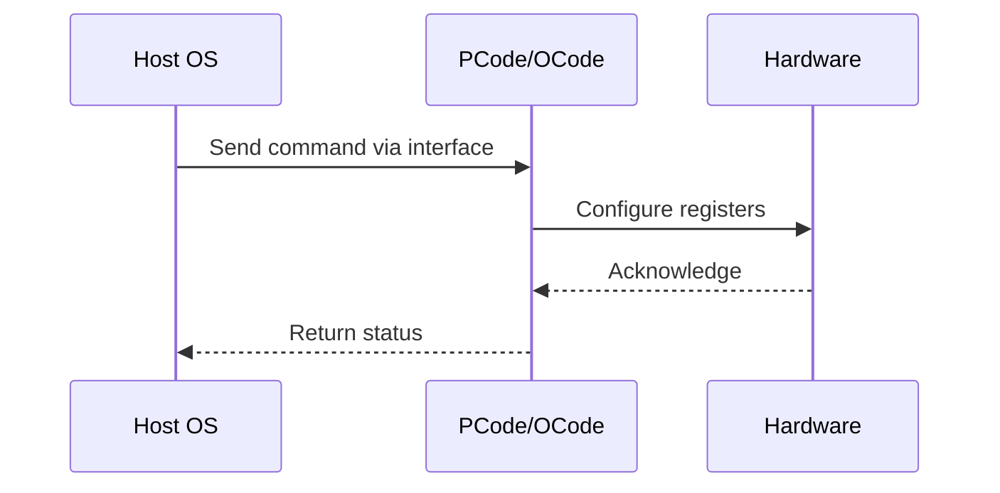

# NWP PSS Analysis

## Metadata
- HSD ID: 22022018388
- Title: PMAX DFX Injection Throttle
- Feature: Power/RAPL
- Sub Feature: PMAX
- Script: pm/pss/pmax/pmax_dfx_inject.py
- HSD Script: (none)
- TC Owner: aprakas2
- TR Owner: mps
- Validation Environment: emulation.hsle,xos
- Test Cycle: Newport Product.trunk.pss_0p8.pss.val.NWP_MCP HSLE XOS
- NWP Scope: Runnable_On_N-1

## HSD Hierarchy
- Test Case Definition: [22021969946 - PMAX E2E Flow](https://hsdes.intel.com/appstore/article/#/22021969946)
- Test Case: [22022018388 - PMAX DFX Injection Throttle](https://hsdes.intel.com/appstore/article/#/22022018388)
- Test Result: [22022027684 - [PSS][PMAX] PMAX DFX Injection Throttle](https://hsdes.intel.com/appstore/article/#/22022027684)

## KB References
- KB Article: [KB/pm_features/power_rapl/pmax.md](../../../KB/pm_features/power_rapl/pmax.md)

## Model Response

## Refined Intent
Validate PMAX DFX injection, hard and soft throttling, and PLR status checks. The PMAX Detection Circuit senses VccIN voltage (dual rail) within hundreds of nanoseconds. Inject PMAX via DFX injection (Primecode) or PMAX_TRIGGER_IO pin, verify ratio throttling, check PACKAGE_THERM_STATUS (MSR 0x1B1) PMAX_STATUS[12] and PMAX_LOG[13] bits, and verify PLR reflects PMAX event.

## Refined Test Steps
Pre-Conditions:
  - PMAX fuses programmed (SOCKET_VIRUS_POWER_FREQUENCY_CURVE_* fuses, TDP_TO_PSAFE_MULTIPLIER)
  - Platform booted, PythonSV access available

Step 1 — Read PMAX fuse configuration:
  Read SOCKET_VIRUS_POWER_FREQUENCY_CURVE_POWER_POINT_j (6 power points).
  Read SOCKET_VIRUS_POWER_FREQUENCY_CURVE_IA_CDYN_INDEX_i_FREQUENCY_POINT_j (6x6 fuses).
  Read SOCKET_VIRUS_POWER_FREQUENCY_CURVE_MEMCFC/IOCFC/CBBCFC_FREQUENCY_POINT_j.
  Read TDP_TO_PSAFE_MULTIPLIER — expect ~0x33 (Psafe = 1.4 * TDP).

Step 2 — Read PMAX baseline status:
  Read MSR 0x1B1 PACKAGE_THERM_STATUS:
    Bit 12: PMAX_STATUS — expect 0 (no active event).
    Bit 13: PMAX_LOG — expect 0 (no logged event).

Step 3 — Inject PMAX via DFX:
  Use DFX injection (Primecode or pin on soc_tb.soc) to assert PMAX.
  Verify PMAX_STATUS[12] = 1 (PMAX asserted).
  Verify PMAX_LOG[13] = 1 (sticky log set).

Step 4 — Verify hard throttle:
  Check core ratios — verify frequency reduced (hard throttle engaged).
  Read FAST_THROTTLE_IN_0/1 D2D pin status.

Step 5 — Verify PLR:
  Issue PLR mailbox read.
  Verify PMAX-related PLR bits are set.

Step 6 — Release PMAX injection:
  De-assert DFX PMAX injection.
  Verify PMAX_STATUS[12] = 0 (core throttle released).
  Verify PMAX_LOG[13] = 1 (sticky — remains until SW clears).
  Verify frequency recovers.

Step 7 — Clear PMAX_LOG:
  Write 0 to PMAX_LOG[13] (RW/0C — write 0 to clear).
  Verify PMAX_LOG[13] = 0.

Step 8 — Verify PMAX_TRIGGER_IO pin behavior:
  External PMAX event → both IMH_P and IMH_S take PMAX action.
  Internal PMAX event (VCCIN0 VR sense) → IMH_P alone takes action, PMAX_TRIGGER_IO asserts.
  Internal PMAX event (VCCIN1 VR sense) → IMH_S alone takes action, PMAX_TRIGGER_IO asserts.

Pass/Fail Criteria:
  PASS: DFX injection triggers hard throttle, PMAX_STATUS/LOG bits correct, PLR reflects event, frequency recovers after release
  FAIL: No throttle on injection, status bits incorrect, PLR not set, or frequency does not recover

HAS/MAS References:
  - DMR PMax HAS — DFX Injection, PACKAGE_THERM_STATUS: https://docs.intel.com/documents/pm_doc/src/server/DMR/PM%20Features/DMR_PMax.html
  - Perf Limit Reasons HAS — PMAX PLR bits: https://docs.intel.com/documents/pm_doc/src/server/GNR/Features/perf_limit_reasons/perf_limit_reasons_has.html

### NWP Project Relevance
**Test Classification:** Regression (DMR-inherited)
**Feature Status:** Expected to work
**Test Purpose:** Validate PMAX DFX injection, hard and soft throttling, and PLR status checks. The PMAX Detection Circuit senses VccIN voltage (dual rail) within hundreds of nanoseconds. Inject PMAX via DFX injection 
**Negative Test Aspect:** None
**NWP Delta:** Topology differences from DMR (2 CBB + 1 NIO); same Power/RAPL behavior expected

## Section A: Critical Execution Path
1. Step 1 — Read PMAX fuse configuration:
2. Step 2 — Read PMAX baseline status:
3. Step 3 — Inject PMAX via DFX:
4. Step 4 — Verify hard throttle:
5. Step 5 — Verify PLR:

## Section B: Component Interaction Diagram

## Section C: Interface Coverage Assessment
| Interface | Covered | Notes |
| --------- | ------- | ----- |
| CSR | Yes | Primary interface |
| Fuse | Yes | Primary interface |
| HPM | Yes | Primary interface |
| MSR | Yes | Primary interface |
| PLR | Yes | Primary interface |
| 0x1B1 PACKAGE_THERM_STATUS | Yes | Register access |

## Section D: NWP Specification References
- **NWP PM HAS**: [NWP HAS - PM Features](https://docs.intel.com/documents/custom-xeon/newport-docs/has/Overview/NWP_HAS.html#pm-features)
- **NWP PM MAS**: [NWP IMH SoC PM MAS](https://docs.intel.com/documents/custom-xeon/newport-docs/mas/pm/nwp_imh_soc_pm_mas.html)
- **DMR PM HAS**: [DMR SoC PM HAS](https://docs.intel.com/documents/pm_doc/src/server/DMR/SOC_PM_HAS/DMR_SOC_PM_HAS.html)
- **Feature HAS**: [PNC PM HAS §7 - RAPL](https://docs.intel.com/documents/pm_doc/src/server/GNR/Features/LNC/GNR_LNC_RAPL.html)
- **DMR CBB HAS**: [DMR CBB PM HAS - RAPL](https://docs.intel.com/documents/pm_doc/src/DMR_CBB/IP%20Integration/PM%20HAS/cbb_pm_has.html#rapl)
- **Intel® 64 and IA-32 SDM**: MSR definitions, CPUID enumeration

## Section E: NWP Risk Assessment
| Risk | Likelihood | Impact | Mitigation |
| ---- | ---------- | ------ | ---------- |
| Topology change | Medium | Medium | Verify on multi-die config |
| Interface delta | Low | Low | Compare with DMR baseline |
| Timing sensitivity | Low | Medium | Allow tolerance margins |

## Section F: Recommendations
1. Verify test works on NWP multi-die topology
2. Check for any interface changes from DMR
3. Update HAS references to NWP specifications
4. Add negative test coverage if missing
5. Consider additional stress test variants

---
*Generated from metadata on 2026-05-28 23:20:51*