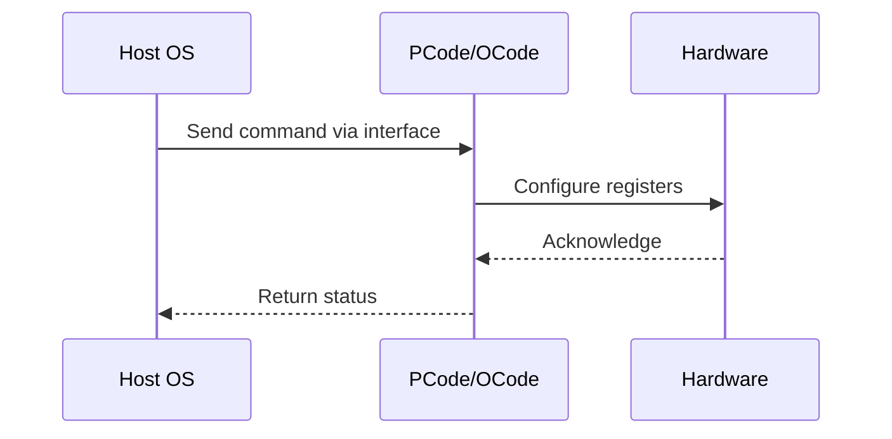

# NWP PSS Analysis

## Metadata
- HSD ID: 22022023844
- Title: PLR Status registers Check for PMAX Events
- Feature: Power/RAPL
- Sub Feature: PMAX
- Script: nwp_pss_scripts/nwp_plr_mailbox.py
- HSD Script: (none)
- TC Owner: aprakas2
- TR Owner: mps
- Validation Environment: emulation.hsle,xos
- Test Cycle: Newport Product.trunk.pss_0p8.pss.val.NWP_MCP HSLE XOS
- NWP Scope: Runnable_On_N-1

## HSD Hierarchy
- Test Case Definition: [22021969946 - PMAX E2E Flow](https://hsdes.intel.com/appstore/article/#/22021969946)
- Test Case: [22022023844 - PLR Status registers Check for PMAX Events](https://hsdes.intel.com/appstore/article/#/22022023844)
- Test Result: [22022027707 - [PSS][PMAX] PLR Status registers Check for PMAX Events](https://hsdes.intel.com/appstore/article/#/22022027707)

## KB References
- KB Article: [KB/pm_features/power_rapl/pmax.md](../../../KB/pm_features/power_rapl/pmax.md)

## Model Response

## Refined Intent
Verify PLR status registers for PMAX events. Inject PMAX via DFX injection (Primecode) or PMAX_TRIGGER_IO pin, verify ratio throttling occurs, check PACKAGE_THERM_STATUS (MSR 0x1B1) PMAX_STATUS[12] and PMAX_LOG[13] bits, and verify PLR reflects the PMAX event. DMR SOC dual-rail VccIN: internal PMAX events from VCCIN0/VCCIN1 VR sense, external events via bidirectional PMAX_TRIGGER_IO pin.

## Refined Test Steps
Pre-Conditions:
  - PMAX fuses programmed (SOCKET_VIRUS_POWER_FREQUENCY_CURVE_*, TDP_TO_PSAFE_MULTIPLIER)
  - PLR mailbox accessible via PythonSV
  - Platform booted to HSLE or XOS

Step 1 — Read PLR baseline:
  Issue PLR mailbox read command.
  Record baseline PLR bit state for PMAX-related bits.

Step 2 — Read PMAX baseline status:
  Read MSR 0x1B1 PACKAGE_THERM_STATUS:
    PMAX_STATUS[12] — expect 0 (no active event).
    PMAX_LOG[13] — expect 0 (no logged event).

Step 3 — Inject PMAX via DFX:
  Use DFX injection (Primecode or pin on soc_tb.soc) to assert PMAX.
  Verify PMAX_STATUS[12] = 1.
  Verify PMAX_LOG[13] = 1 (sticky).

Step 4 — Verify ratio throttling:
  Check core ratios — verify hard throttle engaged (frequency reduced).

Step 5 — Verify PLR reflects PMAX event:
  Issue PLR mailbox read.
  Verify PMAX-related PLR bits are set.

Step 6 — Release PMAX injection and verify recovery:
  De-assert DFX PMAX.
  Verify PMAX_STATUS[12] = 0 (throttle released).
  Verify PMAX_LOG[13] = 1 (sticky until SW clears).
  Verify PLR bits update accordingly.
  Verify frequency recovers.

Step 7 — Clear PMAX_LOG:
  Write 0 to PMAX_LOG[13] (RW/0C).
  Verify cleared without affecting other *_LOG bits.

Pass/Fail Criteria:
  PASS: PLR bits correctly reflect PMAX event, PMAX_STATUS/LOG bits correct, throttle engages and recovers
  FAIL: PLR not set on PMAX event, status bits incorrect, or no throttle

HAS/MAS References:
  - DMR PMax HAS — PLR Status for PMAX: https://docs.intel.com/documents/pm_doc/src/server/DMR/PM%20Features/DMR_PMax.html
  - Perf Limit Reasons HAS — PMAX PLR bits: https://docs.intel.com/documents/pm_doc/src/server/GNR/Features/perf_limit_reasons/perf_limit_reasons_has.html

### NWP Project Relevance
**Test Classification:** Regression (DMR-inherited)
**Feature Status:** Expected to work
**Test Purpose:** Verify PLR status registers for PMAX events. Inject PMAX via DFX injection (Primecode) or PMAX_TRIGGER_IO pin, verify ratio throttling occurs, check PACKAGE_THERM_STATUS (MSR 0x1B1) PMAX_STATUS[12] an
**Negative Test Aspect:** None
**NWP Delta:** Topology differences from DMR (2 CBB + 1 NIO); same Power/RAPL behavior expected

## Section A: Critical Execution Path
1. Step 1 — Read PLR baseline:
2. Step 2 — Read PMAX baseline status:
3. Step 3 — Inject PMAX via DFX:
4. Step 4 — Verify ratio throttling:
5. Step 5 — Verify PLR reflects PMAX event:

## Section B: Component Interaction Diagram

## Section C: Interface Coverage Assessment
| Interface | Covered | Notes |
| --------- | ------- | ----- |
| CSR | Yes | Primary interface |
| Fuse | Yes | Primary interface |
| MSR | Yes | Primary interface |
| PLR | Yes | Primary interface |
| 0x1B1 PACKAGE_THERM_STATUS | Yes | Register access |

## Section D: NWP Specification References
- **NWP PM HAS**: [NWP HAS - PM Features](https://docs.intel.com/documents/custom-xeon/newport-docs/has/Overview/NWP_HAS.html#pm-features)
- **NWP PM MAS**: [NWP IMH SoC PM MAS](https://docs.intel.com/documents/custom-xeon/newport-docs/mas/pm/nwp_imh_soc_pm_mas.html)
- **DMR PM HAS**: [DMR SoC PM HAS](https://docs.intel.com/documents/pm_doc/src/server/DMR/SOC_PM_HAS/DMR_SOC_PM_HAS.html)
- **Feature HAS**: [PNC PM HAS §7 - RAPL](https://docs.intel.com/documents/pm_doc/src/server/GNR/Features/LNC/GNR_LNC_RAPL.html)
- **DMR CBB HAS**: [DMR CBB PM HAS - RAPL](https://docs.intel.com/documents/pm_doc/src/DMR_CBB/IP%20Integration/PM%20HAS/cbb_pm_has.html#rapl)
- **Intel® 64 and IA-32 SDM**: MSR definitions, CPUID enumeration

## Section E: NWP Risk Assessment
| Risk | Likelihood | Impact | Mitigation |
| ---- | ---------- | ------ | ---------- |
| Topology change | Medium | Medium | Verify on multi-die config |
| Interface delta | Low | Low | Compare with DMR baseline |
| Timing sensitivity | Low | Medium | Allow tolerance margins |

## Section F: Recommendations
1. Verify test works on NWP multi-die topology
2. Check for any interface changes from DMR
3. Update HAS references to NWP specifications
4. Add negative test coverage if missing
5. Consider additional stress test variants

---
*Generated from metadata on 2026-05-28 23:20:51*