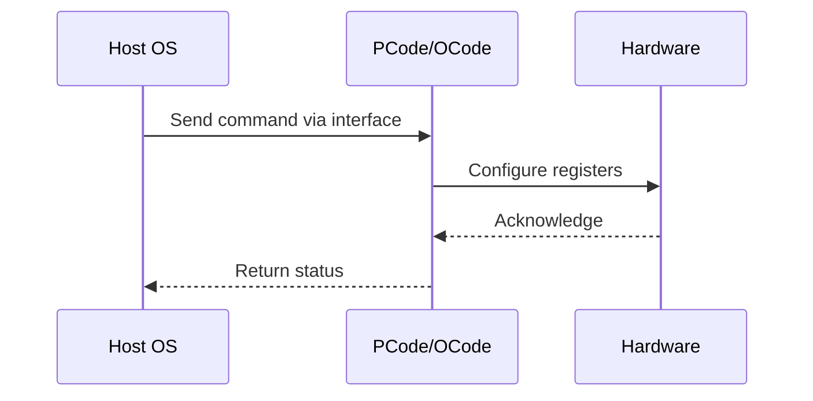

# NWP PSS Analysis

## Metadata
- HSD ID: 22022060651
- Title: DRAM RAPL ZBB Negative Checks
- Feature: Power/RAPL
- Sub Feature: Socket RAPL
- Script: nwp_pss_scripts/pss_rapl_zbb.py
- HSD Script: (none)
- TC Owner: jscanlo1
- TR Owner: mps
- Validation Environment: emulation.hsle
- Test Cycle: Newport Product.trunk.pss_1p0.pss.val.NWP_MCP-HSLE
- NWP Scope: Runnable_On_N-1

## HSD Hierarchy
- Test Case Definition: [22022060621 - NWP ZBB Negative Validation](https://hsdes.intel.com/appstore/article/#/22022060621)
- Test Case: [22022060651 - DRAM RAPL ZBB Negative Checks](https://hsdes.intel.com/appstore/article/#/22022060651)
- Test Result: [22022060669 - [PSS][DRAM_RAPL] DRAM RAPL ZBB Negative Checks](https://hsdes.intel.com/appstore/article/#/22022060669)

## KB References
- KB Article: [KB/pm_features/power_rapl/socket_rapl.md](../../../KB/pm_features/power_rapl/socket_rapl.md)

## Model Response

## Refined Intent
NWP ZBB negative validation: verify ZBB'd RAPL features (DRAM RAPL, Platform RAPL/Psys, FastRAPL, Fine-Grained Energy) are inaccessible on NWP. Socket RAPL should remain functional.

## Refined Test Steps
Pre-Conditions:
  - NWP platform booted

Step 1 — Verify DRAM RAPL fused off:
  Attempt to read/write DRAM RAPL MSRs — expect disabled or zero.

Step 2 — Verify Platform RAPL/Psys not available:
  Attempt to access Platform RAPL registers — expect not enumerated.

Step 3 — Verify Socket RAPL still works:
  Read MSR 0x610 — verify PL1/PL2 accessible and enabled.
  Run throttling test — verify Socket RAPL functional.

Pass/Fail Criteria:
  PASS: ZBB'd RAPL features inaccessible, Socket RAPL functional
  FAIL: ZBB'd feature accessible, or Socket RAPL broken

HAS/MAS References:
  - DMR RAPL Simplification HAS: https://docs.intel.com/documents/pm_doc/src/server/DMR/PM%20Features/DMR_RAPL_Simplification.html
  - NWP PM MAS — RAPL ZBB scope (DRAM/Platform/FastRAPL): https://docs.intel.com/documents/custom-xeon/newport-docs/mas/pm/nwp_imh_soc_pm_mas.html

### NWP Project Relevance
**Test Classification:** Regression (DMR-inherited)
**Feature Status:** Expected to work
**Test Purpose:** NWP ZBB negative validation: verify ZBB'd RAPL features (DRAM RAPL, Platform RAPL/Psys, FastRAPL, Fine-Grained Energy) are inaccessible on NWP. Socket RAPL should remain functional.
**Negative Test Aspect:** None
**NWP Delta:** Topology differences from DMR (2 CBB + 1 NIO); same Power/RAPL behavior expected

## Section A: Critical Execution Path
1. Step 1 — Verify DRAM RAPL fused off:
2. Step 2 — Verify Platform RAPL/Psys not available:
3. Step 3 — Verify Socket RAPL still works:

## Section B: Component Interaction Diagram

## Section C: Interface Coverage Assessment
| Interface | Covered | Notes |
| --------- | ------- | ----- |
| CSR | Yes | Primary interface |
| MSR | Yes | Primary interface |
| TPMI_IB | Yes | Primary interface |
| 0x610 PKG_POWER_LIMIT | Yes | Register access |
| DRAM RAPL MSRs | Yes | Register access |

## Section D: NWP Specification References
- **NWP PM HAS**: [NWP HAS - PM Features](https://docs.intel.com/documents/custom-xeon/newport-docs/has/Overview/NWP_HAS.html#pm-features)
- **NWP PM MAS**: [NWP IMH SoC PM MAS](https://docs.intel.com/documents/custom-xeon/newport-docs/mas/pm/nwp_imh_soc_pm_mas.html)
- **DMR PM HAS**: [DMR SoC PM HAS](https://docs.intel.com/documents/pm_doc/src/server/DMR/SOC_PM_HAS/DMR_SOC_PM_HAS.html)
- **Feature HAS**: [PNC PM HAS §7 - RAPL](https://docs.intel.com/documents/pm_doc/src/server/GNR/Features/LNC/GNR_LNC_RAPL.html)
- **DMR CBB HAS**: [DMR CBB PM HAS - RAPL](https://docs.intel.com/documents/pm_doc/src/DMR_CBB/IP%20Integration/PM%20HAS/cbb_pm_has.html#rapl)
- **Intel® 64 and IA-32 SDM**: MSR definitions, CPUID enumeration

## Section E: NWP Risk Assessment
| Risk | Likelihood | Impact | Mitigation |
| ---- | ---------- | ------ | ---------- |
| Topology change | Medium | Medium | Verify on multi-die config |
| Interface delta | Low | Low | Compare with DMR baseline |
| Timing sensitivity | Low | Medium | Allow tolerance margins |

## Section F: Recommendations
1. Verify test works on NWP multi-die topology
2. Check for any interface changes from DMR
3. Update HAS references to NWP specifications
4. Add negative test coverage if missing
5. Consider additional stress test variants

---
*Generated from metadata on 2026-05-28 23:20:51*