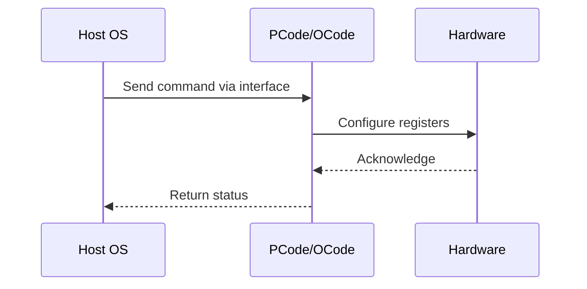

# NWP PSS Analysis

## Metadata
- HSD ID: 22022078274
- Title: PLR Status registers Check during Cstates
- Feature: Core C-States
- Sub Feature: PLR
- Script: nwp_pss_scripts/nwp_plr_mailbox.py
- HSD Script: (none)
- TC Owner: aprakas2
- TR Owner: thangama
- Validation Environment: emulation.hsle,xos
- Test Cycle: Newport Product.trunk.pss_1p0.pss.val.NWP_MCP HSLE XOS
- NWP Scope: Runnable_On_N-1

## HSD Hierarchy
- Test Case Definition: [22021969891 - Core C-State Residency Counter Checks](https://hsdes.intel.com/appstore/article/#/22021969891)
- Test Case: [22022078274 - PLR Status registers Check during Cstates](https://hsdes.intel.com/appstore/article/#/22022078274)
- Test Result: [22022078388 - [PSS][CORE_CSTATES] PLR Status registers Check during Cstates](https://hsdes.intel.com/appstore/article/#/22022078388)

## KB References
- KB Article: [KB/pm_features/core_c_states/plr.md](../../../KB/pm_features/core_c_states/plr.md)

## Model Response

## Refined Intent
Validate PLR (Perf Limit Reasons) bit computation during different C-states. Pcode must ensure PLR computation only happens when the domain is active (not in C6). When the domain is idle (e.g., C6, granted freq = 0), Pcode must NOT falsely set PLR bits for PROCHOT, Thermal Throttling, PMAX, or RAPL events.

## Refined Test Steps
Pre-Conditions:
  - PF Curve fuses programmed
  - VF curve fuses programmed
  - Pmin set for all ratios
  - Model: MCP IC HSLE (uncores), MCP IC XOS (cores), MCP ICC XOS (cores)

Step 1 — Enter C6 on target cores:
  Idle cores to C6 via MWAIT or PEGA.

Step 2 — Check PLR bits during C6:
  While cores are in C6, check PLR for the following events:
  - PROCHOT: PLR bit must NOT be set (domain inactive).
  - Thermal Throttling: PLR bit must NOT be set.
  - PMAX: PLR bit must NOT be set.
  - RAPL: PLR bit must NOT be set.

Step 3 — Exit C6, check PLR bits:
  Wake cores back to C0.
  Trigger a throttling event (e.g., PROCHOT injection).
  Verify PLR bits ARE set when domain is active.

Step 4 — Re-enter C6, verify PLR cleared:
  Enter C6 again — verify PLR bits not falsely set.

Pass/Fail Criteria:
  PASS: PLR bits not set during C6 (domain inactive), correctly set during C0 (domain active)
  FAIL: PLR bits falsely set during C6 idle state

HAS/MAS References:
  - Perf Limit Reasons HAS — PLR during C-states: https://docs.intel.com/documents/pm_doc/src/server/GNR/Features/perf_limit_reasons/perf_limit_reasons_has.html
  - DMR CBB PM HAS: https://docs.intel.com/documents/pm_doc/src/server/DMR/IP_PM_Features/CBB/DMR_CBB_PM.html

### NWP Project Relevance
**Test Classification:** Regression (DMR-inherited)
**Feature Status:** Expected to work
**Test Purpose:** Validate PLR (Perf Limit Reasons) bit computation during different C-states. Pcode must ensure PLR computation only happens when the domain is active (not in C6). When the domain is idle (e.g., C6, gr
**Negative Test Aspect:** None
**NWP Delta:** Topology differences from DMR (2 CBB + 1 NIO); same Core C-States behavior expected

## Section A: Critical Execution Path
1. Step 1 — Enter C6 on target cores:
2. Step 2 — Check PLR bits during C6:
3. Step 3 — Exit C6, check PLR bits:
4. Step 4 — Re-enter C6, verify PLR cleared:

## Section B: Component Interaction Diagram

## Section C: Interface Coverage Assessment
| Interface | Covered | Notes |
| --------- | ------- | ----- |
| CSR | Yes | Primary interface |
| Fuse | Yes | Primary interface |
| PEGA | Yes | Primary interface |
| PLR | Yes | Primary interface |

## Section D: NWP Specification References
- **NWP PM HAS**: [NWP HAS - PM Features](https://docs.intel.com/documents/custom-xeon/newport-docs/has/Overview/NWP_HAS.html#pm-features)
- **NWP PM MAS**: [NWP IMH SoC PM MAS](https://docs.intel.com/documents/custom-xeon/newport-docs/mas/pm/nwp_imh_soc_pm_mas.html)
- **DMR PM HAS**: [DMR SoC PM HAS](https://docs.intel.com/documents/pm_doc/src/server/DMR/SOC_PM_HAS/DMR_SOC_PM_HAS.html)
- **Feature HAS**: [PNC PM HAS §8 - Core C-States](https://docs.intel.com/documents/pm_doc/src/server/GNR/Features/LNC/GNR_LNC_Core.html#core-c-states)
- **DMR CBB HAS**: [DMR CBB CCP HAS](https://docs.intel.com/documents/pm_doc/src/DMR_CBB/IP%20Integration/CCP%20HAS/cbb_cpp_has.html)
- **Intel® 64 and IA-32 SDM**: MSR definitions, CPUID enumeration

## Section E: NWP Risk Assessment
| Risk | Likelihood | Impact | Mitigation |
| ---- | ---------- | ------ | ---------- |
| Topology change | Medium | Medium | Verify on multi-die config |
| Interface delta | Low | Low | Compare with DMR baseline |
| Timing sensitivity | Low | Medium | Allow tolerance margins |

## Section F: Recommendations
1. Verify test works on NWP multi-die topology
2. Check for any interface changes from DMR
3. Update HAS references to NWP specifications
4. Add negative test coverage if missing
5. Consider additional stress test variants

---
*Generated from metadata on 2026-05-28 23:20:51*