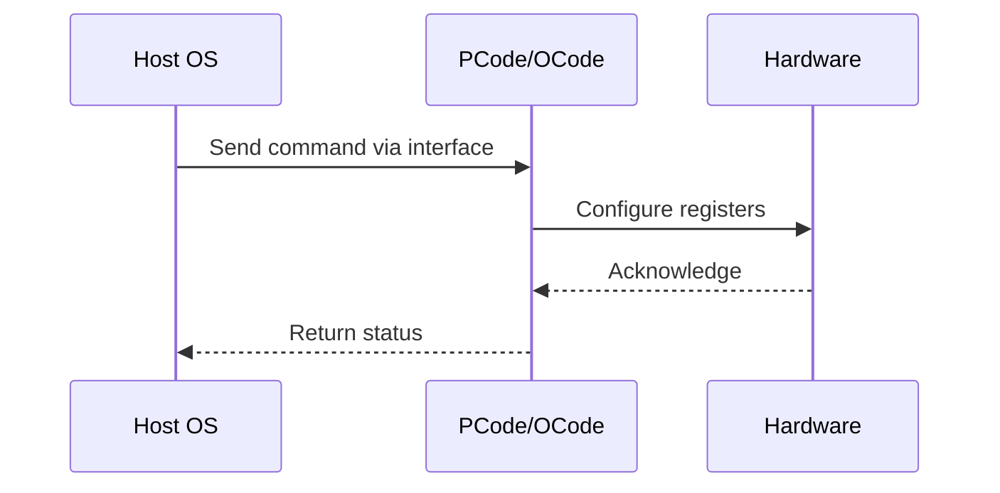

# NWP PSS Analysis

## Metadata
- HSD ID: 22021969976
- Title: Injected Prochot Entry
- Feature: SoC Thermal
- Sub Feature: Prochot
- Script: pm/pss/prochot/pm_mcp_prochot.py
- HSD Script: (none)
- TC Owner: aprakas2
- TR Owner: mps
- Validation Environment: emulation.hsle,xos
- Test Cycle: Newport Product.trunk.pss_0p8.pss.val.NWP_MCP HSLE XOS
- NWP Scope: Runnable_On_N-1

## HSD Hierarchy
- Test Case Definition: [22021969875 - Prochot E2E Flow](https://hsdes.intel.com/appstore/article/#/22021969875)
- Test Case: [22021969976 - Injected Prochot Entry](https://hsdes.intel.com/appstore/article/#/22021969976)
- Test Result: [22022027518 - [PSS][PROCHOT] Injected Prochot Entry](https://hsdes.intel.com/appstore/article/#/22022027518)

## KB References
- KB Article: [KB/pm_features/soc_thermal/prochot.md](../../../KB/pm_features/soc_thermal/prochot.md)

## Model Response

## Refined Intent
Verify that prochot is asserted in socket upon injecting. Inject prochot by global_prochot_hw_inject (SOC level) or throttle_0_hw_inject (die level), check whether prochot status and log are set, verify thermal PLR is set (base.tpmi.plr_die_level.thermal), and verify SVOS receives the thermal interrupt.

## Refined Test Steps
Pre-Conditions:
  - IMH Fuses: punit.pmsrvr_ptpcfsms_gpio_bump_enables_enable_xxprochot_n_fuse,
    punit.pcode_socket_virus_power_frequency_curve_power_point_X,
    punit.pcode_socket_virus_power_frequency_curve_cfcio_frequency_point_X,
    punit.pcode_socket_virus_power_frequency_curve_cfcmem_frequency_point_X
  - BIOS knobs: prochot_response_power, prochot_response_lock
  - Ingredients: Primecode, Pcode
  - Unique Model Requirements: HSLE with Punit Fmod

Step 1 — Inject Prochot:
  Inject prochot via global_prochot_hw_inject (SOC level) or throttle_0_hw_inject (die level).

Step 2 — Verify prochot status:
  Check whether prochot status and log are set.

Step 3 — Verify thermal PLR:
  Verify thermal perf limit reason is set (base.tpmi.plr_die_level.thermal).
  (Could be covered in SLE)

Step 4 — Verify SVOS interrupt:
  Verify that SVOS receives the thermal interrupt.

Pass/Fail Criteria:
  PASS: Prochot status/log are set, PLR is set
  FAIL: Prochot status not set, or PLR not set after injection

HAS/MAS References:
  - DMR Thermal HAS — Prochot Flow: https://docs.intel.com/documents/pm_doc/src/server/DMR/PM%20Features/Thermals/DMR_Thermal.html
  - Socket Thermal Mgmt HAS — Prochot: https://docs.intel.com/documents/pm_doc/src/server/Wave3_common/Socket_Thermal_Mgmt/Socket_Thermal_Mgmt_HAS.html

### NWP Project Relevance
**Test Classification:** Regression (DMR-inherited)
**Feature Status:** Expected to work
**Test Purpose:** Verify that prochot is asserted in socket upon injecting. Inject prochot by global_prochot_hw_inject (SOC level) or throttle_0_hw_inject (die level), check whether prochot status and log are set, veri
**Negative Test Aspect:** None
**NWP Delta:** Topology differences from DMR (2 CBB + 1 NIO); same SoC Thermal behavior expected

## Section A: Critical Execution Path
1. Step 1 — Inject Prochot:
2. Step 2 — Verify prochot status:
3. Step 3 — Verify thermal PLR:
4. Step 4 — Verify SVOS interrupt:

## Section B: Component Interaction Diagram

## Section C: Interface Coverage Assessment
| Interface | Covered | Notes |
| --------- | ------- | ----- |
| CSR | Yes | Primary interface |
| Fuse | Yes | Primary interface |
| PLR | Yes | Primary interface |
| Patch | Yes | Primary interface |

## Section D: NWP Specification References
- **NWP PM HAS**: [NWP HAS - PM Features](https://docs.intel.com/documents/custom-xeon/newport-docs/has/Overview/NWP_HAS.html#pm-features)
- **NWP PM MAS**: [NWP IMH SoC PM MAS - Thermal](https://docs.intel.com/documents/custom-xeon/newport-docs/mas/pm/nwp_imh_soc_pm_mas.html#thermal)
- **DMR PM HAS**: [DMR SoC PM HAS](https://docs.intel.com/documents/pm_doc/src/server/DMR/SOC_PM_HAS/DMR_SOC_PM_HAS.html)
- **Feature HAS**: [DMR Thermal HAS](https://docs.intel.com/documents/pm_doc/src/server/DMR/Features/Thermal/DMR_Thermal.html)
- **DMR CBB HAS**: [DMR CBB PM HAS - DTS](https://docs.intel.com/documents/pm_doc/src/DMR_CBB/IP%20Integration/PM%20HAS/cbb_pm_has.html#dts)
- **Intel® 64 and IA-32 SDM**: MSR definitions, CPUID enumeration

## Section E: NWP Risk Assessment
| Risk | Likelihood | Impact | Mitigation |
| ---- | ---------- | ------ | ---------- |
| Topology change | Medium | Medium | Verify on multi-die config |
| Interface delta | Low | Low | Compare with DMR baseline |
| Timing sensitivity | Low | Medium | Allow tolerance margins |

## Section F: Recommendations
1. Verify test works on NWP multi-die topology
2. Check for any interface changes from DMR
3. Update HAS references to NWP specifications
4. Add negative test coverage if missing
5. Consider additional stress test variants

---
*Generated from metadata on 2026-05-28 23:20:51*