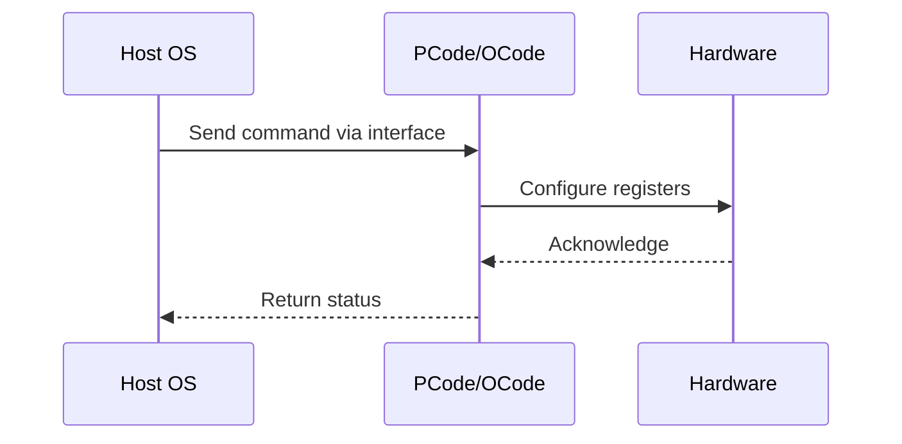

# NWP PSS Analysis

## Metadata
- HSD ID: 22021969979
- Title: IMH DTS Thermal Telemetry
- Feature: SoC Thermal
- Sub Feature: IMH DTS & Telemetry
- Script: pm/pss/thermal/pm_dts_stim.py
- HSD Script: (none)
- TC Owner: jinwengo
- TR Owner: mps
- Validation Environment: emulation.hsle
- Test Cycle: Newport Product.trunk.pss_0p5.pss.val.NWP_MCP-HSLE
- NWP Scope: Runnable_On_N-1

## HSD Hierarchy
- Test Case Definition: [22021969876 - Thermal Telemetry](https://hsdes.intel.com/appstore/article/#/22021969876)
- Test Case: [22021969979 - IMH DTS Thermal Telemetry](https://hsdes.intel.com/appstore/article/#/22021969979)
- Test Result: [22022027534 - [PSS][TELEMETRY] IMH DTS Thermal Telemetry](https://hsdes.intel.com/appstore/article/#/22022027534)

## KB References
- KB Article: [KB/pm_features/soc_thermal/imh_dts_telemetry.md](../../../KB/pm_features/soc_thermal/imh_dts_telemetry.md)

## Model Response

## Refined Intent
Verify that temperature telemetry is propagating correctly from DTS to Punit/Pcode. No unique coverage from SLE but this test is a mandatory pre-test to enable further thermal validation. Verify E2E thermal telemetry from DTS to firmware flows on IMH, CBB (Uncore), and Core.

## Refined Test Steps
Pre-Conditions:
  - IMH Fuses per DTS: cbopair_fuse_0.dts_fuse0_active_diode_mask
  - CBB Fuses: base.fuses.punit_fuses.fw_fuses_sst_pp_0..4_module_disable_mask
    Per DTS: cbopair_fuse_0.dts_fuse0_active_diode_mask
  - BIOS knobs: None
  - Ingredients: Primecode, Pcode
  - Unique Model Requirements: HSLE with Punit Fmod, Aunit Fmod; XOS

Step 1 — Boot with safe temperature overrides:
  Boot with safe/default temperature overrides on all DTSes.

Step 2 — Override DTS temperature:
  Override a temperature on a DTS on one of the domains (IMH, CBB Uncore, Core).

Step 3 — Verify Pcode consumption:
  Verify that Pcode consumes that telemetry.
  Confirm E2E telemetry flow is observed.

Pass/Fail Criteria:
  PASS: E2E telemetry flow is observed (DTS to Punit to Pcode)
  FAIL: Telemetry not propagating from DTS to firmware

HAS/MAS References:
  - DMR Thermal HAS — DTS Telemetry: https://docs.intel.com/documents/pm_doc/src/server/DMR/PM%20Features/Thermals/DMR_Thermal.html
  - Socket Thermal Mgmt HAS: https://docs.intel.com/documents/pm_doc/src/server/Wave3_common/Socket_Thermal_Mgmt/Socket_Thermal_Mgmt_HAS.html

### NWP Project Relevance
**Test Classification:** Regression (DMR-inherited)
**Feature Status:** Expected to work
**Test Purpose:** Verify that temperature telemetry is propagating correctly from DTS to Punit/Pcode. No unique coverage from SLE but this test is a mandatory pre-test to enable further thermal validation. Verify E2E t
**Negative Test Aspect:** None
**NWP Delta:** Topology differences from DMR (2 CBB + 1 NIO); same SoC Thermal behavior expected

## Section A: Critical Execution Path
1. Step 1 — Boot with safe temperature overrides:
2. Step 2 — Override DTS temperature:
3. Step 3 — Verify Pcode consumption:

## Section B: Component Interaction Diagram

## Section C: Interface Coverage Assessment
| Interface | Covered | Notes |
| --------- | ------- | ----- |
| CSR | Yes | Primary interface |
| Fuse | Yes | Primary interface |
| PCUData | Yes | Primary interface |

## Section D: NWP Specification References
- **NWP PM HAS**: [NWP HAS - PM Features](https://docs.intel.com/documents/custom-xeon/newport-docs/has/Overview/NWP_HAS.html#pm-features)
- **NWP PM MAS**: [NWP IMH SoC PM MAS - Thermal](https://docs.intel.com/documents/custom-xeon/newport-docs/mas/pm/nwp_imh_soc_pm_mas.html#thermal)
- **DMR PM HAS**: [DMR SoC PM HAS](https://docs.intel.com/documents/pm_doc/src/server/DMR/SOC_PM_HAS/DMR_SOC_PM_HAS.html)
- **Feature HAS**: [DMR Thermal HAS](https://docs.intel.com/documents/pm_doc/src/server/DMR/Features/Thermal/DMR_Thermal.html)
- **DMR CBB HAS**: [DMR CBB PM HAS - DTS](https://docs.intel.com/documents/pm_doc/src/DMR_CBB/IP%20Integration/PM%20HAS/cbb_pm_has.html#dts)
- **Intel® 64 and IA-32 SDM**: MSR definitions, CPUID enumeration

## Section E: NWP Risk Assessment
| Risk | Likelihood | Impact | Mitigation |
| ---- | ---------- | ------ | ---------- |
| Topology change | Medium | Medium | Verify on multi-die config |
| Interface delta | Low | Low | Compare with DMR baseline |
| Timing sensitivity | Low | Medium | Allow tolerance margins |

## Section F: Recommendations
1. Verify test works on NWP multi-die topology
2. Check for any interface changes from DMR
3. Update HAS references to NWP specifications
4. Add negative test coverage if missing
5. Consider additional stress test variants

---
*Generated from metadata on 2026-05-28 23:20:51*