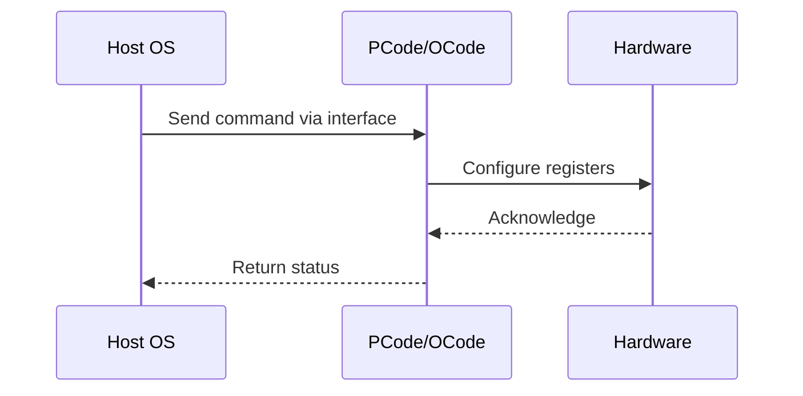

# NWP PSS Analysis

## Metadata
- HSD ID: 22021969983
- Title: iMH North VR Hot Detection
- Feature: SoC Thermal
- Sub Feature: VR
- Script: nwp_pss_scripts/nwp_vr_hot.py
- HSD Script: newport\\pm\\pss\\vrhot\\vr_hot.py
- TC Owner: jinwengo
- TR Owner: mps
- Validation Environment: emulation.hsle,xos
- Test Cycle: Newport Product.trunk.pss_0p8.pss.val.NWP_MCP HSLE XOS
- NWP Scope: Runnable_On_N-1

## HSD Hierarchy
- Test Case Definition: [22021969878 - VR Hot](https://hsdes.intel.com/appstore/article/#/22021969878)
- Test Case: [22021969983 - iMH North VR Hot Detection](https://hsdes.intel.com/appstore/article/#/22021969983)
- Test Result: [22022027573 - [PSS][VR_HOT] iMH North VR Hot Detection + PLR Bits](https://hsdes.intel.com/appstore/article/#/22022027573)

## KB References
- KB Article: [KB/pm_features/soc_thermal/vr.md](../../../KB/pm_features/soc_thermal/vr.md)

## Model Response

## Refined Intent
Inject VRhot, check if IMH and CBB ratios get throttled to P1 and PLR status bits are SET. VR has layers of thermal protection; when VR detects temperature near 97% of max it issues VR Hot. IMH Primecode polls MBVR via SVID_VR_STATUS for alerts in Slowloop. On VRHot detection, IMH sends HPM DNS_EVENT_DELIVERY with VR_THERM_ALERT to leaf CBB dies and other IMH. IMH limits max fabric freq to P1, CBB reduces core/fabric to P1, Pcode sets VR_THERM_ALERT in CORE PERF LIMIT REASONS. On de-assertion, HPM clears VR_THERM_ALERT and frequencies recover.

## Refined Test Steps
Pre-Conditions:
  - P1 ratios known for IMH and CBB
  - Ingredients: Primecode, Pcode, Acode
  - Unique Model Requirements: XOS, HSLE

Step 1 — Inject VRHOT:
  Assert VR ThermAlert via SVID_VR_STATUS register (MBVR injection).

Step 2 — Check throttling:
  Verify IMH ratios throttled to P1.
  Verify CBB ratios throttled to P1.

Step 3 — Check PLR bits:
  Verify PLR bits are SET due to VRHOT (VR_THERM_ALERT in CORE PERF LIMIT REASONS).

Step 4 — Uninject VRHOT:
  Clear VR ThermAlert via SVID_VR_STATUS register.

Step 5 — Verify recovery:
  Check if IMH and CBB ratios returned to original values.
  Verify PLR bits are UNSET after VRHOT de-assertion.

Pass/Fail Criteria:
  PASS: Ratios drop to P1 on VRHOT injection, PLR bits set; ratios recover and PLR bits clear on de-assertion
  FAIL: Ratios do not throttle on VRHOT, PLR bits not set, or no recovery after de-assertion

HAS/MAS References:
  - DMR Thermal HAS — VR Hot / VR ThermAlert: https://docs.intel.com/documents/pm_doc/src/server/DMR/PM%20Features/Thermals/DMR_Thermal.html
  - NWP HAS — PM Features: https://docs.intel.com/documents/custom-xeon/newport-docs/has/Overview/NWP_HAS.html#pm-features

### NWP Project Relevance
**Test Classification:** Regression (DMR-inherited)
**Feature Status:** Expected to work
**Test Purpose:** Inject VRhot, check if IMH and CBB ratios get throttled to P1 and PLR status bits are SET. VR has layers of thermal protection; when VR detects temperature near 97% of max it issues VR Hot. IMH Primec
**Negative Test Aspect:** None
**NWP Delta:** Topology differences from DMR (2 CBB + 1 NIO); same SoC Thermal behavior expected

## Section A: Critical Execution Path
1. Step 1 — Inject VRHOT:
2. Step 2 — Check throttling:
3. Step 3 — Check PLR bits:
4. Step 4 — Uninject VRHOT:
5. Step 5 — Verify recovery:

## Section B: Component Interaction Diagram

## Section C: Interface Coverage Assessment
| Interface | Covered | Notes |
| --------- | ------- | ----- |
| CSR | Yes | Primary interface |
| HPM | Yes | Primary interface |
| PLR | Yes | Primary interface |
| SVID | Yes | Primary interface |
| TPMI_IB | Yes | Primary interface |
| TPMI: plr_mailbox_interface/data | Yes | TPMI interface |
| TPMI: plr_die_level | Yes | TPMI interface |

## Section D: NWP Specification References
- **NWP PM HAS**: [NWP HAS - PM Features](https://docs.intel.com/documents/custom-xeon/newport-docs/has/Overview/NWP_HAS.html#pm-features)
- **NWP PM MAS**: [NWP IMH SoC PM MAS - Thermal](https://docs.intel.com/documents/custom-xeon/newport-docs/mas/pm/nwp_imh_soc_pm_mas.html#thermal)
- **DMR PM HAS**: [DMR SoC PM HAS](https://docs.intel.com/documents/pm_doc/src/server/DMR/SOC_PM_HAS/DMR_SOC_PM_HAS.html)
- **Feature HAS**: [DMR Thermal HAS](https://docs.intel.com/documents/pm_doc/src/server/DMR/Features/Thermal/DMR_Thermal.html)
- **DMR CBB HAS**: [DMR CBB PM HAS - DTS](https://docs.intel.com/documents/pm_doc/src/DMR_CBB/IP%20Integration/PM%20HAS/cbb_pm_has.html#dts)
- **Intel® 64 and IA-32 SDM**: MSR definitions, CPUID enumeration

## Section E: NWP Risk Assessment
| Risk | Likelihood | Impact | Mitigation |
| ---- | ---------- | ------ | ---------- |
| Topology change | Medium | Medium | Verify on multi-die config |
| Interface delta | Low | Low | Compare with DMR baseline |
| Timing sensitivity | Low | Medium | Allow tolerance margins |

## Section F: Recommendations
1. Verify test works on NWP multi-die topology
2. Check for any interface changes from DMR
3. Update HAS references to NWP specifications
4. Add negative test coverage if missing
5. Consider additional stress test variants

---
*Generated from metadata on 2026-05-28 23:20:51*