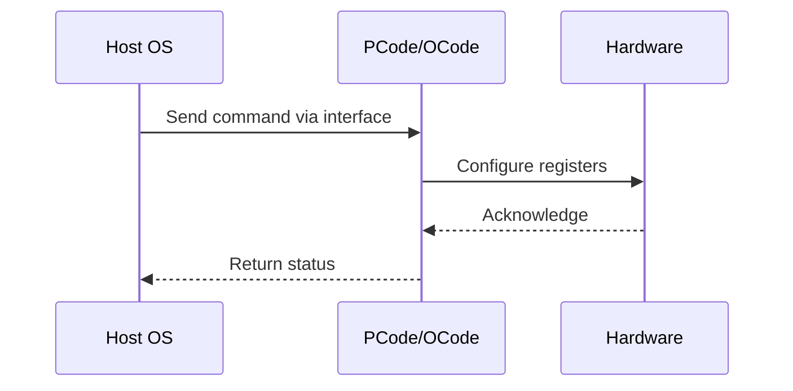

# NWP PSS Analysis

## Metadata
- HSD ID: 22021970005
- Title: Core P-States request using PEGA interface
- Feature: PState Stack
- Sub Feature: Core P-States
- Script: nwp_pss_scripts/nwp_pega_pstate.py
- HSD Script: pm\pss\mailbox\pega_mailbox.py
- TC Owner: jscanlo1
- TR Owner: akurathi
- Validation Environment: emulation.hsle,xos
- Test Cycle: Newport Product.trunk.pss_0p8.pss.val.NWP_MCP HSLE XOS
- NWP Scope: Runnable_On_N-1

## HSD Hierarchy
- Test Plan: [22021969837 - Legacy P-States](https://hsdes.intel.com/appstore/article/#/22021969837)
- Test Case Definition: [22021969881 - Functionality Checks](https://hsdes.intel.com/appstore/article/#/22021969881)
- Test Case: [22021970005 - Core P-States request using PEGA interface](https://hsdes.intel.com/appstore/article/#/22021970005)
- Test Result: [22022027525 - [PSS][CORE_PSTATES] Core P-States request using PEGA interface](https://hsdes.intel.com/appstore/article/#/22022027525)

## KB References
- KB Article: [KB/pm_features/pstate_stack/core_p_states.md](../../../KB/pm_features/pstate_stack/core_p_states.md)

## Model Response

## Refined Intent
Inject core P-states via PEGA mailbox interface — U2P mailbox (CBB) for core/ring ratio, AUX mailbox (IMH) for mem/IO ratio. Sweep fixed ratios and random mode. Verify frequency transitions using UFS_STATUS.current_ratio (TPMI) and MSR 0x198 IA32_PERF_STATUS.

## Refined Test Steps
Pre-Conditions:
  - Platform booted to HSLE or XOS
  - Ingredients: Primecode, Pcode, Ocode (TPMI), BIOS configured
  - All cores in C0 (no deep C-states active)
  - PEGA mailbox accessible; no conflicting PM activity

Configuration (HSD nodes):
  - sv.socket0.cbb{0-1}.base.tpmi.ufs_status
  - sv.socket0.imh0.punit.ptpcfsms.ptpcfsms.ufs_status
  - sv.socket0.imh0.punit.ptpcfsms.ptpcfsms.ufs_status_fabric_1
  - NWP topology: 2 CBBs (cbb0-cbb1), 1 NIO

Step 1 — Baseline:
  Read UFS_STATUS.current_ratio from all CBB and IMH nodes.
  Read MSR 0x198 IA32_PERF_STATUS.core_ratio_100mhz from all cores.
  Record baseline values.

Step 2 — CBB PEGA P-state sweep:
  For each target ratio in [8, 12, 16, 20, 24, 28, 32]:
    a. Write PEGA CMD1 (CORE_RATIO[7:0]=ratio, RING_RATIO[23:16]=ratio) via U2P mailbox
    b. Write PEGA CMD2 (CORE_VALID[0]=1, RING_VALID[2]=1) via U2P mailbox
    c. Write PEGA CMD0 (Command[29:28]=0x2 P-state, Run_Busy[31]=1) via U2P mailbox
    d. Wait for run_busy to clear
    e. Read UFS_STATUS.current_ratio — verify it changed from previous
    f. Read MSR 0x198 — verify core ratios reflect new P-state

Step 3 — IMH PEGA P-state sweep:
  For each memgv in [8, 12, 15]:
    a. Write PEGA CMD1 (MEM_VALID[1]=1) via AUX mailbox
    b. Write PEGA CMD2 (MEM_RATIO[15:8]=memgv) via AUX mailbox
    c. Write PEGA CMD0 (Command=0x2, Run_Busy=1) via AUX mailbox
    d. Wait for completion
    e. Read IMH UFS_STATUS.current_ratio — verify it changed

Step 4 — Random mode:
  Set iagv=rand, meshgv=rand, rearm=rand, act2=rand.
  Write PEGA CMD0/CMD1/CMD2 with random flags on all CBBs.
  Wait, then read UFS_STATUS — verify current_ratio is non-zero.

Pass/Fail Criteria (HSD):
  PASS: UFS_STATUS.current_ratio changes after each PEGA injection
  FAIL: UFS_STATUS unchanged after injection, or mailbox timeout

Coverage Assessment: PythonSV logs, Solar logs, Primecode trackers, Pcode trackers
Extended Coverage: FabricGV with CXL traffic, FabricGV with Mem traffic

HAS/MAS References:
  - Core P-State HAS (Wave3 Common): https://docs.intel.com/documents/pm_doc/src/server/Wave3_common/Core_Pstates/Core_Pstate_HAS.html
  - DMR CBB PEGA HAS: https://docs.intel.com/documents/pm_doc/src/DMR_CBB/Features/PEGA/PEGA.html
  - TPMI HAS — UFS_STATUS: https://docs.intel.com/documents/pm_doc/src/server/arch_common/TPMI/TPMI.html

### NWP Project Relevance
**Test Classification:** Regression (DMR-inherited)
**Feature Status:** Expected to work
**Test Purpose:** Inject core P-states via PEGA mailbox interface — U2P mailbox (CBB) for core/ring ratio, AUX mailbox (IMH) for mem/IO ratio. Sweep fixed ratios and random mode. Verify frequency transitions using UFS_
**Negative Test Aspect:** None
**NWP Delta:** Topology differences from DMR (2 CBB + 1 NIO); same PState Stack behavior expected

## Section A: Critical Execution Path
1. Step 1 — Baseline:
2. Step 2 — CBB PEGA P-state sweep:
3. Step 3 — IMH PEGA P-state sweep:
4. Step 4 — Random mode:

## Section B: Component Interaction Diagram

## Section C: Interface Coverage Assessment
| Interface | Covered | Notes |
| --------- | ------- | ----- |
| CSR | Yes | Primary interface |
| MSR | Yes | Primary interface |
| PEGA | Yes | Primary interface |
| TPMI_IB | Yes | Primary interface |
| U2P | Yes | Primary interface |
| 0x198 IA32_PERF_STATUS | Yes | Register access |
| TPMI: ufs_status.current_ratio | Yes | TPMI interface |

## Section D: NWP Specification References
- **NWP PM HAS**: [NWP HAS - PM Features](https://docs.intel.com/documents/custom-xeon/newport-docs/has/Overview/NWP_HAS.html#pm-features)
- **NWP PM MAS**: [NWP IMH SoC PM MAS](https://docs.intel.com/documents/custom-xeon/newport-docs/mas/pm/nwp_imh_soc_pm_mas.html)
- **DMR PM HAS**: [DMR SoC PM HAS](https://docs.intel.com/documents/pm_doc/src/server/DMR/SOC_PM_HAS/DMR_SOC_PM_HAS.html)
- **Feature HAS**: [PNC PM HAS §4-6 - P-States/HWP](https://docs.intel.com/documents/pm_doc/src/server/GNR/Features/LNC/GNR_LNC_PStates.html)
- **DMR CBB HAS**: [DMR CBB PM HAS - HWP](https://docs.intel.com/documents/pm_doc/src/DMR_CBB/IP%20Integration/PM%20HAS/cbb_pm_has.html#hwp)
- **Intel® 64 and IA-32 SDM**: MSR definitions, CPUID enumeration

## Section E: NWP Risk Assessment
| Risk | Likelihood | Impact | Mitigation |
| ---- | ---------- | ------ | ---------- |
| Topology change | Medium | Medium | Verify on multi-die config |
| Interface delta | Low | Low | Compare with DMR baseline |
| Timing sensitivity | Low | Medium | Allow tolerance margins |

## Section F: Recommendations
1. Verify test works on NWP multi-die topology
2. Check for any interface changes from DMR
3. Update HAS references to NWP specifications
4. Add negative test coverage if missing
5. Consider additional stress test variants

---
*Generated from metadata on 2026-05-28 23:20:51*