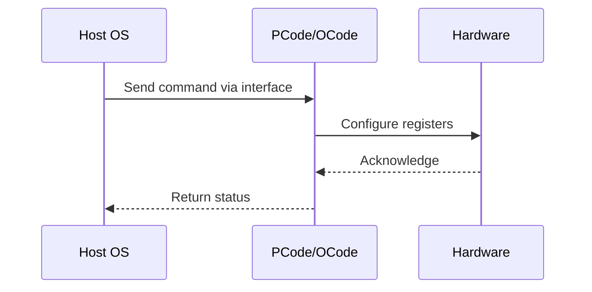

# NWP PSS Analysis

## Metadata
- HSD ID: 22021970014
- Title: MSR 0x198 (UCODE_CR_PERF_STATUS)
- Feature: PState Stack
- Sub Feature: Core P-States
- Script: nwp_pss_scripts/nwp_hwp_tpmi.py
- HSD Script: pm\pss\pstates\hwp_tpmi.py
- TC Owner: jscanlo1
- TR Owner: akurathi
- Validation Environment: emulation.hsle,xos
- Test Cycle: Newport Product.trunk.pss_0p8.pss.val.NWP_MCP HSLE XOS
- NWP Scope: Runnable_On_N-1

## HSD Hierarchy
- Test Case Definition: [22021969882 - Pre-Flight Checks](https://hsdes.intel.com/appstore/article/#/22021969882)
- Test Case: [22021970014 - MSR 0x198 (UCODE_CR_PERF_STATUS)](https://hsdes.intel.com/appstore/article/#/22021970014)
- Test Result: [22022027590 - [PSS][CORE_PSTATES] MSR 0x198 (UCODE_CR_PERF_STATUS)](https://hsdes.intel.com/appstore/article/#/22022027590)

## KB References
- KB Article: [KB/pm_features/pstate_stack/core_p_states.md](../../../KB/pm_features/pstate_stack/core_p_states.md)

## Model Response

## Refined Intent
Verify MSR 0x198 IA32_PERF_STATUS (UCODE_CR_PERF_STATUS) module-scoped core ratio matches MSR 0x196 UCODE_CR_CORE_OPERATING_POINT. Read MSR 0x198[14:8] (ratio in 100 MHz units), read MSR 0x196[15:0] (CORE_RATIO_16P67 in 16.67 MHz units), divide by 6, and compare — values must match.

## Refined Test Steps
Pre-Conditions:
  - Platform booted to SLE, HSLE, or XOS
  - All cores in C0, no C-states active
  - For CORE_OPERATING_POINT MSR access: part must be red-unlocked (IO_FIRMWARE_SYSTEM_MODES_CONTROL.CPU_LOCKED_STATUS cleared) and ENABLE_IA_OPERATING_POINT_REPORTING set, OR overclocking enabled
  - Ingredients: Pcode, Acode, Ucode, BIOS

Step 1 — Read MSR 0x198 per core:
  Read MSR 0x198[14:8] (UCODE_CR_PERF_STATUS.RATIO) — ratio in 100 MHz units.

Step 2 — Read MSR 0x196 per core:
  Read MSR 0x196[15:0] (UCODE_CR_CORE_OPERATING_POINT.CORE_RATIO_16P67) — ratio in 16.67 MHz units.
  Divide by 6 to convert to 100 MHz units.

Step 3 — Compare:
  Verify MSR 0x198[14:8] == MSR 0x196[15:0] / 6 for each core.

Step 4 — Optionally cross-check voltage:
  Read MSR 0x198[47:32] (VOLTAGE, U3.13 format).
  Read MSR 0x196[31:16] (VOLTAGE in 2.5 mV units).
  Verify consistent operating voltage.

Pass/Fail Criteria:
  PASS: MSR 0x198 ratio matches MSR 0x196 PLLRATIO / 6 for all cores
  FAIL: Mismatch between MSR 0x198 and MSR 0x196 readings

HAS/MAS References:
  - Core P-State HAS — IA32_PERF_STATUS / CORE_OPERATING_POINT: https://docs.intel.com/documents/pm_doc/src/server/Wave3_common/Core_Pstates/Core_Pstate_HAS.html

### NWP Project Relevance
**Test Classification:** Regression (DMR-inherited)
**Feature Status:** Expected to work
**Test Purpose:** Verify MSR 0x198 IA32_PERF_STATUS (UCODE_CR_PERF_STATUS) module-scoped core ratio matches MSR 0x196 UCODE_CR_CORE_OPERATING_POINT. Read MSR 0x198[14:8] (ratio in 100 MHz units), read MSR 0x196[15:0] (
**Negative Test Aspect:** None
**NWP Delta:** Topology differences from DMR (2 CBB + 1 NIO); same PState Stack behavior expected

## Section A: Critical Execution Path
1. Step 1 — Read MSR 0x198 per core:
2. Step 2 — Read MSR 0x196 per core:
3. Step 3 — Compare:
4. Step 4 — Optionally cross-check voltage:

## Section B: Component Interaction Diagram

## Section C: Interface Coverage Assessment
| Interface | Covered | Notes |
| --------- | ------- | ----- |
| CSR | Yes | Primary interface |
| MSR | Yes | Primary interface |
| Patch | Yes | Primary interface |
| 0x198 PERF_STATUS | Yes | Register access |
| 0x196 CORE_OPERATING_POINT | Yes | Register access |

## Section D: NWP Specification References
- **NWP PM HAS**: [NWP HAS - PM Features](https://docs.intel.com/documents/custom-xeon/newport-docs/has/Overview/NWP_HAS.html#pm-features)
- **NWP PM MAS**: [NWP IMH SoC PM MAS](https://docs.intel.com/documents/custom-xeon/newport-docs/mas/pm/nwp_imh_soc_pm_mas.html)
- **DMR PM HAS**: [DMR SoC PM HAS](https://docs.intel.com/documents/pm_doc/src/server/DMR/SOC_PM_HAS/DMR_SOC_PM_HAS.html)
- **Feature HAS**: [PNC PM HAS §4-6 - P-States/HWP](https://docs.intel.com/documents/pm_doc/src/server/GNR/Features/LNC/GNR_LNC_PStates.html)
- **DMR CBB HAS**: [DMR CBB PM HAS - HWP](https://docs.intel.com/documents/pm_doc/src/DMR_CBB/IP%20Integration/PM%20HAS/cbb_pm_has.html#hwp)
- **Intel® 64 and IA-32 SDM**: MSR definitions, CPUID enumeration

## Section E: NWP Risk Assessment
| Risk | Likelihood | Impact | Mitigation |
| ---- | ---------- | ------ | ---------- |
| Topology change | Medium | Medium | Verify on multi-die config |
| Interface delta | Low | Low | Compare with DMR baseline |
| Timing sensitivity | Low | Medium | Allow tolerance margins |

## Section F: Recommendations
1. Verify test works on NWP multi-die topology
2. Check for any interface changes from DMR
3. Update HAS references to NWP specifications
4. Add negative test coverage if missing
5. Consider additional stress test variants

---
*Generated from metadata on 2026-05-28 23:20:51*