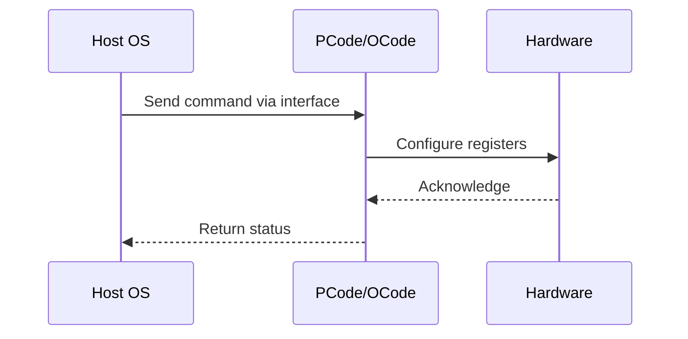

# NWP PSS Analysis

## Metadata
- HSD ID: 22021970028
- Title: PCT - All HP cores in C6
- Feature: SST
- Sub Feature: PCT
- Script: nwp_pss_scripts/pss_pct_tpmi.py
- HSD Script: (none)
- TC Owner: isaxena
- TR Owner: bg3
- Validation Environment: virtual_platform
- Test Cycle: Newport Product.trunk.pss_1p0.pss.val.NWP_VP
- NWP Scope: Runnable_On_N-1

## HSD Hierarchy
- Test Case Definition: [22021969888 - Priority Core Turbo](https://hsdes.intel.com/appstore/article/#/22021969888)
- Test Case: [22021970028 - PCT - All HP cores in C6](https://hsdes.intel.com/appstore/article/#/22021970028)
- Test Result: [22022027654 - [PSS][PCT] All HP cores in C6](https://hsdes.intel.com/appstore/article/#/22022027654)

## KB References
- KB Article: [KB/pm_features/sst/pct.md](../../../KB/pm_features/sst/pct.md)

## Model Response

## Refined Intent
Verify PCT HP/LP frequency behavior when all HP cores enter C6. With PCT enabled and HP modules in C6, verify that LP cores remain clipped to the LP PCT ratio and are not promoted.

## Refined Test Steps
Pre-Conditions:
  - PCT/SST-TF enabled in BIOS with default knobs (PctHpModuleCount=4, PctHpModuleSelection=1)
  - Turbo Disable = False
  - Fuse: PCT_Enabled = 0x0 (default, enabled by BIOS)
  - Ingredients: Primecode, Pcode, BIOS

Step 1 — Disable all C-states.

Step 2 — Enable C6 on all HP cores.

Step 3 — Set HWP MSR 0x774 to request max frequency.

Step 4 — Verify LP cores remain clipped to LP PCT ratio.
  LP cores should not be promoted to HP ratio even when HP cores are idle in C6.

Pass/Fail Criteria:
  PASS: LP cores remain at LP clipping ratio while HP cores are in C6
  FAIL: LP cores promoted to HP ratio, or PCT enforcement broken during HP C6

HAS/MAS References:
  - PCT HAS (Arch Common): https://docs.intel.com/documents/pm_doc/src/server/arch_common/PCT/PCT.html
  - IC PCT HAS: https://docs.intel.com/documents/pm_doc/src/server/arch_common/PCT/IC_PCT.html
  - SST TPMI HAS — SST_CLOS_ASSOC: https://docs.intel.com/documents/pm_doc/src/server/Wave3_common/SST/IC_SST_TPMI.html

### NWP Project Relevance
**Test Classification:** Regression (DMR-inherited)
**Feature Status:** Expected to work
**Test Purpose:** Verify PCT HP/LP frequency behavior when all HP cores enter C6. With PCT enabled and HP modules in C6, verify that LP cores remain clipped to the LP PCT ratio and are not promoted.
**Negative Test Aspect:** None
**NWP Delta:** Topology differences from DMR (2 CBB + 1 NIO); same SST behavior expected

## Section A: Critical Execution Path
1. Step 1 — Disable all C-states.
2. Step 2 — Enable C6 on all HP cores.
3. Step 3 — Set HWP MSR 0x774 to request max frequency.
4. Step 4 — Verify LP cores remain clipped to LP PCT ratio.

## Section B: Component Interaction Diagram

## Section C: Interface Coverage Assessment
| Interface | Covered | Notes |
| --------- | ------- | ----- |
| CSR | Yes | Primary interface |
| Fuse | Yes | Primary interface |
| MSR | Yes | Primary interface |
| PEGA | Yes | Primary interface |
| TPMI_IB | Yes | Primary interface |
| 0x774 HWP_REQUEST | Yes | Register access |

## Section D: NWP Specification References
- **NWP PM HAS**: [NWP HAS - PM Features](https://docs.intel.com/documents/custom-xeon/newport-docs/has/Overview/NWP_HAS.html#pm-features)
- **NWP PM MAS**: [NWP IMH SoC PM MAS - SST](https://docs.intel.com/documents/custom-xeon/newport-docs/mas/pm/nwp_imh_soc_pm_mas.html#sst)
- **DMR PM HAS**: [DMR SoC PM HAS](https://docs.intel.com/documents/pm_doc/src/server/DMR/SOC_PM_HAS/DMR_SOC_PM_HAS.html)
- **Feature HAS**: [DMR SST HAS](https://docs.intel.com/documents/pm_doc/src/server/DMR/Features/SST/DMR_SST.html)
- **DMR CBB HAS**: [DMR CBB PM HAS - SST](https://docs.intel.com/documents/pm_doc/src/DMR_CBB/IP%20Integration/PM%20HAS/cbb_pm_has.html#sst)
- **Intel® 64 and IA-32 SDM**: MSR definitions, CPUID enumeration

## Section E: NWP Risk Assessment
| Risk | Likelihood | Impact | Mitigation |
| ---- | ---------- | ------ | ---------- |
| Topology change | Medium | Medium | Verify on multi-die config |
| Interface delta | Low | Low | Compare with DMR baseline |
| Timing sensitivity | Low | Medium | Allow tolerance margins |

## Section F: Recommendations
1. Verify test works on NWP multi-die topology
2. Check for any interface changes from DMR
3. Update HAS references to NWP specifications
4. Add negative test coverage if missing
5. Consider additional stress test variants

---
*Generated from metadata on 2026-05-28 23:20:51*