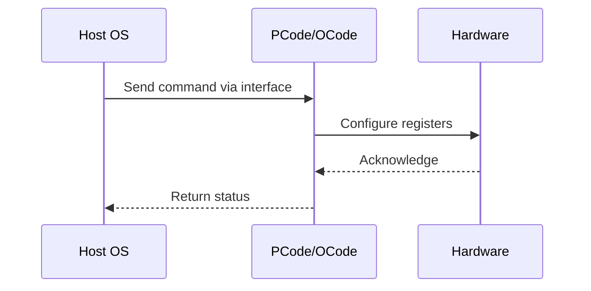

# NWP PSS Analysis

## Metadata
- HSD ID: 22021970029
- Title: PCT - BIOS Menu
- Feature: SST
- Sub Feature: PCT
- Script: nwp_pss_scripts/pss_pct_tpmi.py
- HSD Script: (none)
- TC Owner: isaxena
- TR Owner: bg3
- Validation Environment: virtual_platform
- Test Cycle: Newport Product.trunk.pss_0p8.pss.val.NWP_VP
- NWP Scope: Runnable_On_N-1

## HSD Hierarchy
- Test Case Definition: [22021969888 - Priority Core Turbo](https://hsdes.intel.com/appstore/article/#/22021969888)
- Test Case: [22021970029 - PCT - BIOS Menu](https://hsdes.intel.com/appstore/article/#/22021970029)
- Test Result: [22022027656 - [PSS][PCT] BIOS Menu](https://hsdes.intel.com/appstore/article/#/22022027656)

## KB References
- KB Article: [KB/pm_features/sst/pct.md](../../../KB/pm_features/sst/pct.md)

## Model Response

## Refined Intent
Verify PCT BIOS menu knobs are correctly exposed: PctHpModuleCount and PctHpModuleSelection. Boot with maximum cores (64) to expose all prioritizable modules, enter BIOS menu, and verify knob options match expected per specification.

## Refined Test Steps
Pre-Conditions:
  - PCT-capable SKU
  - Boot with large core count (ideally 64) to expose maximum number of prioritizable modules

Step 1 — Enter BIOS menu:
  Navigate to EDKII menu → Socket → CPU Pstate control.

Step 2 — Verify PCT knobs present:
  PctHpModuleCount: Verify available options match expected module count range.
  PctHpModuleSelection: Verify available selection options.

Step 3 — Verify knob defaults:
  PctHpModuleCount default = 4.
  PctHpModuleSelection default = 1 (auto).

Step 4 — Verify knob options match specification:
  Compare exposed options against PCT HAS specification.

Pass/Fail Criteria:
  PASS: BIOS menu shows correct PCT knobs with expected options and defaults
  FAIL: PCT knobs missing, wrong options, or incorrect defaults

HAS/MAS References:
  - PCT HAS — Enabling & Discovery: https://docs.intel.com/documents/pm_doc/src/server/arch_common/PCT/PCT.html
  - IC PCT HAS: https://docs.intel.com/documents/pm_doc/src/server/arch_common/PCT/IC_PCT.html

### NWP Project Relevance
**Test Classification:** Regression (DMR-inherited)
**Feature Status:** Expected to work
**Test Purpose:** Verify PCT BIOS menu knobs are correctly exposed: PctHpModuleCount and PctHpModuleSelection. Boot with maximum cores (64) to expose all prioritizable modules, enter BIOS menu, and verify knob options 
**Negative Test Aspect:** None
**NWP Delta:** Topology differences from DMR (2 CBB + 1 NIO); same SST behavior expected

## Section A: Critical Execution Path
1. Step 1 — Enter BIOS menu:
2. Step 2 — Verify PCT knobs present:
3. Step 3 — Verify knob defaults:
4. Step 4 — Verify knob options match specification:

## Section B: Component Interaction Diagram

## Section C: Interface Coverage Assessment
| Interface | Covered | Notes |
| --------- | ------- | ----- |
| B2P | Yes | Primary interface |
| CSR | Yes | Primary interface |
| TPMI_IB | Yes | Primary interface |

## Section D: NWP Specification References
- **NWP PM HAS**: [NWP HAS - PM Features](https://docs.intel.com/documents/custom-xeon/newport-docs/has/Overview/NWP_HAS.html#pm-features)
- **NWP PM MAS**: [NWP IMH SoC PM MAS - SST](https://docs.intel.com/documents/custom-xeon/newport-docs/mas/pm/nwp_imh_soc_pm_mas.html#sst)
- **DMR PM HAS**: [DMR SoC PM HAS](https://docs.intel.com/documents/pm_doc/src/server/DMR/SOC_PM_HAS/DMR_SOC_PM_HAS.html)
- **Feature HAS**: [DMR SST HAS](https://docs.intel.com/documents/pm_doc/src/server/DMR/Features/SST/DMR_SST.html)
- **DMR CBB HAS**: [DMR CBB PM HAS - SST](https://docs.intel.com/documents/pm_doc/src/DMR_CBB/IP%20Integration/PM%20HAS/cbb_pm_has.html#sst)
- **Intel® 64 and IA-32 SDM**: MSR definitions, CPUID enumeration

## Section E: NWP Risk Assessment
| Risk | Likelihood | Impact | Mitigation |
| ---- | ---------- | ------ | ---------- |
| Topology change | Medium | Medium | Verify on multi-die config |
| Interface delta | Low | Low | Compare with DMR baseline |
| Timing sensitivity | Low | Medium | Allow tolerance margins |

## Section F: Recommendations
1. Verify test works on NWP multi-die topology
2. Check for any interface changes from DMR
3. Update HAS references to NWP specifications
4. Add negative test coverage if missing
5. Consider additional stress test variants

---
*Generated from metadata on 2026-05-28 23:20:51*