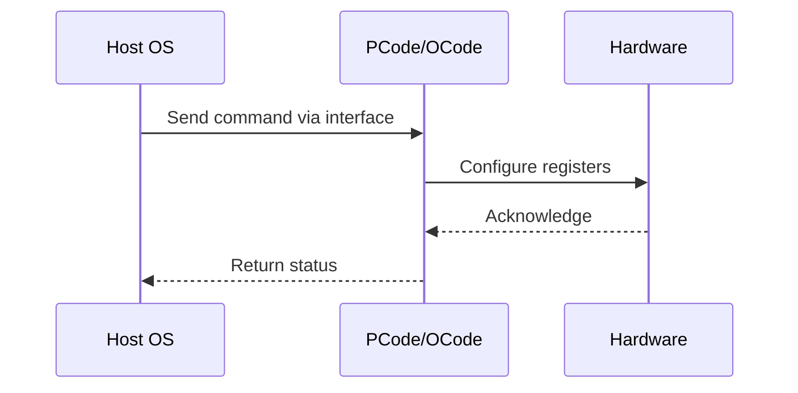

# NWP PSS Analysis

## Metadata
- HSD ID: 22021970030
- Title: PCT - BIOS Negative Validation
- Feature: SST
- Sub Feature: PCT
- Script: nwp_pss_scripts/pss_pct_tpmi.py
- HSD Script: (none)
- TC Owner: isaxena
- TR Owner: bg3
- Validation Environment: virtual_platform
- Test Cycle: Newport Product.trunk.pss_1p0.pss.val.NWP_VP
- NWP Scope: Runnable_On_N-1

## HSD Hierarchy
- Test Case Definition: [22021969888 - Priority Core Turbo](https://hsdes.intel.com/appstore/article/#/22021969888)
- Test Case: [22021970030 - PCT - BIOS Negative Validation](https://hsdes.intel.com/appstore/article/#/22021970030)
- Test Result: [22022027675 - [PSS][PCT] BIOS Negative Validation](https://hsdes.intel.com/appstore/article/#/22022027675)

## KB References
- KB Article: [KB/pm_features/sst/pct.md](../../../KB/pm_features/sst/pct.md)

## Model Response

## Refined Intent
Verify HP cores follow HP PCT turbo ratio and LP cores follow LP PCT ratio. Use SST_TF_INFO registers for expected ratios, MSR 0x198/UFS_STATUS for actual.

## Refined Test Steps
Pre-Conditions:
  - PCT/SST-TF enabled in BIOS with HP core selection
  - All C-states disabled

Step 1 — Read PCT ratio assignments:
  Read SST_TF_INFO-2..7 for HP turbo ratio limits per bucket.
  Read SST_TF_INFO-0 for LP_CLIP_RATIO values.
  Read SST_CLOS_ASSOC registers for per-core CLOS assignment.

Step 2 — Load all cores and verify:
  Set MSR 0x774 IA32_HWP_REQUEST to max frequency on all cores.
  Run workload on HP cores (CLOS0/1) — read MSR 0x198, verify ratio = HP PCT ratio.
  Run workload on LP cores (CLOS2/3) — read MSR 0x198, verify ratio = LP PCT ratio.

Step 3 — Disable PCT, verify all cores at P0n:
  Disable PCT via BIOS, reboot.
  Verify all cores clip to P0n (no HP/LP differentiation).

Step 4 — Re-enable PCT, re-verify:
  Enable PCT, reboot.
  Repeat Step 2 — verify HP/LP ratios match.

Pass/Fail Criteria:
  PASS: HP cores at HP ratio, LP cores at LP ratio, ratios match SST_TF_INFO
  FAIL: HP/LP ratio mismatch or no differentiation

HAS/MAS References:
  - PCT HAS — HP/LP Frequency: https://docs.intel.com/documents/pm_doc/src/server/arch_common/PCT/PCT.html
  - SST TPMI HAS — SST_TF_INFO: https://docs.intel.com/documents/pm_doc/src/server/Wave3_common/SST/IC_SST_TPMI.html

### NWP Project Relevance
**Test Classification:** Regression (DMR-inherited)
**Feature Status:** Expected to work
**Test Purpose:** Verify HP cores follow HP PCT turbo ratio and LP cores follow LP PCT ratio. Use SST_TF_INFO registers for expected ratios, MSR 0x198/UFS_STATUS for actual.
**Negative Test Aspect:** None
**NWP Delta:** Topology differences from DMR (2 CBB + 1 NIO); same SST behavior expected

## Section A: Critical Execution Path
1. Step 1 — Read PCT ratio assignments:
2. Step 2 — Load all cores and verify:
3. Step 3 — Disable PCT, verify all cores at P0n:
4. Step 4 — Re-enable PCT, re-verify:

## Section B: Component Interaction Diagram

## Section C: Interface Coverage Assessment
| Interface | Covered | Notes |
| --------- | ------- | ----- |
| CSR | Yes | Primary interface |
| Fuse | Yes | Primary interface |
| MSR | Yes | Primary interface |
| TPMI_IB | Yes | Primary interface |
| 0x198 PERF_STATUS | Yes | Register access |
| 0x774 HWP_REQUEST | Yes | Register access |

## Section D: NWP Specification References
- **NWP PM HAS**: [NWP HAS - PM Features](https://docs.intel.com/documents/custom-xeon/newport-docs/has/Overview/NWP_HAS.html#pm-features)
- **NWP PM MAS**: [NWP IMH SoC PM MAS - SST](https://docs.intel.com/documents/custom-xeon/newport-docs/mas/pm/nwp_imh_soc_pm_mas.html#sst)
- **DMR PM HAS**: [DMR SoC PM HAS](https://docs.intel.com/documents/pm_doc/src/server/DMR/SOC_PM_HAS/DMR_SOC_PM_HAS.html)
- **Feature HAS**: [DMR SST HAS](https://docs.intel.com/documents/pm_doc/src/server/DMR/Features/SST/DMR_SST.html)
- **DMR CBB HAS**: [DMR CBB PM HAS - SST](https://docs.intel.com/documents/pm_doc/src/DMR_CBB/IP%20Integration/PM%20HAS/cbb_pm_has.html#sst)
- **Intel® 64 and IA-32 SDM**: MSR definitions, CPUID enumeration

## Section E: NWP Risk Assessment
| Risk | Likelihood | Impact | Mitigation |
| ---- | ---------- | ------ | ---------- |
| Topology change | Medium | Medium | Verify on multi-die config |
| Interface delta | Low | Low | Compare with DMR baseline |
| Timing sensitivity | Low | Medium | Allow tolerance margins |

## Section F: Recommendations
1. Verify test works on NWP multi-die topology
2. Check for any interface changes from DMR
3. Update HAS references to NWP specifications
4. Add negative test coverage if missing
5. Consider additional stress test variants

---
*Generated from metadata on 2026-05-28 23:20:51*