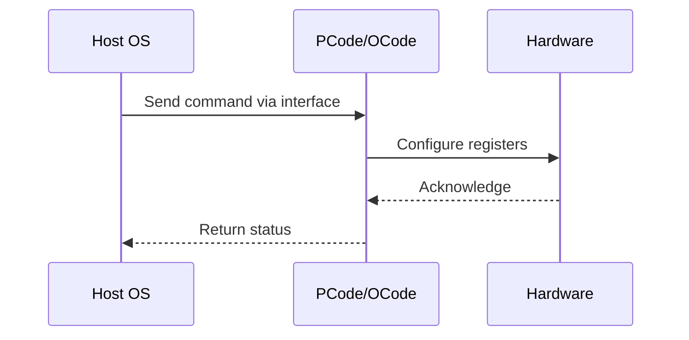

# NWP PSS Analysis

## Metadata
- HSD ID: 22021970034
- Title: PCT - Default HP core selection
- Feature: SST
- Sub Feature: PCT
- Script: nwp_pss_scripts/pss_pct_tpmi.py
- HSD Script: (none)
- TC Owner: isaxena
- TR Owner: bg3
- Validation Environment: virtual_platform
- Test Cycle: Newport Product.trunk.pss_1p0.pss.val.NWP_VP
- NWP Scope: Runnable_On_N-1

## HSD Hierarchy
- Test Case Definition: [22021969888 - Priority Core Turbo](https://hsdes.intel.com/appstore/article/#/22021969888)
- Test Case: [22021970034 - PCT - Default HP core selection](https://hsdes.intel.com/appstore/article/#/22021970034)
- Test Result: [22022027708 - [PSS][PCT] Default HP core selection](https://hsdes.intel.com/appstore/article/#/22022027708)

## KB References
- KB Article: [KB/pm_features/sst/pct.md](../../../KB/pm_features/sst/pct.md)

## Model Response

## Refined Intent
Verify PCT default HP core selection rule: SW divides all available processors into N partitions, and by default the first module in each partition is configured as HP (High Priority). Verify via SST_CLOS_ASSOC TPMI registers.

## Refined Test Steps
Pre-Conditions:
  - PCT enabled in BIOS with default HP core selection
  - Boot with large core count (ideally 32 or 64)

Step 1 — Read SST_CLOS_ASSOC registers:
  Read sv.socket0.cbb0.base.tpmi.sst_clos_assoc_0 (and _1, _2, _3).
  Identify which cores are CLOS0/1 (HP) vs CLOS2/3 (LP).

Step 2 — Try programming different values to HP modules count.

Step 3 — After boot, verify CLOS associations per module:
  For each partition: the first module must be assigned CLOS0/1 (HP).
  Remaining modules must be CLOS2/3 (LP).

Step 4 — Verify HP/LP frequency behavior:
  HP cores reach HP turbo ratio.
  LP cores stay at LP clipping ratio.

Pass/Fail Criteria:
  PASS: First module in each partition is HP by default, CLOS mapping correct
  FAIL: Wrong module assigned as HP, or CLOS mapping incorrect

HAS/MAS References:
  - PCT HAS — HP Core Selection: https://docs.intel.com/documents/pm_doc/src/server/arch_common/PCT/PCT.html
  - SST TPMI HAS — SST_CLOS_ASSOC: https://docs.intel.com/documents/pm_doc/src/server/Wave3_common/SST/IC_SST_TPMI.html

### NWP Project Relevance
**Test Classification:** Regression (DMR-inherited)
**Feature Status:** Expected to work
**Test Purpose:** Verify PCT default HP core selection rule: SW divides all available processors into N partitions, and by default the first module in each partition is configured as HP (High Priority). Verify via SST_
**Negative Test Aspect:** None
**NWP Delta:** Topology differences from DMR (2 CBB + 1 NIO); same SST behavior expected

## Section A: Critical Execution Path
1. Step 1 — Read SST_CLOS_ASSOC registers:
2. Step 2 — Try programming different values to HP modules count.
3. Step 3 — After boot, verify CLOS associations per module:
4. Step 4 — Verify HP/LP frequency behavior:

## Section B: Component Interaction Diagram

## Section C: Interface Coverage Assessment
| Interface | Covered | Notes |
| --------- | ------- | ----- |
| CSR | Yes | Primary interface |
| Fuse | Yes | Primary interface |
| MSR | Yes | Primary interface |
| TPMI_IB | Yes | Primary interface |
| 0x198 PERF_STATUS | Yes | Register access |

## Section D: NWP Specification References
- **NWP PM HAS**: [NWP HAS - PM Features](https://docs.intel.com/documents/custom-xeon/newport-docs/has/Overview/NWP_HAS.html#pm-features)
- **NWP PM MAS**: [NWP IMH SoC PM MAS - SST](https://docs.intel.com/documents/custom-xeon/newport-docs/mas/pm/nwp_imh_soc_pm_mas.html#sst)
- **DMR PM HAS**: [DMR SoC PM HAS](https://docs.intel.com/documents/pm_doc/src/server/DMR/SOC_PM_HAS/DMR_SOC_PM_HAS.html)
- **Feature HAS**: [DMR SST HAS](https://docs.intel.com/documents/pm_doc/src/server/DMR/Features/SST/DMR_SST.html)
- **DMR CBB HAS**: [DMR CBB PM HAS - SST](https://docs.intel.com/documents/pm_doc/src/DMR_CBB/IP%20Integration/PM%20HAS/cbb_pm_has.html#sst)
- **Intel® 64 and IA-32 SDM**: MSR definitions, CPUID enumeration

## Section E: NWP Risk Assessment
| Risk | Likelihood | Impact | Mitigation |
| ---- | ---------- | ------ | ---------- |
| Topology change | Medium | Medium | Verify on multi-die config |
| Interface delta | Low | Low | Compare with DMR baseline |
| Timing sensitivity | Low | Medium | Allow tolerance margins |

## Section F: Recommendations
1. Verify test works on NWP multi-die topology
2. Check for any interface changes from DMR
3. Update HAS references to NWP specifications
4. Add negative test coverage if missing
5. Consider additional stress test variants

---
*Generated from metadata on 2026-05-28 23:20:51*