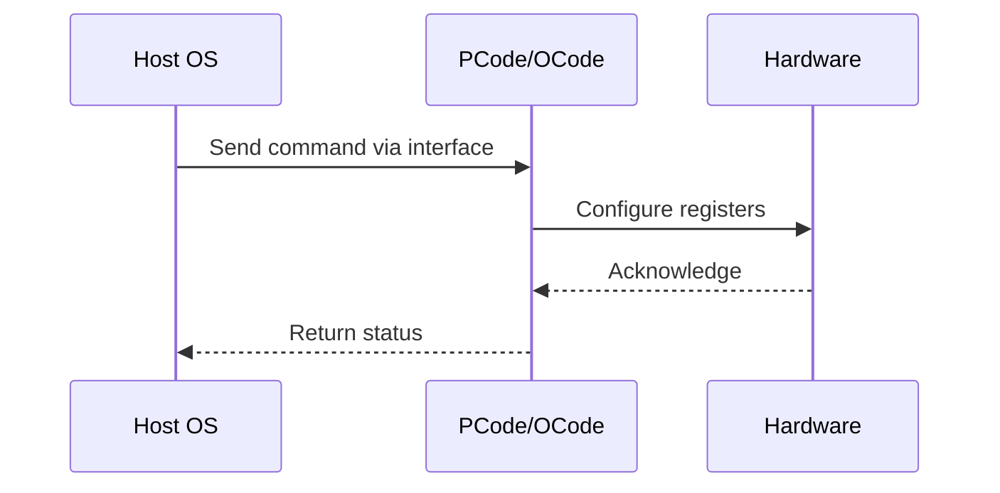

# NWP PSS Analysis

## Metadata
- HSD ID: 22021970036
- Title: PCT - TPMI register check (FlexconPM)
- Feature: SST
- Sub Feature: PCT
- Script: nwp_pss_scripts/pss_pct_tpmi.py
- HSD Script: (none)
- TC Owner: isaxena
- TR Owner: bg3
- Validation Environment: virtual_platform
- Test Cycle: Newport Product.trunk.pss_0p8.pss.val.NWP_VP
- NWP Scope: Runnable_On_N-1

## HSD Hierarchy
- Test Case Definition: [22021969888 - Priority Core Turbo](https://hsdes.intel.com/appstore/article/#/22021969888)
- Test Case: [22021970036 - PCT - TPMI register check (FlexconPM)](https://hsdes.intel.com/appstore/article/#/22021970036)
- Test Result: [22022027506 - [PSS][PCT] TPMI register check](https://hsdes.intel.com/appstore/article/#/22022027506)

## KB References
- KB Article: [KB/pm_features/sst/pct.md](../../../KB/pm_features/sst/pct.md)

## Model Response

## Refined Intent
Verify PCT/SST-TF TPMI registers match BIOS settings after boot as part of FlexconPM check. Validate SST_CLOS_CONFIG (HP/LP assignments), SST_CP_CONTROL (Ordered Throttling), SST_PP_CONTROL (feature state), and SST_CLOS_ASSOC registers across all dielets.

## Refined Test Steps
Pre-Conditions:
  - PCT enabled in BIOS (if auto, check that auto means 4 HP modules)
  - TPMI accessible via PythonSV

Step 1 — Verify SST_CLOS_CONFIG programming:
  Read SST_CLOS_CONFIG[0]: min=P1, max=SST_TF_INFO_2.RATIO_0 on all dielets (HP cores).
  Read SST_CLOS_CONFIG[3]: min=Pn, max=SST_TF_INFO_0.LP_CLIP_RATIO_0 on all dielets (LP cores).

Step 2 — Verify SST_CP_CONTROL:
  Read SST_CP_CONTROL.SST_CP_PRIORITY_TYPE — expect 1 (Ordered Throttling).

Step 3 — Verify SST_CLOS_ASSOC:
  Read SST_CLOS_ASSOC[0..3] for each HP and LP core on the Cdie.
  HP cores subscribed to CLOS[0], LP cores to CLOS[3].

Step 4 — Verify SST_PP_CONTROL:
  Read SST_PP_CONTROL.feature_state[1] = 1 on all dielets.

Pass/Fail Criteria:
  PASS: All TPMI registers match BIOS PCT settings across all dielets
  FAIL: Mismatch between TPMI registers and BIOS configuration

HAS/MAS References:
  - PCT HAS — TPMI Register Check: https://docs.intel.com/documents/pm_doc/src/server/arch_common/PCT/PCT.html
  - SST TPMI HAS — SST_CLOS_CONFIG, SST_CP_CONTROL, SST_PP_CONTROL: https://docs.intel.com/documents/pm_doc/src/server/Wave3_common/SST/IC_SST_TPMI.html

### NWP Project Relevance
**Test Classification:** Regression (DMR-inherited)
**Feature Status:** Expected to work
**Test Purpose:** Verify PCT/SST-TF TPMI registers match BIOS settings after boot as part of FlexconPM check. Validate SST_CLOS_CONFIG (HP/LP assignments), SST_CP_CONTROL (Ordered Throttling), SST_PP_CONTROL (feature s
**Negative Test Aspect:** None
**NWP Delta:** Topology differences from DMR (2 CBB + 1 NIO); same SST behavior expected

## Section A: Critical Execution Path
1. Step 1 — Verify SST_CLOS_CONFIG programming:
2. Step 2 — Verify SST_CP_CONTROL:
3. Step 3 — Verify SST_CLOS_ASSOC:
4. Step 4 — Verify SST_PP_CONTROL:

## Section B: Component Interaction Diagram

## Section C: Interface Coverage Assessment
| Interface | Covered | Notes |
| --------- | ------- | ----- |
| CSR | Yes | Primary interface |
| Fuse | Yes | Primary interface |
| TPMI_IB | Yes | Primary interface |
| TPMI: SST_CLOS_CONFIG | Yes | TPMI interface |
| TPMI: SST_CP_CONTROL | Yes | TPMI interface |
| TPMI: SST_PP_CONTROL | Yes | TPMI interface |

## Section D: NWP Specification References
- **NWP PM HAS**: [NWP HAS - PM Features](https://docs.intel.com/documents/custom-xeon/newport-docs/has/Overview/NWP_HAS.html#pm-features)
- **NWP PM MAS**: [NWP IMH SoC PM MAS - SST](https://docs.intel.com/documents/custom-xeon/newport-docs/mas/pm/nwp_imh_soc_pm_mas.html#sst)
- **DMR PM HAS**: [DMR SoC PM HAS](https://docs.intel.com/documents/pm_doc/src/server/DMR/SOC_PM_HAS/DMR_SOC_PM_HAS.html)
- **Feature HAS**: [DMR SST HAS](https://docs.intel.com/documents/pm_doc/src/server/DMR/Features/SST/DMR_SST.html)
- **DMR CBB HAS**: [DMR CBB PM HAS - SST](https://docs.intel.com/documents/pm_doc/src/DMR_CBB/IP%20Integration/PM%20HAS/cbb_pm_has.html#sst)
- **Intel® 64 and IA-32 SDM**: MSR definitions, CPUID enumeration

## Section E: NWP Risk Assessment
| Risk | Likelihood | Impact | Mitigation |
| ---- | ---------- | ------ | ---------- |
| Topology change | Medium | Medium | Verify on multi-die config |
| Interface delta | Low | Low | Compare with DMR baseline |
| Timing sensitivity | Low | Medium | Allow tolerance margins |

## Section F: Recommendations
1. Verify test works on NWP multi-die topology
2. Check for any interface changes from DMR
3. Update HAS references to NWP specifications
4. Add negative test coverage if missing
5. Consider additional stress test variants

---
*Generated from metadata on 2026-05-28 23:20:51*