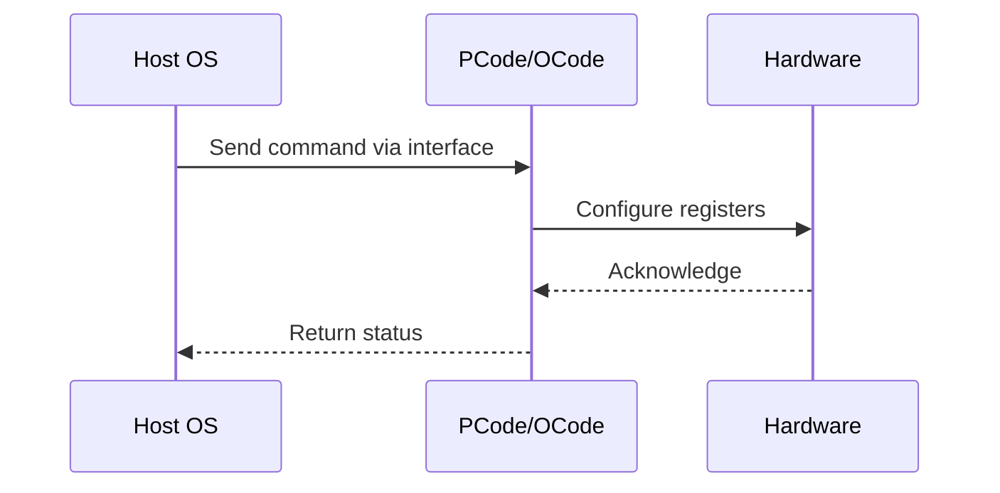

# NWP PSS Analysis

## Metadata
- HSD ID: 22021970066
- Title: HW Feedback bit 1
- Feature: PState Stack
- Sub Feature: HGS
- Script: nwp_pss_scripts/pss_hgs_feedback.py
- HSD Script: (none)
- TC Owner: isaxena
- TR Owner: bg3
- Validation Environment: emulation.hsle,xos
- Test Cycle: Newport Product.trunk.pss_1p0.pss.val.NWP_MCP HSLE XOS
- NWP Scope: Runnable_On_N-1

## HSD Hierarchy
- Test Case Definition: [22021969905 - HGS CPUID](https://hsdes.intel.com/appstore/article/#/22021969905)
- Test Case: [22021970066 - HW Feedback bit 1](https://hsdes.intel.com/appstore/article/#/22021970066)
- Test Result: [22022027598 - [PSS][HGS] HW Feedback bit 1](https://hsdes.intel.com/appstore/article/#/22022027598)

## KB References
- KB Article: [KB/pm_features/pstate_stack/hgs.md](../../../KB/pm_features/pstate_stack/hgs.md)

## Model Response

## Refined Intent
Verify HGS (Hardware Guided Scheduler) CPUID fields are populated correctly. When CPUID.6.EAX[19] (HW_FEEDBACK) is 1, CPUID.6.EDX reports: EDX[7:0] bitmap of supported HW feedback capabilities (Server enumerates 0x01 = performance only), EDX[11:8] HGS information table size in pages minus 1 (currently 0x00 = one 4K page on all products).

## Refined Test Steps
Pre-Conditions:
  - No special configuration required
  - Model: XOS

Step 1 — Execute CPUID.6 on each logical processor:
  Record EAX, EBX, ECX, EDX values.

Step 2 — Verify HW Feedback support bit:
  Check CPUID.6.EAX[19] (HW_FEEDBACK) = 1.

Step 3 — Verify EDX capability fields:
  EDX[7:0]: Bitmap of supported HW feedback interface capabilities.
    Server expected: 0x01 (performance capability only).
    Client expected: 0x03 (performance + energy efficiency).
  EDX[11:8]: Size of HGS information table (pages - 1).
    Expected: 0x00 (one 4K page) for parts with < 255 logical processors.

Step 4 — Cross-processor consistency:
  Verify CPUID.6.EAX[19] is consistent across all logical processors.

Pass/Fail Criteria:
  PASS: CPUID.6.EAX[19]=1, EDX[7:0] and EDX[11:8] match expected values
  FAIL: EAX[19]=0, or EDX fields report unexpected values

HAS/MAS References:
  - DMR Turbo HAS — HGS / HW Feedback: https://docs.intel.com/documents/pm_doc/src/server/DMR/PM%20Features/DMR_Turbo.html
  - NWP HAS — PM Features: https://docs.intel.com/documents/custom-xeon/newport-docs/has/Overview/NWP_HAS.html#pm-features

### NWP Project Relevance
**Test Classification:** Regression (DMR-inherited)
**Feature Status:** Expected to work
**Test Purpose:** Verify HGS (Hardware Guided Scheduler) CPUID fields are populated correctly. When CPUID.6.EAX[19] (HW_FEEDBACK) is 1, CPUID.6.EDX reports: EDX[7:0] bitmap of supported HW feedback capabilities (Server
**Negative Test Aspect:** None
**NWP Delta:** Topology differences from DMR (2 CBB + 1 NIO); same PState Stack behavior expected

## Section A: Critical Execution Path
1. Step 1 — Execute CPUID.6 on each logical processor:
2. Step 2 — Verify HW Feedback support bit:
3. Step 3 — Verify EDX capability fields:
4. Step 4 — Cross-processor consistency:

## Section B: Component Interaction Diagram

## Section C: Interface Coverage Assessment
| Interface | Covered | Notes |
| --------- | ------- | ----- |
| MSR | Yes | Primary interface |
| CPUID.6 (EAX/EDX) | Yes | Register access |

## Section D: NWP Specification References
- **NWP PM HAS**: [NWP HAS - PM Features](https://docs.intel.com/documents/custom-xeon/newport-docs/has/Overview/NWP_HAS.html#pm-features)
- **NWP PM MAS**: [NWP IMH SoC PM MAS](https://docs.intel.com/documents/custom-xeon/newport-docs/mas/pm/nwp_imh_soc_pm_mas.html)
- **DMR PM HAS**: [DMR SoC PM HAS](https://docs.intel.com/documents/pm_doc/src/server/DMR/SOC_PM_HAS/DMR_SOC_PM_HAS.html)
- **Feature HAS**: [PNC PM HAS §4-6 - P-States/HWP](https://docs.intel.com/documents/pm_doc/src/server/GNR/Features/LNC/GNR_LNC_PStates.html)
- **DMR CBB HAS**: [DMR CBB PM HAS - HWP](https://docs.intel.com/documents/pm_doc/src/DMR_CBB/IP%20Integration/PM%20HAS/cbb_pm_has.html#hwp)
- **Intel® 64 and IA-32 SDM**: MSR definitions, CPUID enumeration

## Section E: NWP Risk Assessment
| Risk | Likelihood | Impact | Mitigation |
| ---- | ---------- | ------ | ---------- |
| Topology change | Medium | Medium | Verify on multi-die config |
| Interface delta | Low | Low | Compare with DMR baseline |
| Timing sensitivity | Low | Medium | Allow tolerance margins |

## Section F: Recommendations
1. Verify test works on NWP multi-die topology
2. Check for any interface changes from DMR
3. Update HAS references to NWP specifications
4. Add negative test coverage if missing
5. Consider additional stress test variants

---
*Generated from metadata on 2026-05-28 23:20:51*