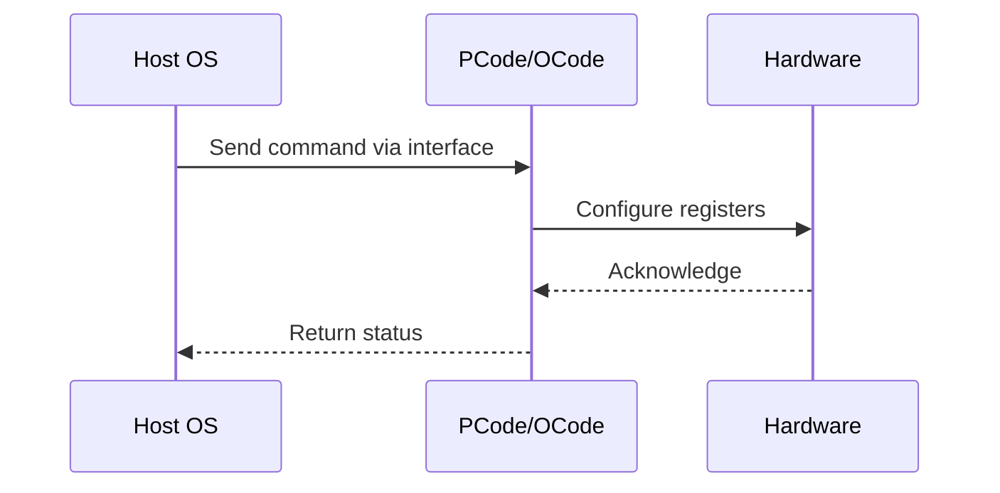

# NWP PSS Analysis

## Metadata
- HSD ID: 22021970067
- Title: HW Feedback bit 19
- Feature: PState Stack
- Sub Feature: HGS
- Script: nwp_pss_scripts/pss_hgs_feedback.py
- HSD Script: (none)
- TC Owner: isaxena
- TR Owner: bg3
- Validation Environment: emulation.hsle,xos
- Test Cycle: Newport Product.trunk.pss_1p0.pss.val.NWP_MCP HSLE XOS
- NWP Scope: Runnable_On_N-1

## HSD Hierarchy
- Test Case Definition: [22021969905 - HGS CPUID](https://hsdes.intel.com/appstore/article/#/22021969905)
- Test Case: [22021970067 - HW Feedback bit 19](https://hsdes.intel.com/appstore/article/#/22021970067)
- Test Result: [22022027594 - [PSS][HGS] HW Feedback bit 19](https://hsdes.intel.com/appstore/article/#/22022027594)

## KB References
- KB Article: [KB/pm_features/pstate_stack/hgs.md](../../../KB/pm_features/pstate_stack/hgs.md)

## Model Response

## Refined Intent
Verify HGS HFI performance and energy efficiency capability fields are populated and updated. Each logical processor's HFI entry has Performance (byte 0, 0-255) and Energy Efficiency (byte 1, 0-255).

## Refined Test Steps
Pre-Conditions:
  - HGS enabled in BIOS, OS HGS support active
  - HGS table address known from CPUID.6 and HGS MSR config

Step 1 — Locate HGS table:
  Read HGS table base from IA32_HW_FEEDBACK_CONFIG MSR.
  Verify table size from CPUID.6.EDX[11:8] (pages).

Step 2 — Read HFI entries:
  For each logical processor index (from CPUID.6.EDX[31:16]):
    Read Performance capability byte (0-255).
    Read Energy Efficiency capability byte (0-255).

Step 3 — Verify values are populated:
  Performance byte > 0 for at least some cores.
  Energy Efficiency byte > 0 for at least some cores.
  HP cores should have higher Performance capability than LP cores.

Step 4 — Verify table updates:
  Change workload (idle vs loaded), re-read HFI entries.
  Verify HGS table updates reflect workload changes.

Pass/Fail Criteria:
  PASS: HFI entries populated with non-zero perf/energy values, table updates on workload change
  FAIL: All-zero entries, or table never updates

HAS/MAS References:
  - DMR Turbo HAS — HGS / HFI Table: https://docs.intel.com/documents/pm_doc/src/server/DMR/PM%20Features/DMR_Turbo.html
  - NWP HAS — PM Features: https://docs.intel.com/documents/custom-xeon/newport-docs/has/Overview/NWP_HAS.html#pm-features

### NWP Project Relevance
**Test Classification:** Regression (DMR-inherited)
**Feature Status:** Expected to work
**Test Purpose:** Verify HGS HFI performance and energy efficiency capability fields are populated and updated. Each logical processor's HFI entry has Performance (byte 0, 0-255) and Energy Efficiency (byte 1, 0-255).
**Negative Test Aspect:** None
**NWP Delta:** Topology differences from DMR (2 CBB + 1 NIO); same PState Stack behavior expected

## Section A: Critical Execution Path
1. Step 1 — Locate HGS table:
2. Step 2 — Read HFI entries:
3. Step 3 — Verify values are populated:
4. Step 4 — Verify table updates:

## Section B: Component Interaction Diagram

## Section C: Interface Coverage Assessment
| Interface | Covered | Notes |
| --------- | ------- | ----- |
| CSR | Yes | Primary interface |
| MSR | Yes | Primary interface |
| IA32_HW_FEEDBACK_CONFIG | Yes | Register access |

## Section D: NWP Specification References
- **NWP PM HAS**: [NWP HAS - PM Features](https://docs.intel.com/documents/custom-xeon/newport-docs/has/Overview/NWP_HAS.html#pm-features)
- **NWP PM MAS**: [NWP IMH SoC PM MAS](https://docs.intel.com/documents/custom-xeon/newport-docs/mas/pm/nwp_imh_soc_pm_mas.html)
- **DMR PM HAS**: [DMR SoC PM HAS](https://docs.intel.com/documents/pm_doc/src/server/DMR/SOC_PM_HAS/DMR_SOC_PM_HAS.html)
- **Feature HAS**: [PNC PM HAS §4-6 - P-States/HWP](https://docs.intel.com/documents/pm_doc/src/server/GNR/Features/LNC/GNR_LNC_PStates.html)
- **DMR CBB HAS**: [DMR CBB PM HAS - HWP](https://docs.intel.com/documents/pm_doc/src/DMR_CBB/IP%20Integration/PM%20HAS/cbb_pm_has.html#hwp)
- **Intel® 64 and IA-32 SDM**: MSR definitions, CPUID enumeration

## Section E: NWP Risk Assessment
| Risk | Likelihood | Impact | Mitigation |
| ---- | ---------- | ------ | ---------- |
| Topology change | Medium | Medium | Verify on multi-die config |
| Interface delta | Low | Low | Compare with DMR baseline |
| Timing sensitivity | Low | Medium | Allow tolerance margins |

## Section F: Recommendations
1. Verify test works on NWP multi-die topology
2. Check for any interface changes from DMR
3. Update HAS references to NWP specifications
4. Add negative test coverage if missing
5. Consider additional stress test variants

---
*Generated from metadata on 2026-05-28 23:20:51*