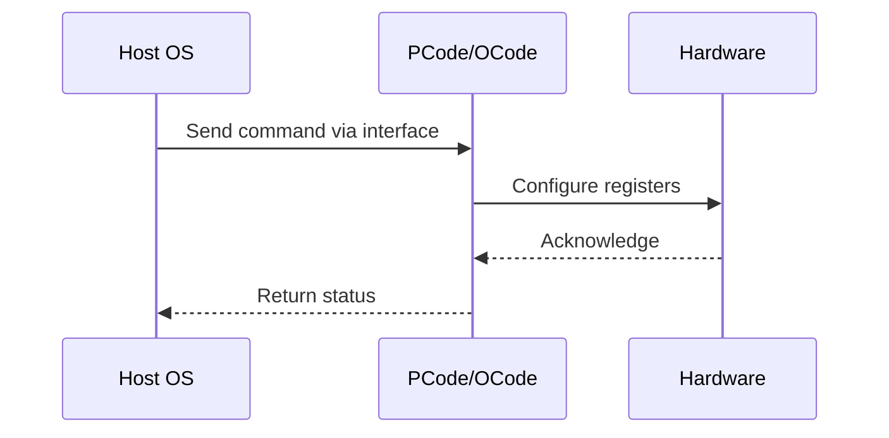

# NWP PSS Analysis

## Metadata
- HSD ID: 22021970092
- Title: [DMR][PM][SST-TF][SLE] All Cores Assigned to High Priority (CLOS0 / CLOS1)
- Feature: SST
- Sub Feature: SST-CP
- Script: nwp_pss_scripts/pss_sst_cp.py
- HSD Script: (none)
- TC Owner: isaxena
- TR Owner: bg3
- Validation Environment: virtual_platform
- Test Cycle: Newport Product.trunk.pss_0p8.pss.val.NWP_VP
- NWP Scope: Runnable_On_N-1

## HSD Hierarchy
- Test Case Definition: [22021969913 - [SST-TF] Functionality Checks](https://hsdes.intel.com/appstore/article/#/22021969913)
- Test Case: [22021970092 - [DMR][PM][SST-TF][SLE] All Cores Assigned to High Priority (CLOS0 / CLOS1)](https://hsdes.intel.com/appstore/article/#/22021970092)
- Test Result: [22022027516 - [PSS][SST] All Cores Assigned to High Priority (CLOS0 / CLOS1)](https://hsdes.intel.com/appstore/article/#/22022027516)

## KB References
- KB Article: [KB/pm_features/sst/sst_cp.md](../../../KB/pm_features/sst/sst_cp.md)

## Model Response

## Refined Intent
SST-TF: Verify turbo ratios higher than SST-PP TRL are granted when all cores are assigned to High Priority (CLOS0/CLOS1). Enable SST-TF, assign all cores to CLOS0 via SST_CLOS_ASSOC registers, verify XEON_CORE module_max_ratio matches SST-TF TRL for the corresponding bucket.

## Refined Test Steps
Pre-Conditions:
  - SST-TF enabled in BIOS
  - All C-states disabled

Step 1 — Enable SST-TF:
  Write 1 to SST.SST_PP_CONTROL.FEATURE_STATE[1].

Step 2 — Assign all cores to CLOS0 (HP):
  Write 0 to all fields in SST.SST_CLOS_ASSOC_<0, 1, 2, 3>.

Step 3 — Determine bucket number:
  Read SST.SST_TF_INFO_1 for bucket number based on active core count.

Step 4 — Obtain SST-TF ratio for corresponding bucket:
  Read SST.SST_TF_INFO_2.RATIO_<bucket>.

Step 5 — Verify per-core ratio:
  For each active core, check XEON_CORE_<CORE_NUM>.module_max_ratio matches the corresponding bucket's SST-TF TRL.

Step 6 — Repeat with CLOS1:
  Assign all cores to CLOS1, repeat Steps 3-5.

Step 7 — Repeat with mix of CLOS0 and CLOS1.

Pass/Fail Criteria:
  PASS: All cores at HP turbo ratio (SST-TF TRL) for the correct active-core bucket
  FAIL: Any core at LP ratio, or ratio does not match bucket TRL

HAS/MAS References:
  - Intel SST HAS — SST-TF HP CLOS0/1: https://docs.intel.com/documents/pm_doc/src/server/Wave3_common/SST/Intel_SST.html
  - SST TPMI HAS — SST_CLOS_ASSOC, SST_TF_INFO: https://docs.intel.com/documents/pm_doc/src/server/Wave3_common/SST/IC_SST_TPMI.html

### NWP Project Relevance
**Test Classification:** Regression (DMR-inherited)
**Feature Status:** Expected to work
**Test Purpose:** SST-TF: Verify turbo ratios higher than SST-PP TRL are granted when all cores are assigned to High Priority (CLOS0/CLOS1). Enable SST-TF, assign all cores to CLOS0 via SST_CLOS_ASSOC registers, verify
**Negative Test Aspect:** None
**NWP Delta:** Topology differences from DMR (2 CBB + 1 NIO); same SST behavior expected

## Section A: Critical Execution Path
1. Step 1 — Enable SST-TF:
2. Step 2 — Assign all cores to CLOS0 (HP):
3. Step 3 — Determine bucket number:
4. Step 4 — Obtain SST-TF ratio for corresponding bucket:
5. Step 5 — Verify per-core ratio:

## Section B: Component Interaction Diagram

## Section C: Interface Coverage Assessment
| Interface | Covered | Notes |
| --------- | ------- | ----- |
| CSR | Yes | Primary interface |
| Fuse | Yes | Primary interface |
| MSR | Yes | Primary interface |
| TPMI_IB | Yes | Primary interface |
| 0x198 PERF_STATUS | Yes | Register access |
| TPMI: SST_PP_CONTROL | Yes | TPMI interface |
| TPMI: SST_TF_INFO_0..7 | Yes | TPMI interface |
| TPMI: SST_CLOS_ASSOC | Yes | TPMI interface |

## Section D: NWP Specification References
- **NWP PM HAS**: [NWP HAS - PM Features](https://docs.intel.com/documents/custom-xeon/newport-docs/has/Overview/NWP_HAS.html#pm-features)
- **NWP PM MAS**: [NWP IMH SoC PM MAS - SST](https://docs.intel.com/documents/custom-xeon/newport-docs/mas/pm/nwp_imh_soc_pm_mas.html#sst)
- **DMR PM HAS**: [DMR SoC PM HAS](https://docs.intel.com/documents/pm_doc/src/server/DMR/SOC_PM_HAS/DMR_SOC_PM_HAS.html)
- **Feature HAS**: [DMR SST HAS](https://docs.intel.com/documents/pm_doc/src/server/DMR/Features/SST/DMR_SST.html)
- **DMR CBB HAS**: [DMR CBB PM HAS - SST](https://docs.intel.com/documents/pm_doc/src/DMR_CBB/IP%20Integration/PM%20HAS/cbb_pm_has.html#sst)
- **Intel® 64 and IA-32 SDM**: MSR definitions, CPUID enumeration

## Section E: NWP Risk Assessment
| Risk | Likelihood | Impact | Mitigation |
| ---- | ---------- | ------ | ---------- |
| Topology change | Medium | Medium | Verify on multi-die config |
| Interface delta | Low | Low | Compare with DMR baseline |
| Timing sensitivity | Low | Medium | Allow tolerance margins |

## Section F: Recommendations
1. Verify test works on NWP multi-die topology
2. Check for any interface changes from DMR
3. Update HAS references to NWP specifications
4. Add negative test coverage if missing
5. Consider additional stress test variants

---
*Generated from metadata on 2026-05-28 23:20:51*