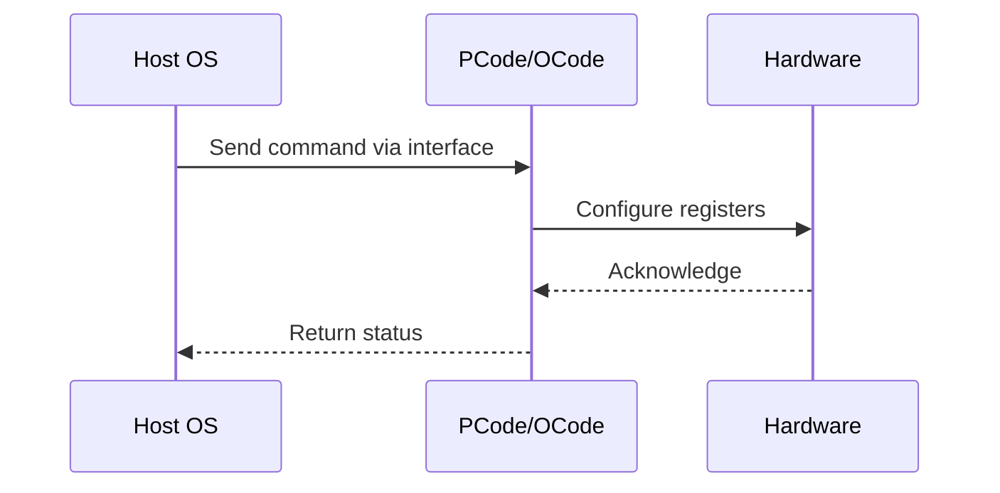

# NWP PSS Analysis

## Metadata
- HSD ID: 22021970094
- Title: [DMR][PM][SST-TF][SLE] SST-TF Dynamic Enabling and Disabling
- Feature: SST
- Sub Feature: TF
- Script: nwp_pss_scripts/pss_sst_cp.py
- HSD Script: (none)
- TC Owner: isaxena
- TR Owner: bg3
- Validation Environment: virtual_platform
- Test Cycle: Newport Product.trunk.pss_1p0.pss.val.NWP_VP
- NWP Scope: Runnable_On_N-1

## HSD Hierarchy
- Test Case Definition: [22021969913 - [SST-TF] Functionality Checks](https://hsdes.intel.com/appstore/article/#/22021969913)
- Test Case: [22021970094 - [DMR][PM][SST-TF][SLE] SST-TF Dynamic Enabling and Disabling](https://hsdes.intel.com/appstore/article/#/22021970094)
- Test Result: [22022027548 - [PSS][SST] SST-TF Dynamic Enabling and Disabling](https://hsdes.intel.com/appstore/article/#/22022027548)

## KB References
- KB Article: [KB/pm_features/sst/tf.md](../../../KB/pm_features/sst/tf.md)

## Model Response

## Refined Intent
SST-TF dynamic enabling/disabling: verify SST-TF can be toggled at runtime via TPMI SST_PP_CONTROL.FEATURE_STATE[1]. Enabling should allow HP/LP frequency differentiation, disabling should restore unified turbo. Also verify error handling when fuse or turbo-disable prevents enabling.

## Refined Test Steps
Pre-Conditions:
  - SST-TF supported (fuse enabled)
  - All C-states disabled

Step 1 — Enable SST-TF when currently disabled:
  Verify SST.SST_PP_STATUS.FEATURE_STATE[1] == 0.
  Write 1 to SST.SST_PP_CONTROL.FEATURE_STATE[1].
  Read SST.SST_TF_INFO_0.FEATURE_SUPPORTED — expect 1 (if fuse supports and turbo not disabled).
  If fuse does not support or turbo disabled: expect FEATURE_SUPPORTED = 0 and SST_PP_ERROR_TYPE = 1.

Step 2 — Disable SST-TF when currently enabled:
  Verify SST.SST_PP_STATUS.FEATURE_STATE[1] == 1.
  Write 0 to SST.SST_PP_CONTROL.FEATURE_STATE[1].
  Read SST_PP_STATUS.FEATURE_STATE[1] — expect 0.
  Read SST_TF_INFO_0.FEATURE_SUPPORTED — expect 0.

Step 3 — Verify frequency behavior:
  Enabled: HP cores reach HP ratio, LP cores clipped.
  Disabled: all cores at unified turbo.
  Re-enable: HP/LP split returns.

Pass/Fail Criteria:
  PASS: SST-TF toggles cleanly, frequency matches enabled/disabled state, error type set correctly on invalid enable
  FAIL: Toggle stuck, frequency mismatch, or no error on invalid enable

HAS/MAS References:
  - Intel SST HAS — SST-TF dynamic enable: https://docs.intel.com/documents/pm_doc/src/server/Wave3_common/SST/Intel_SST.html
  - SST TPMI HAS — SST_PP_CONTROL, SST_PP_STATUS: https://docs.intel.com/documents/pm_doc/src/server/Wave3_common/SST/IC_SST_TPMI.html

### NWP Project Relevance
**Test Classification:** Regression (DMR-inherited)
**Feature Status:** Expected to work
**Test Purpose:** SST-TF dynamic enabling/disabling: verify SST-TF can be toggled at runtime via TPMI SST_PP_CONTROL.FEATURE_STATE[1]. Enabling should allow HP/LP frequency differentiation, disabling should restore uni
**Negative Test Aspect:** None
**NWP Delta:** Topology differences from DMR (2 CBB + 1 NIO); same SST behavior expected

## Section A: Critical Execution Path
1. Step 1 — Enable SST-TF when currently disabled:
2. Step 2 — Disable SST-TF when currently enabled:
3. Step 3 — Verify frequency behavior:

## Section B: Component Interaction Diagram

## Section C: Interface Coverage Assessment
| Interface | Covered | Notes |
| --------- | ------- | ----- |
| CSR | Yes | Primary interface |
| Fuse | Yes | Primary interface |
| MSR | Yes | Primary interface |
| TPMI_IB | Yes | Primary interface |
| 0x198 PERF_STATUS | Yes | Register access |
| TPMI: SST_PP_CONTROL | Yes | TPMI interface |
| TPMI: SST_PP_STATUS | Yes | TPMI interface |
| TPMI: SST_TF_INFO_0 | Yes | TPMI interface |

## Section D: NWP Specification References
- **NWP PM HAS**: [NWP HAS - PM Features](https://docs.intel.com/documents/custom-xeon/newport-docs/has/Overview/NWP_HAS.html#pm-features)
- **NWP PM MAS**: [NWP IMH SoC PM MAS - SST](https://docs.intel.com/documents/custom-xeon/newport-docs/mas/pm/nwp_imh_soc_pm_mas.html#sst)
- **DMR PM HAS**: [DMR SoC PM HAS](https://docs.intel.com/documents/pm_doc/src/server/DMR/SOC_PM_HAS/DMR_SOC_PM_HAS.html)
- **Feature HAS**: [DMR SST HAS](https://docs.intel.com/documents/pm_doc/src/server/DMR/Features/SST/DMR_SST.html)
- **DMR CBB HAS**: [DMR CBB PM HAS - SST](https://docs.intel.com/documents/pm_doc/src/DMR_CBB/IP%20Integration/PM%20HAS/cbb_pm_has.html#sst)
- **Intel® 64 and IA-32 SDM**: MSR definitions, CPUID enumeration

## Section E: NWP Risk Assessment
| Risk | Likelihood | Impact | Mitigation |
| ---- | ---------- | ------ | ---------- |
| Topology change | Medium | Medium | Verify on multi-die config |
| Interface delta | Low | Low | Compare with DMR baseline |
| Timing sensitivity | Low | Medium | Allow tolerance margins |

## Section F: Recommendations
1. Verify test works on NWP multi-die topology
2. Check for any interface changes from DMR
3. Update HAS references to NWP specifications
4. Add negative test coverage if missing
5. Consider additional stress test variants

---
*Generated from metadata on 2026-05-28 23:20:51*