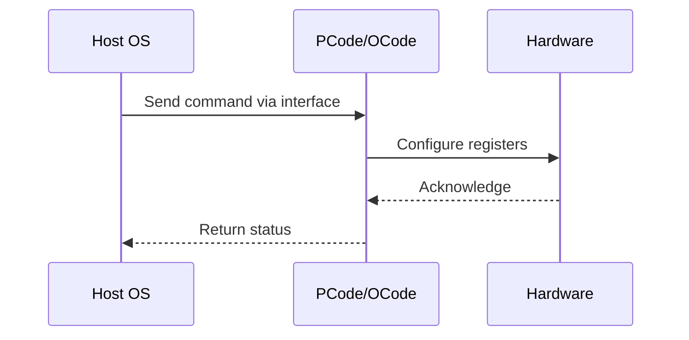

# NWP PSS Analysis

## Metadata
- HSD ID: 22021970095
- Title: [DMR][PM][SST-TF][SLE] Fuse Values Propagation Checks
- Feature: SST
- Sub Feature: Fuse
- Script: nwp_pss_scripts/pss_sst_cp.py
- HSD Script: (none)
- TC Owner: isaxena
- TR Owner: bg3
- Validation Environment: virtual_platform
- Test Cycle: Newport Product.trunk.pss_1p0.pss.val.NWP_VP
- NWP Scope: Runnable_On_N-1

## HSD Hierarchy
- Test Case Definition: [22021969914 - [SST-TF] Pre-Flight Checks](https://hsdes.intel.com/appstore/article/#/22021969914)
- Test Case: [22021970095 - [DMR][PM][SST-TF][SLE] Fuse Values Propagation Checks](https://hsdes.intel.com/appstore/article/#/22021970095)
- Test Result: [22022027526 - [PSS][SST] Fuse Values Propagation Checks](https://hsdes.intel.com/appstore/article/#/22022027526)

## KB References
- KB Article: [KB/pm_features/sst/fuse.md](../../../KB/pm_features/sst/fuse.md)

## Model Response

## Refined Intent
SST-TF fuse propagation: verify SST-TF fuse values are correctly propagated to SST_TF_INFO TPMI registers at the current SST-PP level. LP_CLIP_RATIO fuses → SST_TF_INFO_0, NUM_CORE fuses → SST_TF_INFO_1, TRL RATIO fuses → SST_TF_INFO_2 through SST_TF_INFO_7.

## Refined Test Steps
Pre-Conditions:
  - Platform booted with known SST-TF fuse configuration
  - No special configuration required, boot with default fuses
  - BIOS knob: turbo disable = False

Step 1 — Verify LP_CLIP_RATIO fuse propagation:
  Read SST_TF_CONFIG_<PP_LEVEL>_LP_CLIP_RATIO_CDYN_INDEX<CDYN>.
  Compare with SST.SST_TF_INFO_0.LP_CLIP_RATIO_<CDYN>.
  Fuse value must equal TPMI register value.

Step 2 — Verify NUM_CORE fuse propagation:
  Read SST_TF_CONFIG_<PP_LEVEL>_TURBO_RATIO_LIMIT_CORES_NUMCORE<BUCKET>.
  Compare with SST.SST_TF_INFO_1.NUM_CORE_<BUCKET>.
  Fuse value must equal TPMI register value.

Step 3 — Verify TRL RATIO fuse propagation:
  Read SST_TF_CONFIG_<PP_LEVEL>_TURBO_RATIO_LIMIT_RATIOS_CDYN_INDEX<0..5>_RATIO<BUCKET>.
  Compare with SST.SST_TF_INFO_<2, 3, 4, 5, 6, 7>.RATIO<BUCKET>.
  Fuse value must equal TPMI register value.

Pass/Fail Criteria:
  PASS: All SST_TF_INFO TPMI values match their source fuses
  FAIL: Any mismatch between fuse and TPMI register

HAS/MAS References:
  - SST TPMI HAS — SST_TF_INFO fuse propagation: https://docs.intel.com/documents/pm_doc/src/server/Wave3_common/SST/IC_SST_TPMI.html
  - Intel SST HAS: https://docs.intel.com/documents/pm_doc/src/server/Wave3_common/SST/Intel_SST.html

### NWP Project Relevance
**Test Classification:** Regression (DMR-inherited)
**Feature Status:** Expected to work
**Test Purpose:** SST-TF fuse propagation: verify SST-TF fuse values are correctly propagated to SST_TF_INFO TPMI registers at the current SST-PP level. LP_CLIP_RATIO fuses → SST_TF_INFO_0, NUM_CORE fuses → SST_TF_INFO
**Negative Test Aspect:** None
**NWP Delta:** Topology differences from DMR (2 CBB + 1 NIO); same SST behavior expected

## Section A: Critical Execution Path
1. Step 1 — Verify LP_CLIP_RATIO fuse propagation:
2. Step 2 — Verify NUM_CORE fuse propagation:
3. Step 3 — Verify TRL RATIO fuse propagation:

## Section B: Component Interaction Diagram

## Section C: Interface Coverage Assessment
| Interface | Covered | Notes |
| --------- | ------- | ----- |
| Fuse | Yes | Primary interface |
| TPMI_IB | Yes | Primary interface |
| TPMI: SST_TF_INFO_0..7 | Yes | TPMI interface |

## Section D: NWP Specification References
- **NWP PM HAS**: [NWP HAS - PM Features](https://docs.intel.com/documents/custom-xeon/newport-docs/has/Overview/NWP_HAS.html#pm-features)
- **NWP PM MAS**: [NWP IMH SoC PM MAS - SST](https://docs.intel.com/documents/custom-xeon/newport-docs/mas/pm/nwp_imh_soc_pm_mas.html#sst)
- **DMR PM HAS**: [DMR SoC PM HAS](https://docs.intel.com/documents/pm_doc/src/server/DMR/SOC_PM_HAS/DMR_SOC_PM_HAS.html)
- **Feature HAS**: [DMR SST HAS](https://docs.intel.com/documents/pm_doc/src/server/DMR/Features/SST/DMR_SST.html)
- **DMR CBB HAS**: [DMR CBB PM HAS - SST](https://docs.intel.com/documents/pm_doc/src/DMR_CBB/IP%20Integration/PM%20HAS/cbb_pm_has.html#sst)
- **Intel® 64 and IA-32 SDM**: MSR definitions, CPUID enumeration

## Section E: NWP Risk Assessment
| Risk | Likelihood | Impact | Mitigation |
| ---- | ---------- | ------ | ---------- |
| Topology change | Medium | Medium | Verify on multi-die config |
| Interface delta | Low | Low | Compare with DMR baseline |
| Timing sensitivity | Low | Medium | Allow tolerance margins |

## Section F: Recommendations
1. Verify test works on NWP multi-die topology
2. Check for any interface changes from DMR
3. Update HAS references to NWP specifications
4. Add negative test coverage if missing
5. Consider additional stress test variants

---
*Generated from metadata on 2026-05-28 23:20:51*