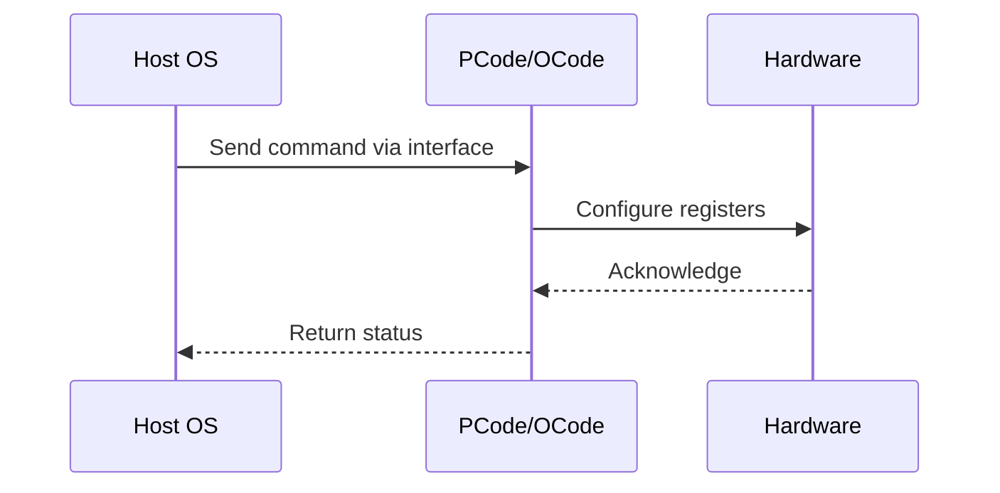

# NWP PSS Analysis

## Metadata
- HSD ID: 22021970206
- Title: Mailbox Sweep
- Feature: PState Stack
- Sub Feature: Mailbox
- Script: nwp_pss_scripts/nwp_osmb_sweep.py
- HSD Script: pm\pss\mailbox\osmb_tpmi.py
- TC Owner: jscanlo1
- TR Owner: bg3
- Validation Environment: virtual_platform
- Test Cycle: Newport Product.trunk.pss_1p0.pss.val.NWP_VP
- NWP Scope: Runnable_On_N-1

## HSD Hierarchy
- Test Case Definition: [22021969949 - BIOS/OS/BMC Mailbox](https://hsdes.intel.com/appstore/article/#/22021969949)
- Test Case: [22021970206 - Mailbox Sweep](https://hsdes.intel.com/appstore/article/#/22021970206)
- Test Result: [22022027691 - [PSS][MAILBOX] BIOS/OS Mailbox Sweep](https://hsdes.intel.com/appstore/article/#/22022027691)

## KB References
- KB Article: [KB/pm_features/pstate_stack/mailbox.md](../../../KB/pm_features/pstate_stack/mailbox.md)

## Model Response

## Refined Intent
Sweep BIOS-to-Pcode (PCU_CR_BIOS_MAILBOX at 0x705c/0x7058) and OS-to-Pcode (MSR 0xB0/0xB1) mailbox commands. Verify valid responses and side-effects for each command code.

## Refined Test Steps
Pre-Conditions:
  - Platform booted, BIOS and Pcode initialized
  - Mailbox interfaces accessible via PythonSV

Step 1 — BIOS mailbox sweep:
  For each command in [0xA6 SET_MC_FREQ, 0xA7 READ_MC_FREQ, ...]:
    a. Write command to PCU_CR_BIOS_MAILBOX_INTERFACE (0x705c)
    b. Write data to PCU_CR_BIOS_MAILBOX_DATA (0x7058)
    c. Set run_busy, wait for completion
    d. Read return code — verify no error
    e. Read data register — verify expected response

Step 2 — OS mailbox sweep:
  For each OS mailbox command:
    a. Write MSR 0xB1 (OS_MAILBOX_DATA)
    b. Write MSR 0xB0 (OS_MAILBOX_INTERFACE) with command + run_busy
    c. Wait for run_busy to clear
    d. Read MSR 0xB0 return code — verify no error

Step 3 — Verify side-effects:
  After SET commands, read related registers to confirm the setting took effect.
  After READ commands, verify returned data matches expected register values.

Pass/Fail Criteria:
  PASS: All supported commands return success, data matches expected
  FAIL: Mailbox timeout, error return code, or data mismatch

HAS/MAS References:
  - DMR SoC PM HAS — B2P / O2P Mailbox: https://docs.intel.com/documents/pm_doc/src/server/DMR/SOC_PM_HAS/DMR_SOC_PM_HAS.html

### NWP Project Relevance
**Test Classification:** Regression (DMR-inherited)
**Feature Status:** Expected to work
**Test Purpose:** Sweep BIOS-to-Pcode (PCU_CR_BIOS_MAILBOX at 0x705c/0x7058) and OS-to-Pcode (MSR 0xB0/0xB1) mailbox commands. Verify valid responses and side-effects for each command code.
**Negative Test Aspect:** None
**NWP Delta:** Topology differences from DMR (2 CBB + 1 NIO); same PState Stack behavior expected

## Section A: Critical Execution Path
1. Step 1 — BIOS mailbox sweep:
2. Step 2 — OS mailbox sweep:
3. Step 3 — Verify side-effects:

## Section B: Component Interaction Diagram

## Section C: Interface Coverage Assessment
| Interface | Covered | Notes |
| --------- | ------- | ----- |
| B2P | Yes | Primary interface |
| CSR | Yes | Primary interface |
| MSR | Yes | Primary interface |
| O2P | Yes | Primary interface |
| 0xB0 OS_MAILBOX_INTERFACE | Yes | Register access |
| 0xB1 OS_MAILBOX_DATA | Yes | Register access |

## Section D: NWP Specification References
- **NWP PM HAS**: [NWP HAS - PM Features](https://docs.intel.com/documents/custom-xeon/newport-docs/has/Overview/NWP_HAS.html#pm-features)
- **NWP PM MAS**: [NWP IMH SoC PM MAS](https://docs.intel.com/documents/custom-xeon/newport-docs/mas/pm/nwp_imh_soc_pm_mas.html)
- **DMR PM HAS**: [DMR SoC PM HAS](https://docs.intel.com/documents/pm_doc/src/server/DMR/SOC_PM_HAS/DMR_SOC_PM_HAS.html)
- **Feature HAS**: [PNC PM HAS §4-6 - P-States/HWP](https://docs.intel.com/documents/pm_doc/src/server/GNR/Features/LNC/GNR_LNC_PStates.html)
- **DMR CBB HAS**: [DMR CBB PM HAS - HWP](https://docs.intel.com/documents/pm_doc/src/DMR_CBB/IP%20Integration/PM%20HAS/cbb_pm_has.html#hwp)
- **Intel® 64 and IA-32 SDM**: MSR definitions, CPUID enumeration

## Section E: NWP Risk Assessment
| Risk | Likelihood | Impact | Mitigation |
| ---- | ---------- | ------ | ---------- |
| Topology change | Medium | Medium | Verify on multi-die config |
| Interface delta | Low | Low | Compare with DMR baseline |
| Timing sensitivity | Low | Medium | Allow tolerance margins |

## Section F: Recommendations
1. Verify test works on NWP multi-die topology
2. Check for any interface changes from DMR
3. Update HAS references to NWP specifications
4. Add negative test coverage if missing
5. Consider additional stress test variants

---
*Generated from metadata on 2026-05-28 23:20:51*