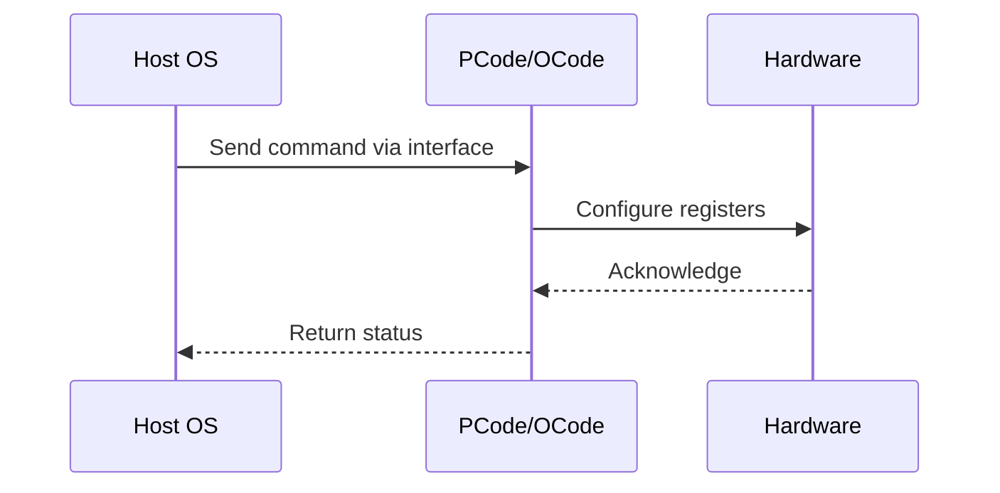

# NWP PSS Analysis

## Metadata
- HSD ID: 22021974407
- Title: VCCFCFCAB
- Feature: SoC Thermal
- Sub Feature: ITD
- Script: pm/pss/ITD/python/itd.py
- HSD Script: (none)
- TC Owner: aprakas2
- TR Owner: mps
- Validation Environment: emulation.hsle
- Test Cycle: Newport Product.trunk.pss_1p0.pss.val.NWP_MCP-HSLE
- NWP Scope: Runnable_On_N-1

## HSD Hierarchy
- Test Case Definition: [22021969873 - ITD Domains](https://hsdes.intel.com/appstore/article/#/22021969873)
- Test Case: [22021974407 - VCCFCFCAB](https://hsdes.intel.com/appstore/article/#/22021974407)
- Test Result: [22022027700 - [PSS][ITD] VCCFCFCAB](https://hsdes.intel.com/appstore/article/#/22022027700)

## KB References
- KB Article: [KB/pm_features/soc_thermal/itd.md](../../../KB/pm_features/soc_thermal/itd.md)

## Model Response

## Refined Intent
Verify Inverse Temperature Dependence (ITD) voltage compensation across CBB and IMH ITD domains. Validate dual-slope behavior: ITD_SLOPE applied below fused ITD_CUTOFF_V_X, ITD_SLOPE_2 applied above. Confirm HW autonomous work-point switching (active/auto_idle/idle) and RC Voltage Offset application for ITD correction.

## Refined Test Steps
Pre-Conditions:
  - Platform booted to SLE/HSLE
  - ITD enabled in BIOS/fuses
  - Thermal sensor access available (PECI or TPMI)
  - PythonSV access to voltage/frequency registers and RC Voltage Offset
  - Known fused values: ITD_SLOPE, ITD_SLOPE_2, ITD_CUTOFF_V_X per domain

Step 1 — Read fused ITD parameters per domain (CBB and IMH):
  For each ITD domain:
    Read ITD_SLOPE (slope below cutoff)
    Read ITD_SLOPE_2 (slope above cutoff)
    Read ITD_CUTOFF_V_X (voltage crossover point)
  Record expected dual-slope breakpoints.

Step 2 — Verify ITD compensation at temperature below Tj,max:
  Sweep temperature from nominal down toward low end.
  At each temperature point:
    Read uncompensated voltage request.
    If uncompensated voltage < ITD_CUTOFF_V_X:
      Verify ITD_SLOPE is applied (voltage increases as temperature decreases).
    If uncompensated voltage >= ITD_CUTOFF_V_X:
      Verify ITD_SLOPE_2 is applied.
    Read actual delivered voltage — confirm ITD offset matches expected slope * delta-T.

Step 3 — Verify RC Voltage Offset application:
  Read RC Voltage Offset register for each ITD domain.
  Confirm ITD correction is applied via Voltage Offset (not direct VID override).
  Verify offset magnitude matches ITD_SLOPE * (Tref - Tactual).

Step 4 — Verify dual-slope crossover at ITD_CUTOFF_V_X:
  Set operating point so uncompensated voltage crosses ITD_CUTOFF_V_X.
  Verify slope transitions from ITD_SLOPE to ITD_SLOPE_2 (or vice versa) at the cutoff.
  No discontinuity in delivered voltage at the crossover.

Step 5 — Verify work-point autonomy:
  Trigger HW transitions between active, auto_idle, and idle work points.
  At each work point:
    Verify ITD compensation is correctly applied.
    Verify all three work points produce valid voltage/frequency.
  Confirm HW switches autonomously without SW intervention.

Step 6 — Verify FIVR/MBVR independence:
  During ITD voltage changes, verify no sequencing dependency between FIVR and MBVR.
  Allow FIVR ramp up while MBVR ramps down (and vice versa).
  Confirm no glitches or invalid intermediate states.

Step 7 — Repeat for all ITD domains:
  CBB domains: per CBB ITD HAS domain table.
  IMH domains: per IMH ITD HAS domain table.

References:
  CBB ITD HAS: https://docs.intel.com/documents/pm_doc/src/DMR_CBB/HAS/Thermal/ITD/ITD.html#itd-ttd-domains
  IMH ITD HAS: https://docs.intel.com/documents/pm_doc/src/server/DMR/PM%20Features/Thermals/DMR_Thermal.html#itd

Pass/Fail Criteria:
  PASS: ITD compensation matches expected slope per domain, dual-slope transition at ITD_CUTOFF_V_X is seamless, all work points valid, FIVR/MBVR ramp independently
  FAIL: Wrong slope applied, voltage discontinuity at crossover, invalid work point, FIVR/MBVR sequencing error

HAS/MAS References:
  - DMR CBB ITD HAS — ITD/TTD Domains: https://docs.intel.com/documents/pm_doc/src/DMR_CBB/HAS/Thermal/ITD/ITD.html#itd-ttd-domains
  - DMR Thermal HAS — ITD: https://docs.intel.com/documents/pm_doc/src/server/DMR/PM%20Features/Thermals/DMR_Thermal.html#itd

### NWP Project Relevance
**Test Classification:** Regression (DMR-inherited)
**Feature Status:** Expected to work
**Test Purpose:** Verify Inverse Temperature Dependence (ITD) voltage compensation across CBB and IMH ITD domains. Validate dual-slope behavior: ITD_SLOPE applied below fused ITD_CUTOFF_V_X, ITD_SLOPE_2 applied above. 
**Negative Test Aspect:** None
**NWP Delta:** Topology differences from DMR (2 CBB + 1 NIO); same SoC Thermal behavior expected

## Section A: Critical Execution Path
1. Step 1 — Read fused ITD parameters per domain (CBB and IMH):
2. Step 2 — Verify ITD compensation at temperature below Tj,max:
3. Step 3 — Verify RC Voltage Offset application:
4. Step 4 — Verify dual-slope crossover at ITD_CUTOFF_V_X:
5. Step 5 — Verify work-point autonomy:

## Section B: Component Interaction Diagram

## Section C: Interface Coverage Assessment
| Interface | Covered | Notes |
| --------- | ------- | ----- |
| CSR | Yes | Primary interface |
| Fuse | Yes | Primary interface |
| SVID | Yes | Primary interface |

## Section D: NWP Specification References
- **NWP PM HAS**: [NWP HAS - PM Features](https://docs.intel.com/documents/custom-xeon/newport-docs/has/Overview/NWP_HAS.html#pm-features)
- **NWP PM MAS**: [NWP IMH SoC PM MAS - Thermal](https://docs.intel.com/documents/custom-xeon/newport-docs/mas/pm/nwp_imh_soc_pm_mas.html#thermal)
- **DMR PM HAS**: [DMR SoC PM HAS](https://docs.intel.com/documents/pm_doc/src/server/DMR/SOC_PM_HAS/DMR_SOC_PM_HAS.html)
- **Feature HAS**: [DMR Thermal HAS](https://docs.intel.com/documents/pm_doc/src/server/DMR/Features/Thermal/DMR_Thermal.html)
- **DMR CBB HAS**: [DMR CBB PM HAS - DTS](https://docs.intel.com/documents/pm_doc/src/DMR_CBB/IP%20Integration/PM%20HAS/cbb_pm_has.html#dts)
- **Intel® 64 and IA-32 SDM**: MSR definitions, CPUID enumeration

## Section E: NWP Risk Assessment
| Risk | Likelihood | Impact | Mitigation |
| ---- | ---------- | ------ | ---------- |
| Topology change | Medium | Medium | Verify on multi-die config |
| Interface delta | Low | Low | Compare with DMR baseline |
| Timing sensitivity | Low | Medium | Allow tolerance margins |

## Section F: Recommendations
1. Verify test works on NWP multi-die topology
2. Check for any interface changes from DMR
3. Update HAS references to NWP specifications
4. Add negative test coverage if missing
5. Consider additional stress test variants

---
*Generated from metadata on 2026-05-28 23:20:51*