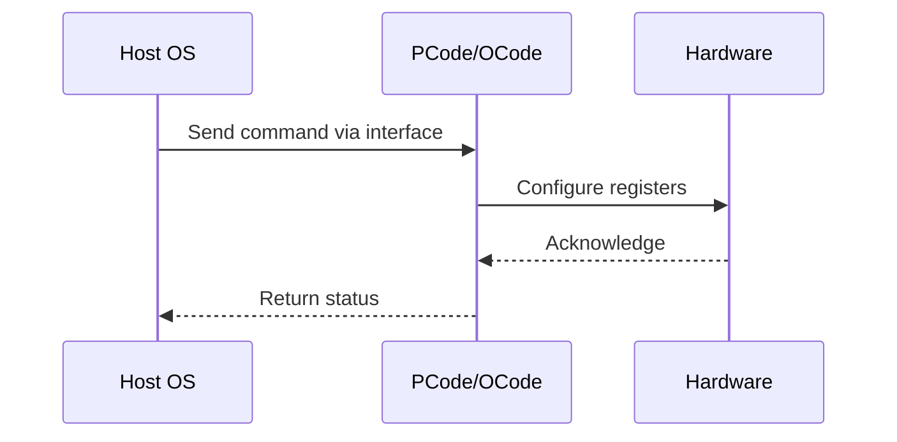

# NWP PSS Analysis

## Metadata
- HSD ID: 22021987656
- Title: C1/C6 Demotion/Undemotion BIOSKnobs
- Feature: Core C-States
- Sub Feature: Demotion
- Script: pm/pss/cstate/dmr_pegaCstate.py
- HSD Script: (none)
- TC Owner: aprakas2
- TR Owner: thangama
- Validation Environment: emulation.hsle,xos
- Test Cycle: Newport Product.trunk.pss_1p0.pss.val.NWP_MCP HSLE XOS
- NWP Scope: Runnable_On_N-1

## HSD Hierarchy
- Test Case Definition: [22021987655 - C1/C6 Demotion/Undemotion](https://hsdes.intel.com/appstore/article/#/22021987655)
- Test Case: [22021987656 - C1/C6 Demotion/Undemotion BIOSKnobs](https://hsdes.intel.com/appstore/article/#/22021987656)
- Test Result: [22022027514 - [PSS][CORE_CSTATES] C1/C6 Demotion/Undemotion BIOSKnobs](https://hsdes.intel.com/appstore/article/#/22022027514)

## KB References
- KB Article: [KB/pm_features/core_c_states/demotion.md](../../../KB/pm_features/core_c_states/demotion.md)

## Model Response

## Refined Intent
Validate C1/C6 demotion and undemotion via BIOS knobs. MSR 0xE2 bits 25-30 control demotion/undemotion enables.

## Refined Test Steps
Pre-Conditions:
  - C-states enabled in BIOS (C1 and C6)
  - BIOS knobs for demotion/undemotion accessible

Step 1 — Read MSR 0xE2 (MSR_PKG_CST_CONFIG_CONTROL):
  Bit 25: C3 Demotion Enable
  Bit 26: C1 Demotion Enable
  Bit 27: C3 Undemotion Enable
  Bit 28: C1 Undemotion Enable
  Bits 29-30: Package C-state demotion/undemotion

Step 2 — Enable C1 demotion (bit 26=1):
  Request C6 via MWAIT — verify core demotes to C1.
  Read MSR 0x660 (C1 residency) — should increment.
  Read MSR 0x3FD (C6 residency) — should not increment.

Step 3 — Disable C1 demotion (bit 26=0):
  Request C6 via MWAIT — verify core enters C6.
  Read MSR 0x3FD — should increment.

Step 4 — Test undemotion (bit 28=1):
  With demotion active, enable undemotion.
  Verify core promotes back to deeper state when conditions allow.

Pass/Fail Criteria:
  PASS: Demotion/undemotion BIOS knobs correctly control C-state behavior
  FAIL: Demotion has no effect, or undemotion doesn't restore deeper state

HAS/MAS References:
  - DMR CBB PM HAS — C1/C6 Demotion/Undemotion: https://docs.intel.com/documents/pm_doc/src/server/DMR/IP_PM_Features/CBB/DMR_CBB_PM.html

### NWP Project Relevance
**Test Classification:** Regression (DMR-inherited)
**Feature Status:** Expected to work
**Test Purpose:** Validate C1/C6 demotion and undemotion via BIOS knobs. MSR 0xE2 bits 25-30 control demotion/undemotion enables.
**Negative Test Aspect:** None
**NWP Delta:** Topology differences from DMR (2 CBB + 1 NIO); same Core C-States behavior expected

## Section A: Critical Execution Path
1. Step 1 — Read MSR 0xE2 (MSR_PKG_CST_CONFIG_CONTROL):
2. Step 2 — Enable C1 demotion (bit 26=1):
3. Step 3 — Disable C1 demotion (bit 26=0):
4. Step 4 — Test undemotion (bit 28=1):

## Section B: Component Interaction Diagram

## Section C: Interface Coverage Assessment
| Interface | Covered | Notes |
| --------- | ------- | ----- |
| B2P | Yes | Primary interface |
| CSR | Yes | Primary interface |
| MSR | Yes | Primary interface |
| 0xE2 PKG_CST_CONFIG_CONTROL | Yes | Register access |
| 0x660 C1_RES | Yes | Register access |
| 0x3FD C6_RES | Yes | Register access |

## Section D: NWP Specification References
- **NWP PM HAS**: [NWP HAS - PM Features](https://docs.intel.com/documents/custom-xeon/newport-docs/has/Overview/NWP_HAS.html#pm-features)
- **NWP PM MAS**: [NWP IMH SoC PM MAS](https://docs.intel.com/documents/custom-xeon/newport-docs/mas/pm/nwp_imh_soc_pm_mas.html)
- **DMR PM HAS**: [DMR SoC PM HAS](https://docs.intel.com/documents/pm_doc/src/server/DMR/SOC_PM_HAS/DMR_SOC_PM_HAS.html)
- **Feature HAS**: [PNC PM HAS §8 - Core C-States](https://docs.intel.com/documents/pm_doc/src/server/GNR/Features/LNC/GNR_LNC_Core.html#core-c-states)
- **DMR CBB HAS**: [DMR CBB CCP HAS](https://docs.intel.com/documents/pm_doc/src/DMR_CBB/IP%20Integration/CCP%20HAS/cbb_cpp_has.html)
- **Intel® 64 and IA-32 SDM**: MSR definitions, CPUID enumeration

## Section E: NWP Risk Assessment
| Risk | Likelihood | Impact | Mitigation |
| ---- | ---------- | ------ | ---------- |
| Topology change | Medium | Medium | Verify on multi-die config |
| Interface delta | Low | Low | Compare with DMR baseline |
| Timing sensitivity | Low | Medium | Allow tolerance margins |

## Section F: Recommendations
1. Verify test works on NWP multi-die topology
2. Check for any interface changes from DMR
3. Update HAS references to NWP specifications
4. Add negative test coverage if missing
5. Consider additional stress test variants

---
*Generated from metadata on 2026-05-28 23:20:51*