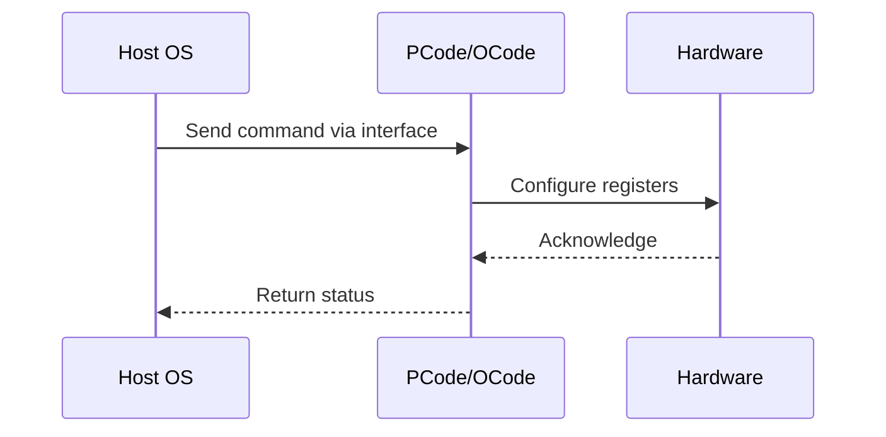

# NWP PSS Analysis

## Metadata
- HSD ID: 22021987660
- Title: HWP Out of Band control
- Feature: PState Stack
- Sub Feature: Core P-States
- Script: nwp_pss_scripts/nwp_hwp_tpmi.py
- HSD Script: pm\pss\pstates\hwp_tpmi.py
- TC Owner: jscanlo1
- TR Owner: akurathi
- Validation Environment: emulation.hsle,xos
- Test Cycle: Newport Product.trunk.pss_0p8.pss.val.NWP_MCP HSLE XOS
- NWP Scope: Runnable_On_N-1

## HSD Hierarchy
- Test Case Definition: [22021969879 - Functionality Checks](https://hsdes.intel.com/appstore/article/#/22021969879)
- Test Case: [22021987660 - HWP Out of Band control](https://hsdes.intel.com/appstore/article/#/22021987660)
- Test Result: [22022027592 - [PSS][CORE_PSTATES] HWP Out of Band control](https://hsdes.intel.com/appstore/article/#/22022027592)

## KB References
- KB Article: [KB/pm_features/pstate_stack/core_p_states.md](../../../KB/pm_features/pstate_stack/core_p_states.md)

## Model Response

## Refined Intent
Verify HWPM Out-of-Band control via TPMI registers (OPC_HWP_CONTROLS) replacing legacy PECI. Validate OOB min/max/EPP override of in-band MSR 0x774 IA32_HWP_REQUEST, and confirm effective HWP hints via MSR 0x771 IA32_HWP_CAPABILITIES.

## Refined Test Steps
Pre-Conditions:
  - Platform booted to HSLE or XOS
  - HWP enabled: MSR 0x770 IA32_PM_ENABLE = 1
  - TPMI accessible via PythonSV or BMC OOB

Step 1 — Baseline HWP state:
  Read MSR 0x771 IA32_HWP_CAPABILITIES (Highest/Guaranteed/Efficient/Lowest).
  Read MSR 0x774 IA32_HWP_REQUEST (min/max/EPP from OS).
  Read TPMI OPC_HWP_CONTROLS (MINIMUM_PERFORMANCE[7:0], MAXIMUM_PERFORMANCE[15:8], EPP[31:24]).
  Read TPMI OPC_HWP_CAPABILITY.

Step 2 — OOB override via TPMI:
  a. Write OPC_HWP_CONTROLS.MINIMUM_PERFORMANCE = Pn ratio, set MIN override bit [32]=1
  b. Write OPC_HWP_CONTROLS.MAXIMUM_PERFORMANCE = P1 ratio, set MAX override bit [33]=1
  c. Write OPC_HWP_CONTROLS.EPP = 0x80 (balanced), set EPP override bit [34]=1
  d. Verify MSR 0x774 in-band values are overridden by TPMI values
  e. Read MSR 0x198 IA32_PERF_STATUS — verify core ratio clamps to OOB range

Step 3 — Clear OOB overrides:
  Clear override bits [32:34] in OPC_HWP_CONTROLS.
  Verify in-band MSR 0x774 values take effect again.

Step 4 — Sweep EPP values via TPMI:
  For EPP in [0x00 (performance), 0x80 (balanced), 0xFF (power savings)]:
    Write OPC_HWP_CONTROLS.EPP, enable override.
    Run workload, verify frequency behavior matches EPP hint.

Pass/Fail Criteria:
  PASS: OOB TPMI overrides take precedence over in-band MSR 0x774
  FAIL: In-band values not overridden, or core ratio outside OOB range

HAS/MAS References:
  - Core P-State HAS — HWP / HWPM OOB: https://docs.intel.com/documents/pm_doc/src/server/Wave3_common/Core_Pstates/Core_Pstate_HAS.html
  - TPMI HAS — OPC_HWP_CONTROLS: https://docs.intel.com/documents/pm_doc/src/server/arch_common/TPMI/TPMI.html

### NWP Project Relevance
**Test Classification:** Regression (DMR-inherited)
**Feature Status:** Expected to work
**Test Purpose:** Verify HWPM Out-of-Band control via TPMI registers (OPC_HWP_CONTROLS) replacing legacy PECI. Validate OOB min/max/EPP override of in-band MSR 0x774 IA32_HWP_REQUEST, and confirm effective HWP hints vi
**Negative Test Aspect:** None
**NWP Delta:** Topology differences from DMR (2 CBB + 1 NIO); same PState Stack behavior expected

## Section A: Critical Execution Path
1. Step 1 — Baseline HWP state:
2. Step 2 — OOB override via TPMI:
3. Step 3 — Clear OOB overrides:
4. Step 4 — Sweep EPP values via TPMI:

## Section B: Component Interaction Diagram

## Section C: Interface Coverage Assessment
| Interface | Covered | Notes |
| --------- | ------- | ----- |
| CSR | Yes | Primary interface |
| MSR | Yes | Primary interface |
| TPMI_IB | Yes | Primary interface |
| TPMI_OOB | Yes | Primary interface |
| 0x770 PM_ENABLE | Yes | Register access |
| 0x774 HWP_REQUEST | Yes | Register access |
| 0x772 HWP_REQUEST_PKG | Yes | Register access |
| TPMI: opc_hwp_controls | Yes | TPMI interface |
| TPMI: opc_hwp_capability | Yes | TPMI interface |

## Section D: NWP Specification References
- **NWP PM HAS**: [NWP HAS - PM Features](https://docs.intel.com/documents/custom-xeon/newport-docs/has/Overview/NWP_HAS.html#pm-features)
- **NWP PM MAS**: [NWP IMH SoC PM MAS](https://docs.intel.com/documents/custom-xeon/newport-docs/mas/pm/nwp_imh_soc_pm_mas.html)
- **DMR PM HAS**: [DMR SoC PM HAS](https://docs.intel.com/documents/pm_doc/src/server/DMR/SOC_PM_HAS/DMR_SOC_PM_HAS.html)
- **Feature HAS**: [PNC PM HAS §4-6 - P-States/HWP](https://docs.intel.com/documents/pm_doc/src/server/GNR/Features/LNC/GNR_LNC_PStates.html)
- **DMR CBB HAS**: [DMR CBB PM HAS - HWP](https://docs.intel.com/documents/pm_doc/src/DMR_CBB/IP%20Integration/PM%20HAS/cbb_pm_has.html#hwp)
- **Intel® 64 and IA-32 SDM**: MSR definitions, CPUID enumeration

## Section E: NWP Risk Assessment
| Risk | Likelihood | Impact | Mitigation |
| ---- | ---------- | ------ | ---------- |
| Topology change | Medium | Medium | Verify on multi-die config |
| Interface delta | Low | Low | Compare with DMR baseline |
| Timing sensitivity | Low | Medium | Allow tolerance margins |

## Section F: Recommendations
1. Verify test works on NWP multi-die topology
2. Check for any interface changes from DMR
3. Update HAS references to NWP specifications
4. Add negative test coverage if missing
5. Consider additional stress test variants

---
*Generated from metadata on 2026-05-28 23:20:51*