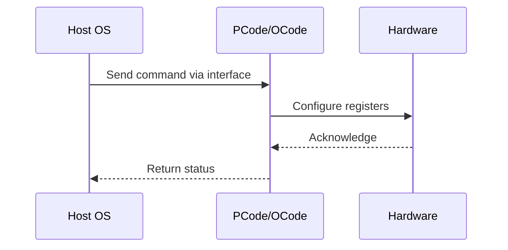

# NWP PSS Analysis

## Metadata
- HSD ID: 22022015520
- Title: IMH Thermal Throttling
- Feature: SoC Thermal
- Sub Feature: EMTTM
- Script: pm/pss/thermal/pm_mcp_tm2_cbb_2_max_core_pma_time_dcf_new_core_freq_reads.py
- HSD Script: (none)
- TC Owner: jinwengo
- TR Owner: mps
- Validation Environment: emulation.hsle,xos
- Test Cycle: Newport Product.trunk.pss_0p8.pss.val.NWP_MCP HSLE XOS
- NWP Scope: Runnable_On_N-1

## HSD Hierarchy
- Test Case Definition: [22021969872 - EMTTM](https://hsdes.intel.com/appstore/article/#/22021969872)
- Test Case: [22022015520 - IMH Thermal Throttling](https://hsdes.intel.com/appstore/article/#/22022015520)
- Test Result: [22022027632 - [PSS][EMTTM] IMH Thermal Throttling](https://hsdes.intel.com/appstore/article/#/22022027632)

## KB References
- KB Article: [KB/pm_features/soc_thermal/emttm.md](../../../KB/pm_features/soc_thermal/emttm.md)

## Model Response

## Refined Intent
Inject high temperature in DTSes through RTL/PCUDATA accesses. Verify IMH thermal PID control loop engages near TjMax — IO and Memory fabric ratios throttled to Pn/Pm. NWP: EMTTM/thermal PID is active (derived from DMR, EMTTM_DISABLE=0). UFS is ZBB'd but thermal PID heavy-hammer still throttles fabrics.

## Refined Test Steps
Pre-Conditions:
  - Platform booted to SLE/HSLE
  - EMTTM enabled (EMTTM_DISABLE=0)
  - DTS sensors accessible via RTL/PCUDATA
  - PID params: Kp=0.17, Ki=0.06 (defaults)

Step 1 — Read baseline fabric ratios:
  Record current IMH Memory fabric ratio and IO fabric ratio.
  Read EFFECTIVE_TJ_MAX.

Step 2 — Inject high temperature via DTS:
  Inject temperature > TjMax in one of the IMH DTSes through RTL/PCUDATA accesses.
  Verify package temperature reflects the injected high temperature.

Step 3 — Verify IMH thermal PID engagement:
  Check IMH Memory fabric ratio throttled to Pmin (Pm).
  Check IMH IO fabric ratio throttled to Pmin (Pn).
  Thermal PID loop drives fabric frequency ceiling down near TjMax.

Step 4 — Check PLR thermal bits:
  Read PLR via mailbox. Verify THERMAL PLR bits are SET.

Step 5 — Uninject and verify recovery:
  Remove DTS temperature injection.
  Verify temperatures recover to nominal.
  Verify IMH fabric ratios recover from Pmin.
  Verify PLR THERMAL bits clear.

Pass/Fail Criteria:
  PASS: IMH IO and Mem ratios throttled to Pmin near TjMax; PLR THERMAL bits set during throttle and cleared after recovery
  FAIL: No throttling observed, or PLR bits not reflecting thermal state

HAS/MAS References:
  - DMR Thermal HAS — IMH PID Thermal Control: https://docs.intel.com/documents/pm_doc/src/server/DMR/PM%20Features/Thermals/DMR_Thermal.html
  - NWP PM MAS — Thermal (EMTTM supported): https://docs.intel.com/documents/custom-xeon/newport-docs/mas/pm/nwp_imh_soc_pm_mas.html

### NWP Project Relevance
**Test Classification:** Regression (DMR-inherited)
**Feature Status:** Expected to work
**Test Purpose:** Inject high temperature in DTSes through RTL/PCUDATA accesses. Verify IMH thermal PID control loop engages near TjMax — IO and Memory fabric ratios throttled to Pn/Pm. NWP: EMTTM/thermal PID is active
**Negative Test Aspect:** None
**NWP Delta:** Topology differences from DMR (2 CBB + 1 NIO); same SoC Thermal behavior expected

## Section A: Critical Execution Path
1. Step 1 — Read baseline fabric ratios:
2. Step 2 — Inject high temperature via DTS:
3. Step 3 — Verify IMH thermal PID engagement:
4. Step 4 — Check PLR thermal bits:
5. Step 5 — Uninject and verify recovery:

## Section B: Component Interaction Diagram

## Section C: Interface Coverage Assessment
| Interface | Covered | Notes |
| --------- | ------- | ----- |
| CSR | Yes | Primary interface |
| Fuse | Yes | Primary interface |
| PCUData | Yes | Primary interface |
| PLR | Yes | Primary interface |
| TPMI_IB | Yes | Primary interface |
| TPMI: package_temperature | Yes | TPMI interface |
| TPMI: ufs_control/status | Yes | TPMI interface |

## Section D: NWP Specification References
- **NWP PM HAS**: [NWP HAS - PM Features](https://docs.intel.com/documents/custom-xeon/newport-docs/has/Overview/NWP_HAS.html#pm-features)
- **NWP PM MAS**: [NWP IMH SoC PM MAS - Thermal](https://docs.intel.com/documents/custom-xeon/newport-docs/mas/pm/nwp_imh_soc_pm_mas.html#thermal)
- **DMR PM HAS**: [DMR SoC PM HAS](https://docs.intel.com/documents/pm_doc/src/server/DMR/SOC_PM_HAS/DMR_SOC_PM_HAS.html)
- **Feature HAS**: [DMR Thermal HAS](https://docs.intel.com/documents/pm_doc/src/server/DMR/Features/Thermal/DMR_Thermal.html)
- **DMR CBB HAS**: [DMR CBB PM HAS - DTS](https://docs.intel.com/documents/pm_doc/src/DMR_CBB/IP%20Integration/PM%20HAS/cbb_pm_has.html#dts)
- **Intel® 64 and IA-32 SDM**: MSR definitions, CPUID enumeration

## Section E: NWP Risk Assessment
| Risk | Likelihood | Impact | Mitigation |
| ---- | ---------- | ------ | ---------- |
| Topology change | Medium | Medium | Verify on multi-die config |
| Interface delta | Low | Low | Compare with DMR baseline |
| Timing sensitivity | Low | Medium | Allow tolerance margins |

## Section F: Recommendations
1. Verify test works on NWP multi-die topology
2. Check for any interface changes from DMR
3. Update HAS references to NWP specifications
4. Add negative test coverage if missing
5. Consider additional stress test variants

---
*Generated from metadata on 2026-05-28 23:20:51*