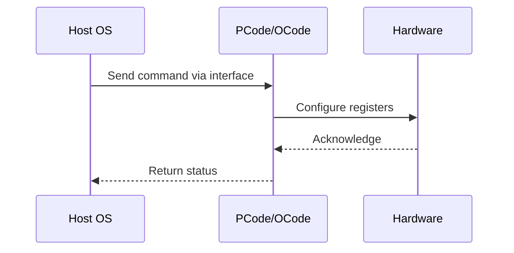

# NWP PSS Analysis

## Metadata
- HSD ID: 22022018466
- Title: PEGA/Solar Based C6 injection
- Feature: Core C-States
- Sub Feature: Entry/Exit
- Script: nwp_pss_scripts/nwp_pega_cstate.py
- HSD Script: newport\\pm\\pss\\pega\\pega.py
- TC Owner: aprakas2
- TR Owner: thangama
- Validation Environment: emulation.hsle,xos
- Test Cycle: Newport Product.trunk.pss_0p8.pss.val.NWP_MCP HSLE XOS
- NWP Scope: Runnable_On_N-1

## HSD Hierarchy
- Test Case Definition: [22021969890 - Core C-State Entry/Exit Flow](https://hsdes.intel.com/appstore/article/#/22021969890)
- Test Case: [22022018466 - PEGA/Solar Based C6 injection](https://hsdes.intel.com/appstore/article/#/22022018466)
- Test Result: [22022027531 - [PSS][CORE_CSTATES] PEGA/Solar Based Cstate injection](https://hsdes.intel.com/appstore/article/#/22022027531)

## KB References
- KB Article: [KB/pm_features/core_c_states/entry_exit.md](../../../KB/pm_features/core_c_states/entry_exit.md)

## Model Response

## Refined Intent
Validate C6 state entry and exit using PEGA framework and Solar Tool on XOS with full BIOS and OS. C6 is core-off state where core PMA relinquishes its electrical budget — autonomous C6 exit not allowed until new electrical budget is granted by SoC.

## Refined Test Steps
Pre-Conditions:
  - Platform booted to XOS with full BIOS
  - PEGA accessible via PythonSV
  - CBB CCP PM Integration HAS configuration
  - C-states enabled in BIOS

Step 1 — Configure PEGA CMD1 for C-state injection:
  LP_ID[2:0]: Core to inject C-state to.
  MODULE_ID[7:3]: Module ID.
  CLSTR_ID[9:8]: Cluster ID.
  RANDOM_CSTATE_TARGET[10]: Set 0 for specific target.
  ALL_BIGCORES[12]: Set 1 to apply to all big cores.
  SELECT_ALL_MODULE_CORES[14]: Set 1 to target all cores in module.

Step 2 — Inject C6 via PEGA:
  Write PEGA CMD0 with C-state command type.
  Wait for completion.

Step 3 — Verify C6 entry:
  Read C6 residency counters — verify increment.
  Verify core PMA relinquished electrical budget.

Step 4 — Verify C6 exit:
  Send interrupt or workload to target core.
  Verify core resumes execution and gets new electrical budget.

Step 5 — Solar-based C6 injection:
  Use Solar tool for MWAIT-based C6 injection.
  Verify same entry/exit behavior.

Pass/Fail Criteria:
  PASS: C6 entry and exit work correctly via both PEGA and Solar
  FAIL: Core hang on C6 exit, counter not incrementing, or budget not managed correctly

HAS/MAS References:
  - DMR CBB PM HAS — C6 Entry/Exit: https://docs.intel.com/documents/pm_doc/src/server/DMR/IP_PM_Features/CBB/DMR_CBB_PM.html
  - DMR CBB PEGA HAS — C-State injection: https://docs.intel.com/documents/pm_doc/src/DMR_CBB/Features/PEGA/PEGA.html

### NWP Project Relevance
**Test Classification:** Regression (DMR-inherited)
**Feature Status:** Expected to work
**Test Purpose:** Validate C6 state entry and exit using PEGA framework and Solar Tool on XOS with full BIOS and OS. C6 is core-off state where core PMA relinquishes its electrical budget — autonomous C6 exit not allow
**Negative Test Aspect:** None
**NWP Delta:** Topology differences from DMR (2 CBB + 1 NIO); same Core C-States behavior expected

## Section A: Critical Execution Path
1. Step 1 — Configure PEGA CMD1 for C-state injection:
2. Step 2 — Inject C6 via PEGA:
3. Step 3 — Verify C6 entry:
4. Step 4 — Verify C6 exit:
5. Step 5 — Solar-based C6 injection:

## Section B: Component Interaction Diagram

## Section C: Interface Coverage Assessment
| Interface | Covered | Notes |
| --------- | ------- | ----- |
| CSR | Yes | Primary interface |
| PCUData | Yes | Primary interface |
| PEGA | Yes | Primary interface |
| PLR | Yes | Primary interface |

## Section D: NWP Specification References
- **NWP PM HAS**: [NWP HAS - PM Features](https://docs.intel.com/documents/custom-xeon/newport-docs/has/Overview/NWP_HAS.html#pm-features)
- **NWP PM MAS**: [NWP IMH SoC PM MAS](https://docs.intel.com/documents/custom-xeon/newport-docs/mas/pm/nwp_imh_soc_pm_mas.html)
- **DMR PM HAS**: [DMR SoC PM HAS](https://docs.intel.com/documents/pm_doc/src/server/DMR/SOC_PM_HAS/DMR_SOC_PM_HAS.html)
- **Feature HAS**: [PNC PM HAS §8 - Core C-States](https://docs.intel.com/documents/pm_doc/src/server/GNR/Features/LNC/GNR_LNC_Core.html#core-c-states)
- **DMR CBB HAS**: [DMR CBB CCP HAS](https://docs.intel.com/documents/pm_doc/src/DMR_CBB/IP%20Integration/CCP%20HAS/cbb_cpp_has.html)
- **Intel® 64 and IA-32 SDM**: MSR definitions, CPUID enumeration

## Section E: NWP Risk Assessment
| Risk | Likelihood | Impact | Mitigation |
| ---- | ---------- | ------ | ---------- |
| Topology change | Medium | Medium | Verify on multi-die config |
| Interface delta | Low | Low | Compare with DMR baseline |
| Timing sensitivity | Low | Medium | Allow tolerance margins |

## Section F: Recommendations
1. Verify test works on NWP multi-die topology
2. Check for any interface changes from DMR
3. Update HAS references to NWP specifications
4. Add negative test coverage if missing
5. Consider additional stress test variants

---
*Generated from metadata on 2026-05-28 23:20:51*