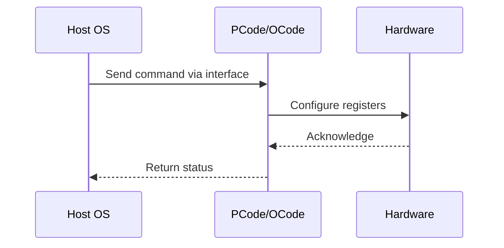

# NWP PSS Analysis

## Metadata
- HSD ID: 22022023845
- Title: PLR Status registers Check for Prochot Events
- Feature: SoC Thermal
- Sub Feature: Prochot
- Script: nwp_pss_scripts/nwp_plr_mailbox.py
- HSD Script: (none)
- TC Owner: jinwengo
- TR Owner: mps
- Validation Environment: emulation.hsle,xos
- Test Cycle: Newport Product.trunk.pss_0p8.pss.val.NWP_MCP HSLE XOS
- NWP Scope: Runnable_On_N-1

## HSD Hierarchy
- Test Case Definition: [22021969875 - Prochot E2E Flow](https://hsdes.intel.com/appstore/article/#/22021969875)
- Test Case: [22022023845 - PLR Status registers Check for Prochot Events](https://hsdes.intel.com/appstore/article/#/22022023845)
- Test Result: [22022027543 - [PSS][PROCHOT] PLR Status registers Check for Prochot Events](https://hsdes.intel.com/appstore/article/#/22022027543)

## KB References
- KB Article: [KB/pm_features/soc_thermal/prochot.md](../../../KB/pm_features/soc_thermal/prochot.md)

## Model Response

## Refined Intent
Validate PLR bit set/unset for Prochot once Prochot is injected. Inject PROCHOT using Socket PIN RTL on top. Check uncore/io/mem ratios throttle to lowest ratios, core ratios drop to Pmin then follow PF Curve, Prochot Status Bits in punit.throttle, and Prochot PLR Status bit via Mailbox accesses. PS: none of these checks require PSS Models but are mandatory before completing Prochot PLR.

## Refined Test Steps
Pre-Conditions:
  - PF curve fuses programmed
  - Pmin set for all ratios
  - Ingredients: Primecode, Pcode, Acode
  - Unique Model Requirements: MCP IC HSLE (uncores), MCP IC XOS (cores), MCP ICC XOS (cores)

Step 1 — Inject PROCHOT:
  Inject PROCHOT using Socket PIN RTL on top.

Step 2 — Check uncore/io/mem ratios:
  Verify uncore/io/mem ratios get throttled to lowest ratios.

Step 3 — Check core ratios:
  Verify core ratios first drop to Pmin then follow the PF Curve.

Step 4 — Check Prochot status bits:
  Read Prochot Status Bits in punit.throttle.

Step 5 — Check PLR via Mailbox:
  Check Prochot PLR Status bit SET using Mailbox accesses.

Pass/Fail Criteria:
  PASS: All ratios throttle appropriately, Prochot status bits set, PLR bit set via Mailbox
  FAIL: Ratios not throttled, or status/PLR bits not set

HAS/MAS References:
  - DMR Thermal HAS — Prochot E2E: https://docs.intel.com/documents/pm_doc/src/server/DMR/PM%20Features/Thermals/DMR_Thermal.html
  - Perf Limit Reasons HAS — Prochot PLR: https://docs.intel.com/documents/pm_doc/src/server/GNR/Features/perf_limit_reasons/perf_limit_reasons_has.html

### NWP Project Relevance
**Test Classification:** Regression (DMR-inherited)
**Feature Status:** Expected to work
**Test Purpose:** Validate PLR bit set/unset for Prochot once Prochot is injected. Inject PROCHOT using Socket PIN RTL on top. Check uncore/io/mem ratios throttle to lowest ratios, core ratios drop to Pmin then follow 
**Negative Test Aspect:** None
**NWP Delta:** Topology differences from DMR (2 CBB + 1 NIO); same SoC Thermal behavior expected

## Section A: Critical Execution Path
1. Step 1 — Inject PROCHOT:
2. Step 2 — Check uncore/io/mem ratios:
3. Step 3 — Check core ratios:
4. Step 4 — Check Prochot status bits:
5. Step 5 — Check PLR via Mailbox:

## Section B: Component Interaction Diagram

## Section C: Interface Coverage Assessment
| Interface | Covered | Notes |
| --------- | ------- | ----- |
| CSR | Yes | Primary interface |
| Fuse | Yes | Primary interface |
| PLR | Yes | Primary interface |
| Patch | Yes | Primary interface |

## Section D: NWP Specification References
- **NWP PM HAS**: [NWP HAS - PM Features](https://docs.intel.com/documents/custom-xeon/newport-docs/has/Overview/NWP_HAS.html#pm-features)
- **NWP PM MAS**: [NWP IMH SoC PM MAS - Thermal](https://docs.intel.com/documents/custom-xeon/newport-docs/mas/pm/nwp_imh_soc_pm_mas.html#thermal)
- **DMR PM HAS**: [DMR SoC PM HAS](https://docs.intel.com/documents/pm_doc/src/server/DMR/SOC_PM_HAS/DMR_SOC_PM_HAS.html)
- **Feature HAS**: [DMR Thermal HAS](https://docs.intel.com/documents/pm_doc/src/server/DMR/Features/Thermal/DMR_Thermal.html)
- **DMR CBB HAS**: [DMR CBB PM HAS - DTS](https://docs.intel.com/documents/pm_doc/src/DMR_CBB/IP%20Integration/PM%20HAS/cbb_pm_has.html#dts)
- **Intel® 64 and IA-32 SDM**: MSR definitions, CPUID enumeration

## Section E: NWP Risk Assessment
| Risk | Likelihood | Impact | Mitigation |
| ---- | ---------- | ------ | ---------- |
| Topology change | Medium | Medium | Verify on multi-die config |
| Interface delta | Low | Low | Compare with DMR baseline |
| Timing sensitivity | Low | Medium | Allow tolerance margins |

## Section F: Recommendations
1. Verify test works on NWP multi-die topology
2. Check for any interface changes from DMR
3. Update HAS references to NWP specifications
4. Add negative test coverage if missing
5. Consider additional stress test variants

---
*Generated from metadata on 2026-05-28 23:20:51*