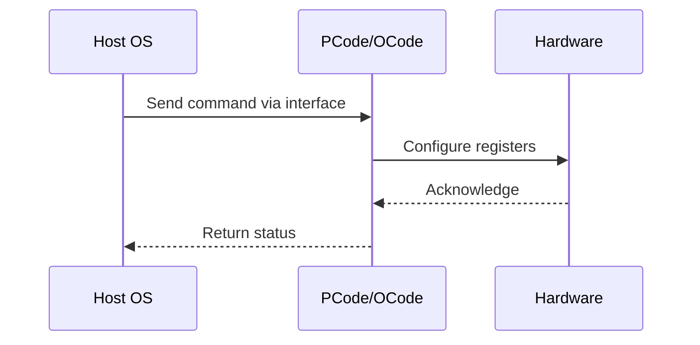

# NWP PSS Analysis

## Metadata
- HSD ID: 22022060653
- Title: SST-PP/CP/BF ZBB Negative Checks
- Feature: SST
- Sub Feature: SST-CP
- Script: nwp_pss_scripts/pss_sst_cp.py
- HSD Script: (none)
- TC Owner: jscanlo1
- TR Owner: bg3
- Validation Environment: emulation.hsle
- Test Cycle: Newport Product.trunk.pss_1p0.pss.val.NWP_MCP-HSLE
- NWP Scope: Runnable_On_N-1

## HSD Hierarchy
- Test Case Definition: [22022060621 - NWP ZBB Negative Validation](https://hsdes.intel.com/appstore/article/#/22022060621)
- Test Case: [22022060653 - SST-PP/CP/BF ZBB Negative Checks](https://hsdes.intel.com/appstore/article/#/22022060653)
- Test Result: [22022060667 - [PSS][SST] SST-CP/BF ZBB Negative Checks](https://hsdes.intel.com/appstore/article/#/22022060667)

## KB References
- KB Article: [KB/pm_features/sst/sst_cp.md](../../../KB/pm_features/sst/sst_cp.md)

## Model Response

## Refined Intent
NWP ZBB negative validation: verify SST-PP, SST-CP, and SST-BF deprecated features are properly disabled on NWP. SST-TF should be the only SST feature enabled. Validate capability mask, control/status registers, and level enable mask.

## Refined Test Steps
Pre-Conditions:
  - NWP platform booted

Step 1 — Read SST capability mask:
  Read sst_header.capability_mask.
  Bit 8 = CP, bit 9 = PP.
  Expected for NWP: bit 8 = 0 (CP not supported), bit 9 = 1 (PP supported for TF only).

Step 2 — Verify SST-CP disabled:
  Read sst_cp_control.sst_cp_enable — expect 0.
  Read sst_cp_status.sst_cp_enable — expect 0.
  Attempt to write sst_cp_control.sst_cp_enable = 1.
  Read sst_cp_status.sst_cp_enable — should still be 0 (write rejected).

Step 3 — Verify SST-PP level mask:
  Read sst_pp_header.sst_pp_level_en_mask — should reflect correct SST_PP levels.

Step 4 — Verify SST-BF disabled:
  Read sst_pp_control.feature_state and sst_pp_status.feature_state.
  Expected: 0x2 (bit 0 = BF = 0, bit 1 = TF = 1).
  Read sst_bf_info_0.feature_supported — expect 0.

Pass/Fail Criteria:
  PASS: SST-CP and SST-BF inaccessible/disabled, SST-TF only active SST feature
  FAIL: SST-CP or SST-BF reports as supported or can be enabled

HAS/MAS References:
  - Intel SST HAS — SST-PP/CP/BF: https://docs.intel.com/documents/pm_doc/src/server/Wave3_common/SST/Intel_SST.html
  - SST TPMI HAS — capability_mask, SST_CP/BF: https://docs.intel.com/documents/pm_doc/src/server/Wave3_common/SST/IC_SST_TPMI.html
  - NWP PM MAS — SST ZBB scope: https://docs.intel.com/documents/custom-xeon/newport-docs/mas/pm/nwp_imh_soc_pm_mas.html

### NWP Project Relevance
**Test Classification:** Regression (DMR-inherited)
**Feature Status:** Expected to work
**Test Purpose:** NWP ZBB negative validation: verify SST-PP, SST-CP, and SST-BF deprecated features are properly disabled on NWP. SST-TF should be the only SST feature enabled. Validate capability mask, control/status
**Negative Test Aspect:** None
**NWP Delta:** Topology differences from DMR (2 CBB + 1 NIO); same SST behavior expected

## Section A: Critical Execution Path
1. Step 1 — Read SST capability mask:
2. Step 2 — Verify SST-CP disabled:
3. Step 3 — Verify SST-PP level mask:
4. Step 4 — Verify SST-BF disabled:

## Section B: Component Interaction Diagram

## Section C: Interface Coverage Assessment
| Interface | Covered | Notes |
| --------- | ------- | ----- |
| CSR | Yes | Primary interface |
| TPMI_IB | Yes | Primary interface |
| TPMI: sst_header | Yes | TPMI interface |
| TPMI: sst_cp_control/status | Yes | TPMI interface |
| TPMI: sst_pp_control/status | Yes | TPMI interface |

## Section D: NWP Specification References
- **NWP PM HAS**: [NWP HAS - PM Features](https://docs.intel.com/documents/custom-xeon/newport-docs/has/Overview/NWP_HAS.html#pm-features)
- **NWP PM MAS**: [NWP IMH SoC PM MAS - SST](https://docs.intel.com/documents/custom-xeon/newport-docs/mas/pm/nwp_imh_soc_pm_mas.html#sst)
- **DMR PM HAS**: [DMR SoC PM HAS](https://docs.intel.com/documents/pm_doc/src/server/DMR/SOC_PM_HAS/DMR_SOC_PM_HAS.html)
- **Feature HAS**: [DMR SST HAS](https://docs.intel.com/documents/pm_doc/src/server/DMR/Features/SST/DMR_SST.html)
- **DMR CBB HAS**: [DMR CBB PM HAS - SST](https://docs.intel.com/documents/pm_doc/src/DMR_CBB/IP%20Integration/PM%20HAS/cbb_pm_has.html#sst)
- **Intel® 64 and IA-32 SDM**: MSR definitions, CPUID enumeration

## Section E: NWP Risk Assessment
| Risk | Likelihood | Impact | Mitigation |
| ---- | ---------- | ------ | ---------- |
| Topology change | Medium | Medium | Verify on multi-die config |
| Interface delta | Low | Low | Compare with DMR baseline |
| Timing sensitivity | Low | Medium | Allow tolerance margins |

## Section F: Recommendations
1. Verify test works on NWP multi-die topology
2. Check for any interface changes from DMR
3. Update HAS references to NWP specifications
4. Add negative test coverage if missing
5. Consider additional stress test variants

---
*Generated from metadata on 2026-05-28 23:20:51*