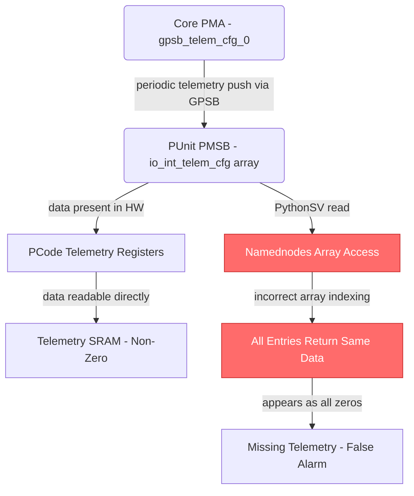
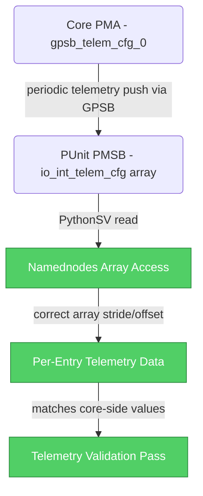

# HSD 13013917876: [DMR] [X1 A0 PO] [Telemetry] Missing Core Telemetry Data on Punit

## Metadata

| Field | Value |
|-------|-------|
| **HSD ID** | [13013917876](https://hsdes.intel.com/appstore/article-one/#/13013917876) |
| **Status** | complete.wont_validate |
| **Priority** | 3-medium |
| **Owner** | ymeshula |
| **Component** | val.env.debug_tools |
| **Defect Die** | compute |
| **Conclusion** | env.bug |

## Classification

| Dimension | Value | Confidence |
|-----------|-------|------------|
| **Root Cause Type** | **TOOL** | 85% |
| **Feature** | Tools | 90% |
| **Sub-Feature** | debug_tools | — |

**Reasoning**: conclusion='env.bug' → TOOL

## Root Cause Summary

System:

========

ha01wvaw0035, AN4CORECAFE501

2 enabled modules (module9 and module10):

In [7]: sv.sockets.cbbs.computes.modules

Out[7]:

socket0.cbb0.compute1.module9 - <socket0.cbb0.compute1.module9 - ModuleComponent @ 1789254313792>

socket0.cbb0.compute1.module10 - <socket0.cbb0.compute1.module10 - ModuleComponent @ 1789254312784>

Details:

========

As part of the DMR PO tasks, we are attempting to sample telemetry on both the core and Punit to verify that the basic telemetry push is 

## Raw HSD Text

<!-- This section provides raw HSD data for agent enrichment (Stage 3b). -->
<!-- The Copilot agent extracts root cause, fix description, code refs, and diagrams. -->

### Forum Notes
[25ww45.1]

We see that he could read correctly this register assignment, but when we trying to read the from PythonSV we get this the same data for all the PCU array.

And we think that the issue is in PythonSV collaterals. We need Westbrook, Mark T and Karanam, kavya.laalasa to check further.

[25ww44.3]

The issue is we are not observing any data from Punit telemetry. They are all zeros. But we can see the data from telemetry SRAM or pCode registers.

AR: Ido / Igal to check further

[25ww44.1]

Igal mentioned this issue was not seen on the system at IDC. Igal will sync with Yossi directly.

[25ww43.3]

Ido relayed a suggestion from Nati to verify that the correct registers are being read and to use PMSB trace to confirm that telemetry messages are being sent as expected, with a request to add these steps to the sighting.

[25ww42.3]

This issue is related to async telemetry data in the Punit.

Ido suggested involving additional CBB owners to investigate the async telemetry data issue

### Description
System:

========

ha01wvaw0035, AN4CORECAFE501

2 enabled modules (module9 and module10):

In [7]: sv.sockets.cbbs.computes.modules

Out[7]:

socket0.cbb0.compute1.module9 - <socket0.cbb0.compute1.module9 - ModuleComponent @ 1789254313792>

socket0.cbb0.compute1.module10 - <socket0.cbb0.compute1.module10 - ModuleComponent @ 1789254312784>

Details:

========

As part of the DMR PO tasks, we are attempting to sample telemetry on both the core and Punit to verify that the basic telemetry push is functioning correctly when enabled by default.

Currently, telemetry data is not being reflected on the Punit side.

it consistently shows all zeros - even for telemetry values that are non-zero on the core side.

default telemetry configuration:

In [1]: sv.sockets.cbb0.compute1.pma9.gpsb.gpsb_telem_cfg_0.show

------> sv.sockets.cbb0.compute1.pma9.gpsb.gpsb_telem_cfg_0.show()

0x00000000 : select_1 (23:16) (rw) -- Group Select for Set1 to send over GPSB

0x0000008c : select_0 (15:08) (rw) -- Group Select for Set0 to send over GPSB

0x00000003 : cec_factor (07:05) (rw) -- This factor divide Cycle_energy_cost telemetry: '0 - shift right by '0 - divide by 1 '1 - shift right by '1 - divide by 2 '2 - shift right by '2 - divide by 4 '3 - shift right by '3 - divide by...

0x00000001 : per_rmid_energy_tel_en (03:03) (rw) -- OOBMSM per RMID change energy cost telemetry enable (server) - set by punit The enable for energy telemetries that are send asynchronously when RMID value is changed

0x00000001 : periodic_mode (02:02) (rw) -- Periodic trigger is based on Time (1 - default) or Instructions count (0).

0x00000001 : oobt_en (01:01) (rw) -- OOBMSM telemetry enable (server) - set by punit

0x00000001 : pushdata_en (00:00) (rw) -- If '1 - data-out FSM will send the target telemetries to PortID defined in CORE_PMA_CR_TELEM_DATA_OUT_CONFIG

In [2]: sv.socket0.cbb0.compute1.pma9.pmsb.io_int_telem_cfg.show

------> sv.socket0.cbb0.compute1.pma9.pmsb.io_int_telem_cfg.show()

io_int_telem_

### Comments (latest)
++++1363429945 ymeshula
original prs: 13013906807 - [DMR_A0_PO_25ww41.2][Telemetry] Missing Core Telemetry Data on Punit - tried to set the override bits on: sv.socket0.cbb0.compute1.pma9.pmsb.io_int_telem_cfg. - tried writing FFs to select0/1 to select all telemetries. - tried to write to the telemetry masks: sv.sockets.cbb0.compute1.pma9.pmsb.telemetry_mask sv.sockets.cbb0.compute1.pma9.pmsb.telemetry_mask_1 (for FIVR telemetry) hasn't change the results (all punit telemetries are 0's). ------------------------------------------------------------------------------------------------------------------------------ discussed with Pavel from the core design. We reviewed the status registers, and everything appears to be functioning correctly on the core side.
++++22611536161 imelamed
Do you have any PMSB trace showing that the telem messages have been sent from the Core to Punit?

++++22611537246 imelamed
Adding also Nati's request: In addition, I think it's worth checking that PythonSV maps the core telemetry registers correctly in Punit, is it possible to get the access info of C0_RESIDENCY_CORE[X]?
++++1363440043 ymeshula
I’ve attached the information from pythonsv. The PMSB SHORT_TELEM register is located under Punit, so I don't think the core has a PMSB register which can collect this information. the trace should be collected on Punit

++++1363441634 nabitan
Hi, we checked C0_RESIDENCY registers on another DMR system and it looks correct (see snapshot below). Punit side looks fine.
++++22611547239 ymeshula
Hi Nati, thanks Can you please add what modules/cores are enabled? on some different systems where only 2 modules are enabled, for some reason, we get telemetry values for disabled cores (it looks like they’re advancing)
++++1667079815 hkharya
I am also observing this issue on the 3-module system.  Where data from punit telemetry is missing but getting data from telem_sram & pcode reg. Below, I am reading mc1e residency counter. HSD - https://hsdes.intel.com/appstore/article-one/#/16028960029  In [106]: sv.sockets.cbbs.pcode.vars.ccp_cfg.physical_all_ccp_mask Out[106]: socket0.cbb0.pcode.vars.ccp_cfg.physical_all_ccp_mask - 0x000000ff In [7]: sv.socket0.cbb0.base.punit_regs.punit_pmsb.pmsb_pcu.mc1e_residency Out[7]: mc1e_residency["fid_0"]=0x0 mc1e_residency["fid_8"]=0x0 mc1e_residency["fid_16"]=0x0 mc1e_residency["fid_24"]=0x0 mc1e_residency["fid_32"]=0x0 mc1e_residency["fid_40"]=0x0 mc1e_residency["fid_48"]=0x0 mc1e_residency["fid_56"]=0x0 mc1e_residency["fid_64"]=0x0 mc1e_residency["fid_72"]=0x0 mc1e_residency["fid_80"]=0x0 mc1e_residency["fid_88"]=0x0 mc1e_residency["fid_96"]=0x0 mc1e_residency["fid_104"]=0x0 mc1e_residency["fid_112"]=0x0 mc1e_residency["fid_120"]=0x0 mc1e_residency["fid_128"]=0x0 mc1e_residency["fid_136"]=0x0 mc1e_residency["fid_144"]=0x0 mc1e_residency["fid_152"]=0x0 mc1e_residency["fid_160"]=0x0 mc1e_residency["fid_168"]=0x0 mc1e_residency["fid_176"]=0x0 mc1e_residency["fid_184"]=0x0 mc1e_residency["fid_192"]=0x0 mc1e

### Tags
DMR_Manageability_PO,TOOL_PYTHONSV,SysDebugCloned,cdgmdt.pm,SysDebugDccbBypass,SysDebugWaCloned,SysDebugWaCloned,DMR_Manageability_BEAT

### Conclusion
env.bug

### Component
val.env.debug_tools

## Root Cause Description

Core telemetry data pushed from the PMA GPSB to the PUnit shows all zeros on the PUnit side, even though the telemetry values are non-zero on the core side (readable from telemetry SRAM and PCode registers). The root cause was identified as a PythonSV collateral issue (`env.bug`) — when reading the PCU telemetry array via PythonSV, the tool returns the same data for all entries in the array, indicating a register access/addressing bug in the namednodes collateral rather than a hardware telemetry pipeline failure.

### LLM-Enriched Root Cause Analysis

The telemetry push pipeline works as follows: Core PMA GPSB is configured via `gpsb_telem_cfg_0` (enable `pushdata_en=1`, `oobt_en=1`, `periodic_mode=1`) to periodically send telemetry data to the PUnit via GPSB sideband messages. On the PUnit side, the data lands in the `io_int_telem_cfg` PMSB register array. The fact that telemetry data is present in the core-side SRAM and PCode registers confirms the hardware pipeline is functional. The issue is that PythonSV’s namednodes collateral for the PCU telemetry array does not correctly index the array elements, returning the same base-address data for all entries. This was confirmed when the IDC team (Igal) did not see the issue on their system using direct register access.

## Fix Description

No silicon or firmware fix required. The issue was a PythonSV namednodes collateral bug (conclusion: `env.bug`). Status: `complete.wont_validate` — the collateral team (Westbrook, Mark T and Karanam, kavya.laalasa) was asked to investigate and fix the register definition for the PCU telemetry array.

### LLM-Enriched Fix Analysis

The fix is in the PythonSV namednodes register definitions for the PCU telemetry array on the PUnit side. The array indexing in the `.xml` register description likely has incorrect stride or base offset, causing all array elements to map to the same physical address. Once the namednodes collateral is updated, `sv.socket0.cbb0.compute1.pma9.pmsb.io_int_telem_cfg` should correctly return per-entry telemetry data. The core-side registers (`gpsb_telem_cfg_0`, `pushdata_en`, `oobt_en`) are correctly defined and functional.

## Source Code References

### Hardware Registers
- `gpsb_telem_cfg_0` — Core PMA GPSB telemetry configuration (select_0, select_1, pushdata_en, oobt_en, periodic_mode)
- `io_int_telem_cfg` — PUnit PMSB interrupt telemetry configuration (receive side)
- `CORE_PMA_CR_TELEM_DATA_OUT_CONFIG` — target PortID for telemetry data-out FSM

### PythonSV Paths
- `sv.socket0.cbb0.compute1.pma9.gpsb.gpsb_telem_cfg_0` — core-side telemetry config
- `sv.socket0.cbb0.compute1.pma9.pmsb.io_int_telem_cfg` — PUnit-side telemetry (buggy array access)

### Validation
- PythonSV namednodes collateral — PCU telemetry array register definitions (env.bug)

## Component Interaction: Root Cause

## Component Interaction: Fix

## Feature Mapping

- **Primary Feature**: Tools
- **Sub-Feature**: debug_tools
- **Component Path**: val.env.debug_tools

## Firmware Touchpoints

- No firmware touchpoints detected in text fields

## Key Registers

- `sv.socket0.cbb0.compute1.pma9.pmsb.io_int_telem_cfg.show`
- `sv.socket0.cbb0.compute1.pma9.pmsb.io_int_telem_cfg`
- `sv.socket0.cbb0.base.punit_regs.punit_pmsb.pmsb_pcu.mc1e_residency`
- `sv.socket0.cbb0.pcode.vars.telemetry_handler.mc1e_residency_ccps.data_low`

## Timeline

- **Submitted**: 2025-10-09 21:30:04
- **Root Caused**: 2025-11-05 05:35:32
- **Closed**: 2025-11-05 19:41:35
- **Days Open**: 26

## Lessons Learned

<!-- Add lessons learned after human review -->

---
*Generated by classify_sightings.py at 2026-05-28T06:39:38+00:00*
