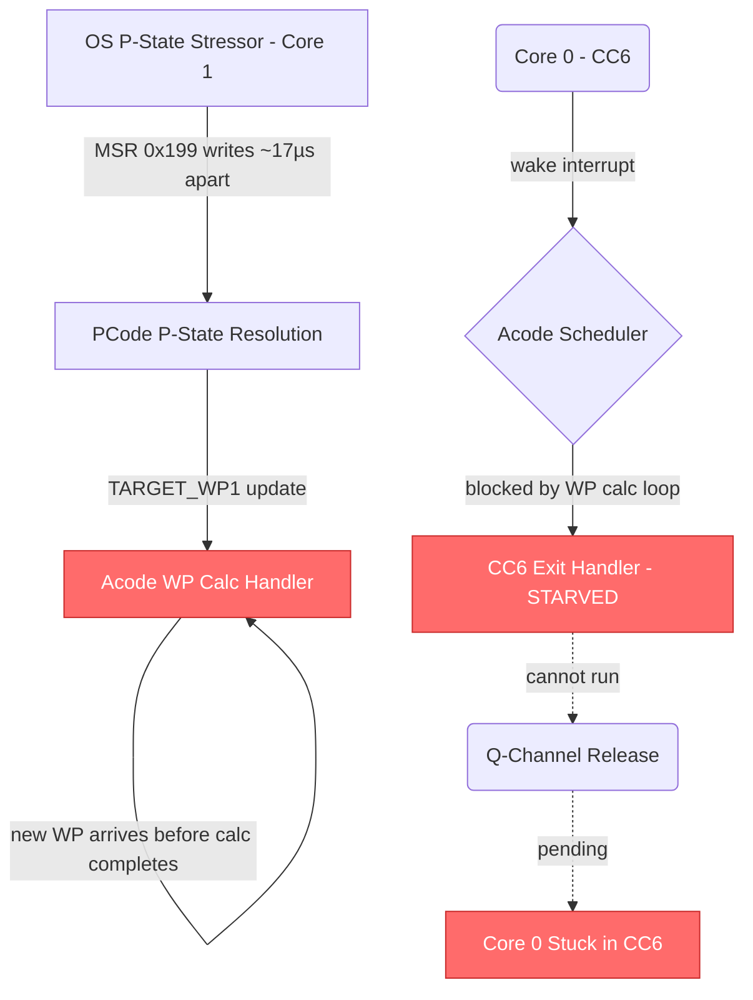
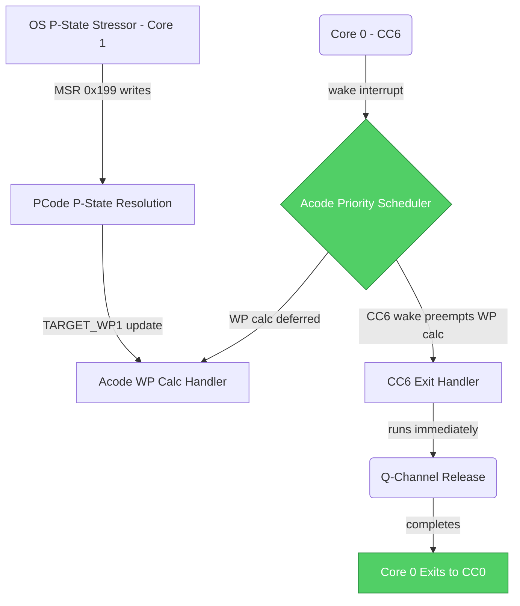

# HSD 13014051741: [DMR][A0] aCode stuck in WP calc loop when stressing 0x199

## Metadata

| Field | Value |
|-------|-------|
| **HSD ID** | [13014051741](https://hsdes.intel.com/appstore/article-one/#/13014051741) |
| **Status** | complete.validated |
| **Priority** | 3-medium |
| **Owner** | jasoncwa |
| **Component** | fw.acode |
| **Defect Die** | compute |
| **Conclusion** | fw.bug |

## Classification

| Dimension | Value | Confidence |
|-----------|-------|------------|
| **Root Cause Type** | **FW_PCODE** | 70% |
| **Feature** | Core C-States | 52% |
| **Sub-Feature** | C6 | — |

**Reasoning**: tag contains FIX_PATCH → FW_PCODE

## Root Cause Summary

Core 1 is a P-State stressor sending back to back 0x199 requests.

Core 0 is a random code core that also goes into CC6 from time to time.

Upon entering CC6, aCode is blocking the wake for core 0, as it is handling a WP request update to its module.

The requests are coming in at ~17-18 usec apart, and aCode doesn’t finish the handling of the WP calc before getting a new WP calc request due to the TARGET_WP1 updates.

Outcome:

 Core 0 cannot wake from CC6. Core 1 cannot release itself from the

## Raw HSD Text

<!-- This section provides raw HSD data for agent enrichment (Stage 3b). -->
<!-- The Copilot agent extracts root cause, fix description, code refs, and diagrams. -->

### Forum Notes
S 17 
 
41 
 
-> 
 
] aCode stuck in WP calc loop when stressing 0x199

Justin 

 

Failing signature: Core 0 cannot wake from CC6. Core 1 cannot release itself from the loop.

Theory: 

Light switches: 

WA: 
 

 

WW49.1

Core 1 is a P-State stressor sending back to back 0x199 requests.

Core 0 is a random code core that also goes into CC6 from time to time.

Upon entering CC6, aCode is blocking the wake for core 0, as it is handling a WP request update to its module.

The requests are coming in at ~17-18 usec apart, and aCode doesn’t finish the handling of the WP calc before getting a new WP calc request due to the TARGET_WP1 updates.

Outcome: Core 0 cannot wake from CC6. Core 1 cannot release itself from the loop.

This comes from a Cafe failure, we belive this is a Acode but, althought we still fail with the proposed fix , new failure maybe realted to Pcode 
Core team will debug this offline, HSD is still open no ready to clone or anything

### Description
Core 1 is a P-State stressor sending back to back 0x199 requests.

Core 0 is a random code core that also goes into CC6 from time to time.

Upon entering CC6, aCode is blocking the wake for core 0, as it is handling a WP request update to its module.

The requests are coming in at ~17-18 usec apart, and aCode doesn’t finish the handling of the WP calc before getting a new WP calc request due to the TARGET_WP1 updates.

Outcome:

 Core 0 cannot wake from CC6. Core 1 cannot release itself from the loop.

### Comments (latest)
++++1363469682 eladva1
14025910174 (related-link) - link(s) are added via link tab.
++++14614877127 jtgilmer
From: VaX, Elad <elad.vax@intel.com> Subject: RE: DMR - suspected pCode sending interrupts at high rate   Hey @Abitan, Nati,   We got a fix from aCode so that it is now handling the interrupts. Now we see that aCode is sending a request with num_domains_active=3, it is shadowed into ccp_electrical_request with 3, but the response in target WP3 is num_domains_active=2.   Is it possible pCode is missing the request?     Best regards, Elad. 
++++1363527422 eladva1
currently we are seeing pCode version 22.1.0.0 no matter what pCode we are trying to load. We need the correct pCode version for pCode vars (and to get pCode tracker). 

++++1363530154 eladva1
DMR execution reporting that with a newer pCode and aCode fix execution on one system is now passing with pstate stressor enabled. 
++++22611645661 vwang
[CloneScript] Sighting [sighting_central.sighting.id=13014051741] of [component=fw.acode] in [release=package.dmrap-ucc-x1-a0] has been cloned to a [bug] to [heia_soc.bugeco.id=22021917770] of [component=dmrcbbtop.soc.cpu-ia.big-core.acode#] in [release=dmrcbbtop-a0] [CloneScript] Ticket [heia_soc.bugeco.id=22021917770] of [component=dmrcbbtop.soc.cpu-ia.big-core.acode#] in [release=dmrcbbtop-a0] has been cloned to a [bug] to [ip_cpu_bigcore.bugeco.id=22021917775] of [component=pnc.ip.acode] in [release=pnc-a0]

++++22611687258 mbfausto
[SysDebug] The FW ticket (id=13014051799) cloned from this sighting has been fixed and released in ingredient version "DMR_A0_60000987" on [SysDebug] Sighting tag appended with "FIX_PATCH_DMR_A0_60000987" [SysDebug] [SysDebug] The Sighting owner (eladva1) may be enabled to validate the fix is working in the released collateral.

++++22611687263 mbfausto
[SysDebug Tag Script] IFWI version "DMR_AP_2026.02.3.01" has been released that contains the component release "FIX_PATCH_DMR_A0_60000987" [SysDebug Tag Script] Sighting tag appended with "FIX_IFWI_DMR_AP_2026.02.3.01"

++++22611695077 mbfausto
[SysDebug Tag Script] BKC version 'OKS_DMR_AP_2026WW04' has been released that contains the component release 'FIX_IFWI_DMR_AP_2026.02.3.01' [SysDebug Tag Script] Sighting tag appended with 'FIX_BKC_OKS_DMR_AP_2026WW04'

++++22611876865 jasoncwa
 Confirmed the WA has been removed in Cafe automation. This failure does not reproduce in Cafe on acode v175 and later.

### Tags
SysDebugCloned,SysDebugDccbBypass,FIX_PATCH_DMR_AP1_A0_60000987,FIX_IFWI_DMR_AP1_2026.02.3.01,ps.cov.bug.pm.pstate,BKC#OKS_DMR_AP_X1_2026WW04,FIX_BKC_OKS_DMR_AP1_2026WW04

### Conclusion
fw.bug

### Component
fw.acode

## Root Cause Description

Acode gets stuck in an infinite workpoint calculation loop when back-to-back MSR 0x199 (IA32_PERF_CTL) writes arrive at ~17–18 µs intervals. Core 1 is a P-state stressor sending rapid PERF_CTL requests, each of which triggers a TARGET_WP1 update that causes Acode to begin a new workpoint calculation before the previous one completes. Meanwhile, Core 0 is in CC6 and cannot wake because Acode is blocking the CC6 exit flow — the wake interrupt is held pending while Acode continuously services WP calc requests.

### LLM-Enriched Root Cause Analysis

Per the Core C-States KB, CC6 exit requires Acode to run the budget release/request flow and manage the CC6→CC1→CC0 staged exit. Acode runs on the Tensilica µcontroller in the Autonomous Core Perimeter (ACP) and is shared between the WP calc handler and the C-state exit handler. Per the PState Stack KB, P-state requests flow through MSR 0x199 → PCode arbitration → TARGET_WP update → Acode GV transition. When TARGET_WP1 updates arrive faster than Acode can complete the WP calc, Acode never yields control to the CC6 exit handler. The Q-channel handshake (CFC_CLK, CFC_PWR) from PMA to SoC remains pending, preventing Core 0 from exiting CC6. The fix in Acode v175 added interrupt prioritization so CC6 wake events preempt the WP calc loop.

## Fix Description

Fixed in Acode v175. The Acode firmware was patched to properly handle interrupt prioritization, ensuring CC6 wake events are not starved by continuous WP calc requests. The fix was released in FW patch `DMR_A0_60000987`, delivered in IFWI `DMR_AP_2026.02.3.01` and BKC `OKS_DMR_AP_2026WW04`. Validated in Cafe automation — confirmed the failure no longer reproduces with Acode v175+.

### LLM-Enriched Fix Analysis

The fix addresses the priority inversion between the WP calc handler and the CC6 exit handler in Acode. Per the ACP PM HAS, Acode manages both P-state GV transitions and C-state timer/budget operations. The patch ensures that when a CC6 wake break event arrives (via the PICLET interrupt filter), Acode completes or defers the current WP calc iteration and services the CC6 exit first. This prevents Core 0 from being indefinitely blocked in CC6 while Core 1’s P-state stress continues. The WA that was temporarily applied in Cafe automation was also removed after the fix was validated.

## Source Code References

### ACode
- Acode WP calc handler — workpoint calculation loop triggered by TARGET_WP1 updates
- Acode CC6 exit handler — budget release/request, staged CC6→CC1→CC0 exit
- Acode v175 — fix version with interrupt prioritization

### PCode
- `source/pcode/flows/autonomous_pstate/` — P-state resolution writing TARGET_WP
- `source/pcode/flows/pega/` — PEGA autonomous P-state engine

### Hardware
- `MSR 0x199` (IA32_PERF_CTL) — legacy P-state request triggering WP updates
- `TARGET_WP1` PMSB register — target workpoint written by PCode, read by Acode
- `CORE_PMA_CR_CORE_STATUS` — core state coordination (CC6 wake pending)
- Q-channels (CFC_CLK, CFC_PWR) — PMA→SoC resource release for CC6 exit

### Tags
- `FIX_PATCH_DMR_AP1_A0_60000987`
- `FIX_IFWI_DMR_AP1_2026.02.3.01`
- `FIX_BKC_OKS_DMR_AP1_2026WW04`

## Component Interaction: Root Cause

## Component Interaction: Fix

## Feature Mapping

- **Primary Feature**: Core C-States
- **Sub-Feature**: C6
- **Component Path**: fw.acode

## Firmware Touchpoints

- No firmware touchpoints detected in text fields

## Timeline

- **Submitted**: 2025-11-27 17:52:42
- **Root Caused**: 2025-12-17 23:00:27
- **Closed**: 2026-05-01 23:46:14
- **Days Open**: 155

## Lessons Learned

<!-- Add lessons learned after human review -->

---
*Generated by classify_sightings.py at 2026-05-28T06:39:38+00:00*
