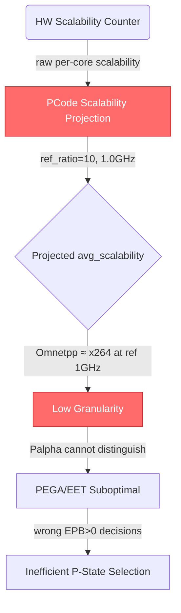
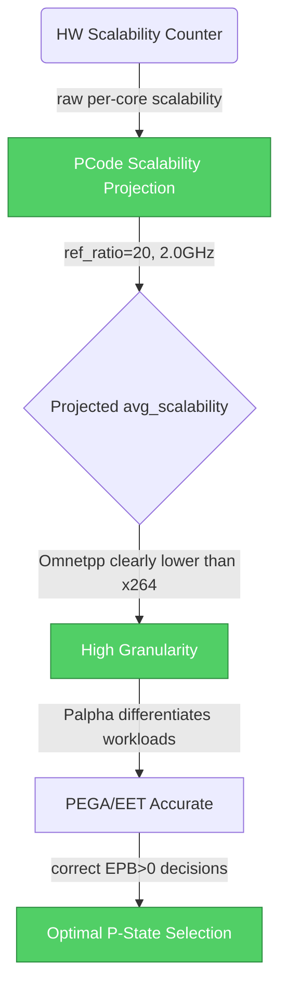

# HSD 13014644985: [DMR][X1 A0]  Change calculation of scalability projection for a more accurate Palpha tuning

## Metadata

| Field | Value |
|-------|-------|
| **HSD ID** | [13014644985](https://hsdes.intel.com/appstore/article-one/#/13014644985) |
| **Status** | complete.validated |
| **Priority** | 3-medium |
| **Owner** | dlevy1 |
| **Component** | fw.pcode |
| **Defect Die** | base |
| **Conclusion** | hw.tuning |

## Classification

| Dimension | Value | Confidence |
|-----------|-------|------------|
| **Root Cause Type** | **FW_PCODE** | 70% |
| **Feature** | Platform PM Interface | 52% |
| **Sub-Feature** | PECI | — |

**Reasoning**: tag contains FIX_PATCH → FW_PCODE

## Root Cause Summary

According
to Post Si 

DMR 

data, 

for Omnetpp, regardless of the ratio, the
avg_scalability_per_core is very similar, while the scalability counter varies
significantly.

At high
frequencies, the gap in scalability between Omnetpp & x264 narrows.

 

The way
that Pcode projects the 

avg_scalability_per_core
to a ref_ratio

=

10 

may 

affect the granularity of 

the 

workload
scalability 

analysis

, particularly for workloads that
don't scale well

This may
impact the post-Si tuning, es

## Raw HSD Text

<!-- This section provides raw HSD data for agent enrichment (Stage 3b). -->
<!-- The Copilot agent extracts root cause, fix description, code refs, and diagrams. -->

### Forum Notes
[26ww10.3]

Waiting on test patch from pcode.

[26ww10.1]

Zigi will provide a patch to update the parameter to 2.0Ghz and expose as class variable.

[26ww09.3]

This is PnP tunning, Yevgeni and David are working on this.

### Description
According
to Post Si 

DMR 

data, 

for Omnetpp, regardless of the ratio, the
avg_scalability_per_core is very similar, while the scalability counter varies
significantly.

At high
frequencies, the gap in scalability between Omnetpp & x264 narrows.

 

The way
that Pcode projects the 

avg_scalability_per_core
to a ref_ratio

=

10 

may 

affect the granularity of 

the 

workload
scalability 

analysis

, particularly for workloads that
don't scale well

This may
impact the post-Si tuning, especially for EPB>0 profiles. 

After presenting the data to the architects (Palpha SOC & Pcode), it was agreed that we have an opportunity to improve the future tuning by changing the reference_ratio. 

For now, we suggest setting scalability_ref_ratio = 20 and making it exposable so we can adjust it Post-Si.

### Comments (latest)
++++1363576976 dlevy1
Automated Message: This record has been cloned. The preceding comments are originally from the parent record 13014632607.
++++14615083023 vwang 
 @Levy, David J  asked me set it to vt.pm.  Please add all discussions you have done with CBB Arch and pCoders.
++++22611781669 mbfausto
Team - no update in ~2 weeks.  Is this just a tuning value setting with an enhancement to make it tunable?  Should this be in vt.perf or vt.pm?   Can we close this promptly as I'm not sure what conversation is in progress these last 2 weeks ... 1) Does the tuning need to be customer visible? 2) Can an ITP-based python variable update work?  (Maybe pCode exposes the value as a variable, use ITP to write into memory, and some way to have pCode re-consume it ?) 3) Do we need a Customer Vislble or Debug-Only Mailbox command (again, via ITP to write the mailbox?)?      ==> And shoudl this mailbox be generic or on top of  another debug mailbox so that if/when we find another debug usage we can just add an encoding ?) After presenting the data to the architects (Palpha SOC & Pcode), it was agreed that we have an opportunity to improve the future tuning by changing the reference_ratio. For now, we suggest setting scalability_ref_ratio = 20 and making it exposable so we can adjust it Post-Si.  

++++22611785531 mbfausto
Team - still no updated or response to  your sighting!
++++14615135633 vwang 
From  @Sabin, Yevgeni : Zigi, I’ll open pcode enhancement for this change, bottom line we want to update the parameter to 2.0Ghz and expose as class variable.   Alternatively, we could get a debug patch to check first the change (even if at this stage we expect a change only at Balanced mode)
++++22611792097 mbfausto
[CloneScript] Sighting [sighting_central.sighting.id=13014644985] of [component=fw.pcode] in [release=package.dmrap-ucc-x1-a0] has been cloned to a [feature] to [heia_soc.bugeco.id=22022155792] of [component=dmrcbbbase.soc.pm.pcode] in [release=dmrcbbbase-a0]

++++22611821825 mbfausto
[SysDebug] The FW ticket (id=22022155792) cloned from this sighting has been fixed and released in ingredient version "DMR_A0_6000099A" on [SysDebug] Sighting tag appended with "FIX_PATCH_DMR_A0_6000099A" [SysDebug] [SysDebug] The Sighting owner (dlevy1) may be enabled to validate the fix is working in the released collateral.

++++22611822020 mbfausto
[SysDebug Tag Script] IFWI version "DMR_AP_2026.13.3.01" has been released that contains the component release "FIX_PATCH_DMR_A0_6000099A" [SysDebug Tag Script] Sighting tag appended with "FIX_IFWI_DMR_AP_2026.13.3.01"

++++22611833204 mbfausto
[SysDebug Tag Script] BKC version "OKS_DMR_AP_2026WW16" has been released that contains the component release "FIX_IFWI_DMR_AP_2026.13.3.01" [SysDebug Tag Script] Sighting tag appended with "FIX_BKC_OKS_DMR_AP_2026WW16"
++++1363639269 dlevy1
Hi All, This HSD can be  closed:   To: Yevgeny/Zigi/ Srihari:  In the Pcode BB/CCB meeting, it was agreed to make the scalability_ref_ratio expo

### Tags
SysDebugCloned,SysDebugDccbBypass,FIX_PATCH_DMR_AP1_A0_6000099A,FIX_IFWI_DMR_AP1_2026.13.3.01,BKC#OKS_DMR_AP_X1_2026WW14_INT,FIX_BKC_OKS_DMR_AP1_2026WW16

### Conclusion
hw.tuning

### Component
fw.pcode

## Root Cause Description

PCode projects `avg_scalability_per_core` to a fixed reference ratio of 10 (1.0 GHz) for workload scalability analysis used by the Palpha tuning algorithm. For workloads that don't scale well (e.g., Omnetpp), the scalability counter varies significantly at different frequencies, but the projected `avg_scalability_per_core` at ref_ratio=10 remains nearly constant, losing granularity needed for accurate Palpha differentiation. At high frequencies, the scalability gap between well-scaling (x264) and poorly-scaling (Omnetpp) workloads narrows, reducing the effectiveness of EPB>0 energy-performance bias profiles.

### LLM-Enriched Root Cause Analysis

Per the PState Stack KB, PCode manages autonomous P-state selection via the PEGA engine, which uses workload characterization signals (including scalability counters) to determine optimal frequency. The scalability projection normalizes raw per-core scalability measurements to a reference frequency for cross-frequency comparison. With `scalability_ref_ratio=10` (1.0 GHz — near Pn), the projection maps all high-frequency observations into a narrow value range, because the scalability function is approximately linear near the bottom of the V/F curve. By raising the reference to `scalability_ref_ratio=20` (2.0 GHz — closer to P1), the projection preserves more of the natural spread between workload types, enabling the Palpha algorithm to better distinguish compute-bound vs memory-bound workloads. This impacts PEGA’s EET (Energy Efficient Turbo) attenuation and EPB-driven efficiency decisions.

## Fix Description

Fixed in PCode patch `DMR_A0_6000099A`. The `scalability_ref_ratio` parameter was changed from 10 to 20 (2.0 GHz) and exposed as a PCode class variable so it can be tuned post-silicon without a code change. Delivered in IFWI `DMR_AP_2026.13.3.01` and BKC `OKS_DMR_AP_2026WW16`. Validated and closed.

### LLM-Enriched Fix Analysis

The fix is a PCode tuning change in the scalability projection function (likely in `source/pcode/flows/autonomous_pstate/` or the PEGA workload characterization path). By exposing `scalability_ref_ratio` as a class variable, it becomes adjustable via ITP/PCode variables without requiring a firmware rebuild, following the PCode vars mechanism pattern. The value of 20 (2.0 GHz) was agreed upon by the Palpha SOC and PCode architects as providing better granularity for workload differentiation while remaining within the guaranteed frequency range (below P1 on most SKUs).

## Source Code References

### PCode Flows
- `source/pcode/flows/autonomous_pstate/` — core P-state and scalability projection
- `source/pcode/flows/pega/` — PEGA workload characterization engine
- `scalability_ref_ratio` — PCode class variable (changed from 10 to 20)
- `avg_scalability_per_core` — per-core scalability measurement projected to ref_ratio

### Hardware
- Scalability counter — hardware performance counter measuring memory-boundedness
- EPB (Energy Performance Bias) / EPP (Energy Performance Preference) — MSR 0x1B0 / HWP_REQUEST

### Tags
- `FIX_PATCH_DMR_AP1_A0_6000099A`
- `FIX_IFWI_DMR_AP1_2026.13.3.01`
- `FIX_BKC_OKS_DMR_AP1_2026WW16`

## Component Interaction: Root Cause

## Component Interaction: Fix

## Feature Mapping

- **Primary Feature**: Platform PM Interface
- **Sub-Feature**: PECI
- **Component Path**: fw.pcode

## Firmware Touchpoints

- No firmware touchpoints detected in text fields

## Timeline

- **Submitted**: 2026-02-12 11:45:40
- **Root Caused**: 2026-03-04 21:22:03
- **Closed**: 2026-04-28 18:31:04
- **Days Open**: 75

## Lessons Learned

<!-- Add lessons learned after human review -->

---
*Generated by classify_sightings.py at 2026-05-28T06:39:38+00:00*
