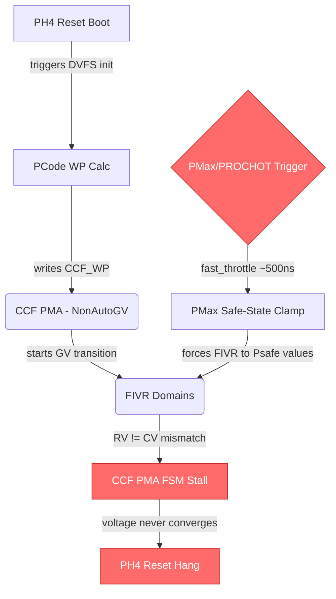
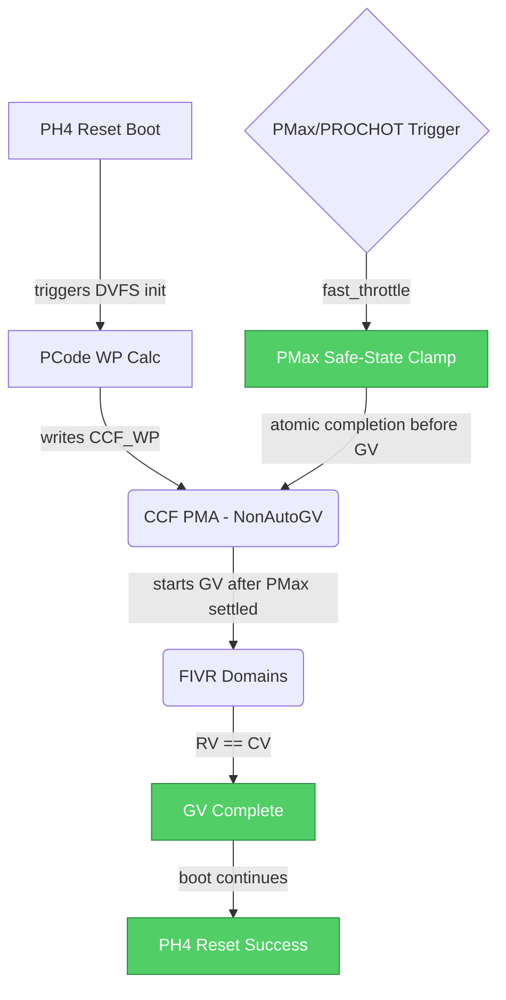

# HSD 14025764036: [X1 A0 PO] CBB DVFS ccf_pma hang during PH4 reset

## Metadata

| Field | Value |
|-------|-------|
| **HSD ID** | [14025764036](https://hsdes.intel.com/appstore/article-one/#/14025764036) |
| **Status** | rejected.cannot_reproduce |
| **Priority** | 4-low |
| **Owner** | wstathis |
| **Component** | hw.power |
| **Defect Die** | base |
| **Conclusion** | no_root_cause.rejected |

## Classification

| Dimension | Value | Confidence |
|-----------|-------|------------|
| **Root Cause Type** | **HW** | 40% |
| **Feature** | Power/RAPL | 80% |
| **Sub-Feature** | VR | — |

**Reasoning**: keyword 'eco' in title/desc → HW

## Root Cause Summary

Summary:

========

Seeing CBB DVFS by ccf_pma hang during boot PH4. Initial debug showed the DVFS may be caused PROCHOT or PMAX flow. 

Impact:

========

Reset hang during PH4

Details:

========

Seen on SC00901159H0010 

[PM_PSTATE_TRANSITION]:Pm:WP Registers Mismatches:Found 12 domains in P-state transition (different RV, TV, CV) : PMAX_CCF PMAX_D2D D2D_UCIE_FIVR D2D_UCIE_FIVR.VOLTAGE RING_FIVR_2 RING_FIVR_2.VOLTAGE RING_FIVR_5 RING_FIVR_5 RING_FIVR_5 RING_FIVR_5.VOLTAGE RING_FIVR_5.VOLTAGE

## Raw HSD Text

<!-- This section provides raw HSD data for agent enrichment (Stage 3b). -->
<!-- The Copilot agent extracts root cause, fix description, code refs, and diagrams. -->

### Forum Notes
WW35.4

Hit during the first week of boot, not able to reproduce anymore ( we know we have several PM stuff disable) , we expect to see once we remove the WA 
Trigger to close this is to make sure we dont see the issue once we remove all the WA from PO

### Description
Summary:

========

Seeing CBB DVFS by ccf_pma hang during boot PH4. Initial debug showed the DVFS may be caused PROCHOT or PMAX flow. 

Impact:

========

Reset hang during PH4

Details:

========

Seen on SC00901159H0010 

[PM_PSTATE_TRANSITION]:Pm:WP Registers Mismatches:Found 12 domains in P-state transition (different RV, TV, CV) : PMAX_CCF PMAX_D2D D2D_UCIE_FIVR D2D_UCIE_FIVR.VOLTAGE RING_FIVR_2 RING_FIVR_2.VOLTAGE RING_FIVR_5 RING_FIVR_5 RING_FIVR_5 RING_FIVR_5.VOLTAGE RING_FIVR_5.VOLTAGE RING_FIVR_5.VOLTAGE

ccf pma status scope:

https://axonsv.app.intel.com/apps/record-viewer/0198afa3-98f6-7590-bce5-4ab849657e8d/intel-svtools-report-v1?tab=report#status_scope.analyzers.pm.Pm_insight_0
 

First debug showed that this could be due to PMAX/PROCHOT triggering dvfs to initial values.

TODO when a system is available, see if we can repro this - also try with PROCHOT/PMAX disables to see if the issue is alleviated.

### Comments (latest)
++++14614534845 wstathis
register mismatch table: https://axonsv.app.intel.com/apps/record-viewer/0198afa3-98f6-7590-bce5-4ab849657e8d/intel-svtools-report-v1?tab=report#status_scope.analyzers.pm.Pm.WP%20Registers%20Mismatches_table_WP%20Registers%20Mismatches  index Domain RV TV TV_IP CV 0 (0x0) PMAX_CCF 0x1fff0000 0x1fff0000 0x1fff0000 0x0 1 (0x1) PMAX_D2D 0x1fff0000 0x1fff0000 0x1fff0000 0x0 2 (0x2) D2D_UCIE_FIVR 0x3ff96c 0x3ff96c 0x3ff96c 0x3ff96d 3 (0x3) D2D_UCIE_FIVR.VOLTAGE 0x16c 0x16c 0x16c 0x16d 4 (0x4) RING_FIVR_2 0x1f16c 0x1f16c 0x1f16c 0x1f16d 5 (0x5) RING_FIVR_2.VOLTAGE 0x16c 0x16c 0x16c 0x16d 6 (0x6) RING_FIVR_5 0x1f16c 0x1f16d 0x1f16d 0x1f16d 7 (0x7) RING_FIVR_5 0x1f16c 0x1f16d 0x1f16d 0x1f16d 8 (0x8) RING_FIVR_5 0x1f16c 0x1f16d 0x1f16d 0x1f16d 9 (0x9) RING_FIVR_5.VOLTAGE 0x16c 0x16d 0x16d 0x16d 10 (0xa) RING_FIVR_5.VOLTAGE 0x16c 0x16d 0x16d 0x16d 11 (0xb) RING_FIVR_5.VOLTAGE 0x16c 0x16d 0x16d 0x16d pcode fuses: punit.pcode_vccuciea_ne_active_voltage = 0xe6 punit.pcode_vccuciea_nw_active_voltage = 0xe6 punit.pcode_vccuciea_se_active_voltage = 0xe6 punit.pcode_vccuciea_sw_active_voltage = 0xe6 punit.pcode_vccuciea_ne_itd_slope = 0x0 punit.pcode_vccuciea_nw_itd_slope = 0x0 punit.pcode_vccuciea_se_itd_slope = 0x0 punit.pcode_vccuciea_sw_itd_slope = 0x0

++++14614535162 wstathis 
Experiments: 1. disable PMAX/PROCHOT as mentioned above 2. Legacy Drainless GV: https://docs.intel.com/documents/pm_doc/src/DMR_CBB/IP%20Integration/CCF/CBB_CCF_PM.html#legacy-drainless-gv  Configure CCF PMA to legacy mode: (CCF_UCLK_GV_CFG.legacy_gv_enable = 1) set FLL to PLL configuration using FLL fuses: (pll_mode=1, pll_mode_ovrden = 1). Pcode can also write these bits to the FUSE CR OVERRIDE register. 3. Default behavior is to send the GV even if WP is unchanged, should be chicken switch to change this behavior. ( sv.socket0.cbb0.base.ccf_pma.ccf_pmc_regs.ccf_uclk_gv_cfg.gv_same_wp_trig  )  4. Try ccf_pma_override_ctl_*/gvcontrol_fsm_mask regs to see if we can get unstuck Debug to add: PMSB/GPSB trace for WP/INC GB msgs  register: ccf_pma_debug  imh d2d wp info (ensure voltage/freq between the two match)

++++14614535237 sasmith2
Comment about proposed experiment #2 is that when Tony was investigating whether we should have validation TCs around drainless GV, we were told it was not supported: From a later conversation:

++++14614535302 sasmith2
I think this is what you are looking for with exp 3: sv.socket0.cbb0.base.ccf_pma.ccf_pmc_regs.ccf_uclk_gv_cfg.gv_same_wp_trig.description  'If this bit is set, when moving to a WP with the same voltage or freq value as the current WP, it will trigger as if the target voltage/freq is lower then the current'
++++1363380261 ygorbman
Hi,   @Smith, Stephen A  Do you need CDG MDT support? How we can help in this debug? Best regards, Igal.
++++14614536510 sasmith2
 @Gorbman, Igal - This is not my sighting/issue.  I was just providing comments/help about the experiments it seemed William will try but since you look to be

### Conclusion
no_root_cause.rejected

### Component
hw.power

## Root Cause Description

The CBB CCF PMA hangs during PH4 reset due to a DVFS (Dynamic Voltage Frequency Scaling) workpoint mismatch. During boot PH4, the CCF PMA initiates a GV (Geyserville) transition but the requested voltage (RV) and current voltage (CV) diverge across multiple FIVR domains (PMAX_CCF, PMAX_D2D, D2D_UCIE_FIVR, RING_FIVR_2, RING_FIVR_5). Initial debug suggests PROCHOT or PMAX flow may be forcing the DVFS to initial/safe values while CCF PMA is mid-transition.

### LLM-Enriched Root Cause Analysis

Per the Power/RAPL KB, PMax provides ~500ns instant hardware protection via fast_throttle wires that clamp to Psafe frequency. During PH4 reset, if PMax triggers (or PROCHOT fires), PCode forces all FIVR domains to safe initial voltages. However, the CCF PMA operates in NonAutoGV mode (per PState Stack KB — CCF does not autonomously select workpoints; it responds to `CCF_WP` written by PCode). If PMax/PROCHOT forces a voltage change while CCF PMA is executing a GV transition, the WP register mismatch (RV ≠ CV) causes the PMA FSM to stall waiting for voltage convergence that never arrives. The WP Registers Mismatch table shows PMAX_CCF and PMAX_D2D with RV=0x1fff0000 but CV=0x0, and RING_FIVR domains with 1-LSB mismatches (0x16c vs 0x16d), suggesting a race between PMax safe-state clamping and the normal GV flow.

## Fix Description

No fix applied — rejected as `cannot_reproduce`. The issue was only seen during the first week of boot (WW35.4) and could not be reproduced after PM WAs were removed. Several experiments were proposed but not conclusively executed: (1) disable PMAX/PROCHOT to isolate the trigger, (2) switch CCF PMA to legacy drainless GV mode (`CCF_UCLK_GV_CFG.legacy_gv_enable=1`), (3) use chicken switch `gv_same_wp_trig` to suppress GV when WP is unchanged, (4) use `ccf_pma_override_ctl` to manually unstick the FSM.

### LLM-Enriched Fix Analysis

The root issue is likely a race condition between PMax/PROCHOT safe-state enforcement and the CCF PMA GV FSM during reset PH4. Per the RAPL KB, PMax operates at ~500ns timescale with hard/soft Vtrip thresholds, while the GV transition takes microseconds. If the bug reappears, the fix should ensure PMax safe-state clamping atomically completes before CCF PMA initiates the next GV transition, or the CCF PMA should detect WP stale/mismatch and reset its FSM. The `ccf_pma_debug` register and PMSB/GPSB trace would confirm whether the hang is in the voltage settling phase or the frequency change phase.

## Source Code References

### PCode Flows
- `source/pcode/flows/workpoint_calc/` — WP calculation and FIVR domain voltage targets
- `source/pcode/drivers/fivr.` — FIVR voltage control

### PrimeCode Flows
- `src/flow/pstates/` — P-state/DVFS flow
- `src/flow/prochot/` — PROCHOT handling

### Hardware Registers
- `CCF_UCLK_GV_CFG` — CCF GV configuration (legacy_gv_enable, gv_same_wp_trig)
- `ccf_pma_override_ctl` / `gvcontrol_fsm_mask` — manual FSM override
- `ccf_pma_debug` — CCF PMA debug register
- PMAX_CCF, PMAX_D2D, D2D_UCIE_FIVR, RING_FIVR_2, RING_FIVR_5 — WP domain registers
- PMax Vtrip fuses: `pcode_vccuciea_*_active_voltage`, `pcode_vccuciea_*_itd_slope`

## Component Interaction: Root Cause

## Component Interaction: Fix

## Feature Mapping

- **Primary Feature**: Power/RAPL
- **Sub-Feature**: VR
- **Component Path**: hw.power

## Firmware Touchpoints

- No firmware touchpoints detected in text fields

## Key Registers

- `sv.socket0.cbb0.base.ccf_pma.ccf_pmc_regs.ccf_uclk_gv_cfg.gv_same_wp_trig`
- `sv.socket0.cbb0.base.ccf_pma.ccf_pmc_regs.ccf_uclk_gv_cfg.gv_same_wp_trig.description`

## Timeline

- **Submitted**: 2025-08-19 01:25:13
- **Closed**: 2025-09-05 09:51:39
- **Days Open**: 17

## Lessons Learned

<!-- Add lessons learned after human review -->

---
*Generated by classify_sightings.py at 2026-05-28T06:39:38+00:00*
