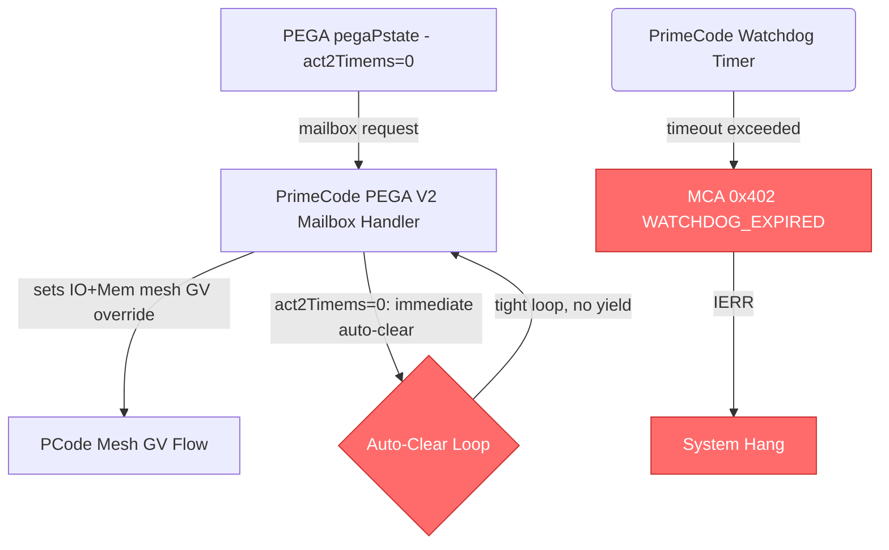
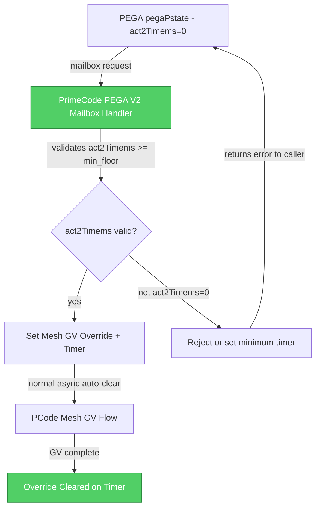

# HSD 14025850936: ][X1 A0 PO][DVFS] iMH0 Punit PRIMECODE_WATCHDOG_TIMER_EXPIRED when stressing IO Mesh and MemMesh using PEGA

## Metadata

| Field | Value |
|-------|-------|
| **HSD ID** | [14025850936](https://hsdes.intel.com/appstore/article-one/#/14025850936) |
| **Status** | rejected.cannot_reproduce |
| **Priority** | 3-medium |
| **Owner** | sasmith2 |
| **Component** | fw.primecode |
| **Defect Die** | ioe |
| **Conclusion** | no_root_cause.rejected |

## Classification

| Dimension | Value | Confidence |
|-----------|-------|------------|
| **Root Cause Type** | **HW** | 40% |
| **Feature** | PState Stack | 60% |
| **Sub-Feature** | general | — |

**Reasoning**: keyword 'eco' in title/desc → HW

## Root Cause Summary

Summary:

========

We are seeing the following iMH Punit FW MCA when running PEGA to stress IO Mesh and Mem Mesh

 

 

 

 

  
|socket0.imh0.punit|IERR_GENERIC             
  |0x402 |Fatal     |1      
  |Punit       |PRIMECODE_WATCHDOG_TIMER_EXPIRED|{}                
  |          |

  

  

  

 

 

PEGA command being used:

pega.pegaPstate(sktNum='all',dieName='all', domainRatioDict={},iagv='r', clrgv='r', iogv='r', memgv = 'r', rearmTimems=1, act2Timems=0, randMask=False, randUnit=0)

Im

## Raw HSD Text

<!-- This section provides raw HSD data for agent enrichment (Stage 3b). -->
<!-- The Copilot agent extracts root cause, fix description, code refs, and diagrams. -->

### Forum Notes
[25WW40.1]

Rejecting this one:  PrimeCode team couldn't reproduce this on both CTE and Simics

Stephane is not able to reproduce this too.  Rejected this sighting.

[25WW38.3]

PrimeCode team confirms this a bug in New the Pega V2 mailbox feature
The team will investigate further to find which part of the code caused this. 
Vidar will root cause this.

Failing Signature: 
 
PRIMECODE_WATCHDOG_TIMER_EXPIRED when stressing IO Mesh and MemMesh using PEGA

[WW36.4]

Team managed to reproduce the issue with WDT disabled

 

From Alex “ see now that the Pega python scripts are using the new Pega mailbox feature and the failure light-switch (Act2TimeMs) is the new functionality added as part of that Pega mailbox for primecode to automatically clear the override.

Therefore, this issue should be specific to just the Pega mailbox overrides and not seen on regular IO and Mem Mesh GV's.”
Sourced by the new Pega Architecture , not a big deal now

Next)Hector )
 Sync up with Stephen and make sure this is not expose as critical

### Description
Summary:

========

We are seeing the following iMH Punit FW MCA when running PEGA to stress IO Mesh and Mem Mesh

 

 

 

 

  
|socket0.imh0.punit|IERR_GENERIC             
  |0x402 |Fatal     |1      
  |Punit       |PRIMECODE_WATCHDOG_TIMER_EXPIRED|{}                
  |          |

  

  

  

 

 

PEGA command being used:

pega.pegaPstate(sktNum='all',dieName='all', domainRatioDict={},iagv='r', clrgv='r', iogv='r', memgv = 'r', rearmTimems=1, act2Timems=0, randMask=False, randUnit=0)

Impact:

========

System hang when stressing iMH DVFS using PEGA

Details:

========

REPLACE  with failure and triage details.

==> System configuration ...

Unfused X1 using Q9CZ fuse override, booting with 1DCM - 2 cores

==> BIOS/Patch/IFWI/BKC/CI Versions ...

OKSDCRB1.86B.2025.34.1.02_2654.D06_70000940._1P0_NonIPClean_Trace_DebugSigned_PE8_MonitorMWaitEnable.bin

==> Reproducibility ...

==> Lightswitch discoveries ...

==> Experiment results ...

### Comments (latest)
++++14614581753 hmpicosm

Stephen was able to reproduce again in same system running PEGA for IOMesh and MemMesh concurrently. Captured status scope using 'auto' and 'pm' plugins, but Axxon generated data is empty. Contacted Bill Stathis and this is his recommendation on command to use:

 
<!--StartFragment--><!--EndFragment-->
status_scope.run(collectors=[&quot;namednodes&quot;], analyzers=[&quot;error&quot;,&quot;auto&quot;])&nbsp;&nbsp;

++++14614581754 agraback

Can this be re-run with Primecode FW timeouts enabled to see if something else is hanging or timing out to narrow down the issue? sv.socket0.imhs.pcudata.timeoutsEnabled = 0x1

<!--StartFragment-->sv.socket0.imhs.pcodeio_map.io_pcode_config = 0x0<!--EndFragment-->
<!--EndFragment-->

++++14614581752 gnagorsk

Ok so sounds so far like this is the WDT that PrimeCode is actively pinging in a looped event. So if it triggered feels like either PrimeCode completely froze somewhere and is in a loop or it was just too slow to wrap around the whole events loop before pinging WDT again.

 

So we think that if you run this again with the experiment to disable the PrimeCode WDT, we will see if it still fails somewhere else with different MCA/failure data or if all works.

If all works/the test is passing while WDT is disabled, then we will need to investigate and measure the actual events/flows that were executing during the load to find the offender and divide/optimize it (either a new test build or will need some tools to extract more details from existing traces).

 

But if it fails, we hope to see more details on where PrimeCode failed to root cause this further.

 

You can disable the WDT by writing the PUNIT Fusa WDT register: <!--StartFragment-->DFX_CTRL_UNPROTECTED.dfx_uc_wdt_mca_disable_lsb bit set.<!--EndFragment-->
<!--StartFragment--><!--EndFragment-->

++++14614581755 sasmith2

I was on SC006 again and tried some experiments:  1.&nbsp; I was able to do a fresh boot and reproduce the WDT issue when issuing the pega commands

2.&nbsp; I set&nbsp;dfx_uc_wdt_mca_disable=1 and tried the pega commands for probably 45 minutes without failure

3.&nbsp; I then set dfx_uc_wdt_mca_disable back to 0 and tried the pega commands but seemed the failure would not occur at this point.&nbsp; I think I observed this behavior twice because I originally tried reproducing the issue with WDT disabled and then still couldn't reproduce when I enabled WDT again.&nbsp; Which is why I started again with a fresh boot and saw the issue when WDT wasn't disabled<!--EndFragment-->

 

 
<

### Tags
SysDebugCloned,FWTF_PS_SKIPTAG

### Conclusion
no_root_cause.rejected

### Component
fw.primecode

## Root Cause Description

The iMH0 PrimeCode watchdog timer expires (MCA 0x402 PRIMECODE_WATCHDOG_TIMER_EXPIRED) when PEGA stresses IO Mesh and Mem Mesh GV simultaneously using `pegaPstate()` with `act2Timems=0`. The root cause is specific to the new PEGA V2 mailbox feature — when `act2Timems` (the auto-clear override timer) is set to 0, PrimeCode’s mailbox handler enters a path that does not complete within the watchdog timeout.

### LLM-Enriched Root Cause Analysis

Per the PState Stack KB, PEGA is the Performance and Energy Guided Autonomy engine within PCode that manages autonomous P-state selection. The PEGA V2 mailbox extends this with a user-facing interface (`pegaPstate()`) that allows direct override of IO mesh and memory mesh GV ratios. Per the KB, CCF operates in NonAutoGV mode — it does not autonomously select workpoints but responds to PCode-written target WPs. When `act2Timems=0`, the new PEGA mailbox code path in PrimeCode attempts to automatically clear the override immediately, creating a tight loop that exceeds the PrimeCode watchdog timer. The `rearmTimems=1` parameter further aggravates timing by causing rapid re-arming. The PrimeCode team confirmed this is a bug in the PEGA V2 mailbox feature but could not reproduce it in CTE or Simics; the sighting was rejected as cannot_reproduce.

## Fix Description

No fix applied — rejected as `cannot_reproduce`. The PrimeCode team could not reproduce the issue in CTE or Simics, and the sighting owner (Stephen Smith) also could not reproduce on silicon. The root cause was identified as a bug in the PEGA V2 mailbox feature with `act2Timems=0`, but since it was not reproducible, no code change was made.

### LLM-Enriched Fix Analysis

The expected fix would be in the PrimeCode PEGA V2 mailbox handler (likely in `src/flow/dvfs/` or the mesh GV mailbox path) to properly handle the `act2Timems=0` case. The handler should either reject `act2Timems=0` as invalid input, or implement a minimum timer floor to prevent the auto-clear path from completing synchronously within the mailbox call. The watchdog timer (MCA 0x402) fires when PrimeCode firmware does not pet the watchdog within its configured interval, indicating the main loop or an interrupt handler is blocked.

## Source Code References

### PrimeCode Flows
- `src/flow/dvfs/` — DVFS/GV flow (mesh frequency transitions)
- PEGA V2 mailbox handler — `act2Timems` auto-clear override feature

### PCode Flows
- `source/pcode/flows/pega/` — PEGA autonomous P-state engine
- `source/pcode/flows/autonomous_pstate/` — core P-state flow

### Hardware
- MCA 0x402 — `PRIMECODE_WATCHDOG_TIMER_EXPIRED`
- `socket0.imh0.punit` — iMH0 PUnit (PrimeCode execution unit)
- IO Mesh GV, Mem Mesh GV — fabric frequency domains

### Validation Tool
- `pega.pegaPstate()` — PEGA stress command with `iogv='r'`, `memgv='r'`, `act2Timems=0`

## Component Interaction: Root Cause

## Component Interaction: Fix

## Feature Mapping

- **Primary Feature**: PState Stack
- **Sub-Feature**: general
- **Component Path**: fw.primecode

## Firmware Touchpoints

- No firmware touchpoints detected in text fields

## Key Registers

- `sv.socket0.imhs.pcudata.timeoutsEnabled`
- `sv.socket0.imhs.pcodeio_map.io_pcode_config`

## Timeline

- **Submitted**: 2025-09-03 08:01:20
- **Closed**: 2025-09-30 01:35:09
- **Days Open**: 26

## Lessons Learned

<!-- Add lessons learned after human review -->

---
*Generated by classify_sightings.py at 2026-05-28T06:39:38+00:00*
